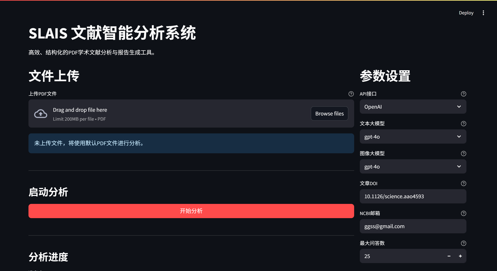
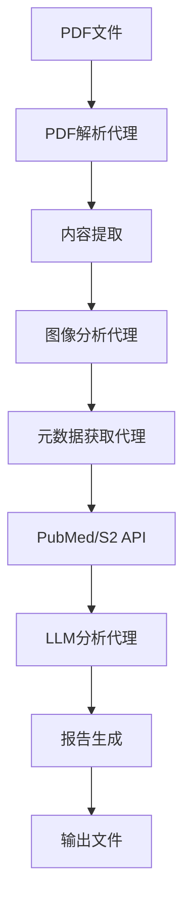

# SLAIS - PDF文献智能分析与洞察系统

<div align="center">


[](https://python.org)
[](LICENSE)
[]()

**高效、结构化的PDF学术文献分析与报告生成工具**

[功能特点](#功能特点) • [快速开始](#快速开始) • [安装指南](#安装指南) • [使用文档](#使用文档) • [开发指南](#开发指南)

</div>

---

## 📖 项目简介

SLAIS (Smart Literature Analysis and Insight System) 是一个基于人工智能的PDF文献智能分析系统，专为科研人员、学生和学术从业者设计。系统能够自动化地从PDF格式的学术文献中提取关键信息、生成深刻洞察并构建结构化报告，大幅提升文献阅读和研究效率。

### 🎯 核心价值

- **智能化分析**：利用大语言模型深度解析文献内容，提取方法学、创新点、研究意义。核心分析逻辑基于最新版 LangChain 组件，确保稳定性和兼容性。
- **结构化输出**：生成标准化的Markdown报告，包含完整的参考文献和相关文献数据
- **多模态处理**：支持PDF文本提取、图像内容分析、元数据获取的完整流程
- **高度可配置**：支持多种LLM模型、灵活的参数调整、个性化分析需求

## ✨ 功能特点

### 📄 PDF内容处理
- **智能PDF解析**：基于MinerU的`magic_pdf`库，高质量提取PDF文本内容
- **图像内容分析**：支持PDF中图表、图片的智能识别和分析
- **多格式输出**：Markdown、HTML、CSV等多种格式报告生成

### 🔍 元数据获取
- **多源数据整合**：集成PubMed、Semantic Scholar等权威学术数据库
- **参考文献解析**：自动提取并丰富参考文献信息（作者、发表日期、期刊等）
- **相关文献推荐**：基于主题相似度推荐相关研究文献

### 🤖 智能分析
- **方法学分析**：深度解析研究方法、技术路线、数据来源
- **创新点提取**：识别核心创新贡献、解决的关键问题
- **问答生成**：自动生成针对文献内容的Q&A对，便于理解和记忆
- **洞察总结**：提供研究意义、应用前景、局限性等全面分析

### 🎨 用户体验
- **Web界面**：直观的Streamlit Web界面，支持文件上传、实时进度、报告预览
- **命令行工具**：强大的CLI支持，适合批量处理和自动化工作流
- **实时反馈**：详细的进度跟踪、日志输出、错误提示

## 🖼️ 应用截图 (Application Screenshots)
<div align="center">
  <!-- 示例：Web界面主页 -->
  
  <p><em>图1：SLAIS Web应用主界面 (Placeholder: Main interface of the SLAIS Web App)</em></p>

[生成的分析报告示例](output/darwin/darwin_analysis.md)


## 🚀 快速开始

### 环境要求

- Python 3.10
- 8GB+ RAM（推荐16GB）
- 网络连接（用于API调用）

### 一键运行

```bash
# 1. 克隆项目
git clone https://github.com/xtbggqy/SLAIS.git
cd SLAIS

# 2. 安装依赖
pip install -r requirements.txt

# 3. 配置环境变量（复制并修改.env文件）
cp .env.example .env
# 编辑.env文件，设置API密钥等配置

# 4. 启动Web界面
python -m streamlit run web/web_app.py
```

### 命令行使用

```bash
# 分析单个PDF文件
python app.py --pdf pdfs/example.pdf --doi "10.1234/example.doi" --email your@email.com

# 查看帮助信息
python app.py --help
```

## 📦 安装指南

### 使用pip安装（推荐）

```bash
# 创建虚拟环境
python -m venv slais_env
source slais_env/bin/activate  # Windows: slais_env\Scripts\activate

# 安装依赖
pip install -r requirements.txt
```

### 使用conda/mamba安装

```bash
# 创建conda环境
conda create -n slais python=3.10
conda activate slais

# 安装依赖
pip install -r requirements.txt
```

### 开发环境安装

```bash
# 安装开发依赖
pip install -r requirements-dev.txt

# 安装pre-commit钩子
pre-commit install
```

## ⚙️ 配置说明

### 环境变量配置

创建`.env`文件并配置以下必要参数：

```env
# 大语言模型配置
OPENAI_API_KEY=your_openai_api_key
OPENAI_API_MODEL=gpt-4
OPENAI_API_BASE_URL=https://api.openai.com/v1

# 图像分析模型配置
IMAGE_LLM_API_KEY=your_image_llm_key
IMAGE_LLM_API_MODEL=qwen-vl-plus

# 学术数据库配置
NCBI_EMAIL=your@email.com
SEMANTIC_SCHOLAR_API_KEY=your_s2_api_key

# 文档配置
ARTICLE_DOI=10.1234/example.doi
DEFAULT_PDF_PATH=pdfs/example.pdf

# 分析参数
MAX_QUESTIONS_TO_GENERATE=30
MAX_CONTENT_CHARS_FOR_LLM=15000
```

### 重要配置参数

| 参数 | 说明 | 默认值 |
|------|------|--------|
| `OPENAI_API_MODEL` | 文本分析使用的LLM模型 | gpt-4 |
| `MAX_QUESTIONS_TO_GENERATE` | 生成的问答对数量上限 | 30 |
| `MAX_CONTENT_CHARS_FOR_LLM` | 传递给LLM的内容字符数上限 | 15000 |
| `RELATED_ARTICLES_MAX` | 获取的相关文献数量上限 | 30 |

## 📚 使用文档

### Web界面使用

1. **启动Web服务**：`python -m streamlit run web/web_app.py`
2. **上传PDF文件**：在界面中上传要分析的PDF文档
3. **设置参数**：配置DOI、邮箱、分析选项等
4. **开始分析**：点击"开始分析"按钮，系统将自动完成全流程
5. **查看结果**：分析完成后可在线预览报告，或下载Markdown/CSV文件

### 命令行使用

```bash
# 基本用法
python app.py --pdf path/to/paper.pdf --doi "10.1234/example" --email your@email.com

# 指定输出目录
python app.py --pdf paper.pdf --output-dir custom_output --doi "10.1234/example"

# 调整分析参数
python app.py --pdf paper.pdf --max-questions 50 --doi "10.1234/example"

# 批量处理（开发中）
python app.py --batch-dir pdfs_folder/ --email your@email.com
```

### 输出文件说明

分析完成后，系统会在`output/<pdf_name>/`目录下生成：

- `<name>_analysis_report_<timestamp>.md`：完整的分析报告
- `<name>_references_<timestamp>.csv`：参考文献详细信息
- `<name>_related_pubmed_<timestamp>.csv`：相关文献推荐

## 🏗️ 项目架构

### 核心模块

```
slais/
├── agents/                 # 智能代理模块
│   ├── pdf_parsing_agent.py      # PDF解析
│   ├── metadata_fetching_agent.py # 元数据获取
│   ├── image_analysis_agent.py   # 图像分析
│   ├── llm_analysis_agent.py     # LLM分析
│   ├── callbacks.py              # 回调处理 (如Token统计)
│   ├── formatting_utils.py       # 格式化工具 (如报告生成)
│   └── base_agent.py             # 基础代理类
├── slais/                  # 核心功能模块
│   ├── config.py                 # 配置管理
│   ├── pubmed_client.py          # PubMed API客户端
│   ├── semantic_scholar_client.py # Semantic Scholar客户端
│   └── utils/                    # 工具函数
├── web/                    # Web界面
│   └── web_app.py               # Streamlit应用
└── app.py                  # 主程序入口
```

### 数据流程




## 🗺️ 路线图 (Roadmap)

我们对SLAIS的未来发展充满期待，并计划在以下方面进行增强和扩展：

- **[ ] 更广泛的文献数据库集成**：除了PubMed和Semantic Scholar，计划支持更多学术数据库（如ArXiv、Crossref等）。
- **[ ] 交互式图表与可视化**：在Web报告中引入交互式图表，更直观地展示分析结果。
- **[ ] 批量处理增强**：完善命令行工具的批量处理功能，支持更复杂的自动化工作流。
- **[ ] 知识图谱构建**：探索从分析文献中自动构建小型知识图谱的可行性。
- **[ ] 多语言支持**：初步支持对非英文文献的分析。
- **[ ] 用户账户与个性化设置**：为Web应用添加用户系统，允许保存偏好和历史记录。
- **[ ] 插件化架构**：使分析模块更加插件化，方便社区贡献和扩展。

*我们欢迎社区成员就未来方向提出建议和功能请求。您可以通过项目的Issue跟踪器分享您的想法。*


<!--
## 📊 性能与优化

### 性能指标

- **处理速度**：单篇文献分析时间约3-5分钟
- **内存使用**：峰值内存约2-4GB
- **Token消耗**：每篇文献约5000-10000 tokens 

### 优化建议

- **缓存机制**：已实现API响应缓存（针对元数据、参考文献、相关文章），并优化了缓存处理逻辑，有效减少重复API调用。
- **并发处理**：适当调整并发参数，平衡速度与资源消耗。
- **内容截断**：合理设置`MAX_CONTENT_CHARS_FOR_LLM`参数。-->

## 🧪 测试

### 运行测试

```bash
# 运行所有测试
pytest

# 运行特定测试文件
pytest tests/test_pdf_parsing.py

# 生成覆盖率报告
pytest --cov=slais --cov-report=html
```

### 测试结构

```
tests/
├── unit/                   # 单元测试
│   ├── test_agents/
│   ├── test_slais/
│   └── test_utils/
├── integration/            # 集成测试
│   ├── test_pipelines/
│   └── test_api_clients/
└── fixtures/               # 测试数据
    ├── sample.pdf
    └── mock_responses/
```

## 🤝 贡献指南

我们欢迎社区贡献！请参考以下步骤：

1. **Fork项目**并创建你的功能分支
2. **遵循代码规范**，确保代码质量
3. **添加测试**，确保新功能正常工作
4. **更新文档**，如有API变更请更新相关文档
5. **提交PR**，详细描述你的更改

### Bug报告

请使用GitHub Issues报告bug，包含以下信息：
- 操作系统和Python版本
- 完整的错误消息和堆栈跟踪
- 重现步骤
- 期望行为

### 功能请求

欢迎提出新功能建议，请在Issue中说明：
- 功能描述和使用场景
- 预期的API设计
- 可能的实现方案

## 📄 许可证

本项目采用MIT许可证。详细信息请查看[LICENSE](LICENSE)文件。


## 🙏 致谢

感谢以下开源项目和服务：

- [MinerU](https://github.com/opendatalab/MinerU) - 高质量PDF解析
- [LangChain](https://github.com/langchain-ai/langchain) - LLM应用框架
- [Streamlit](https://streamlit.io/) - Web界面框架
- [PubMed API](https://www.ncbi.nlm.nih.gov/home/develop/api/) - 学术文献数据
- [Semantic Scholar API](https://www.semanticscholar.org/product/api) - 学术搜索服务

---

<div align="center">

**⭐ 如果这个项目对你有帮助，请给我们一个Star！⭐**

</div>
