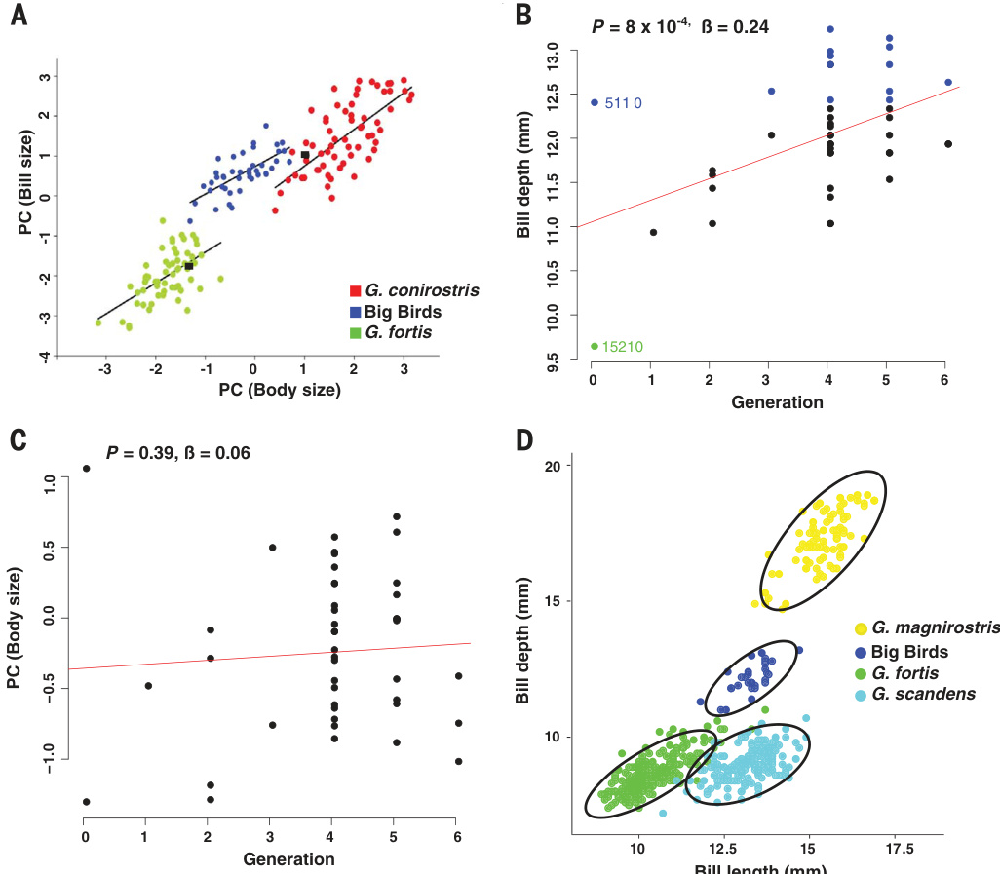

# HYBRIDSPECIATION

# Rapid hybrid speciation in Darwin's finches

Sangeet Lamichhaney,1\* Fan Han,1 Matthew T. Webster,1 Leif Andersson,1,2,3+ B.Rosemary Grant,4 Peter R. Grant4

Homoploid hybrid speciation inanimals has been inferred frequently frompatternsof variation, but few examples have withstood critical scrutiny. Here we report a directly documented example,from its origin to reproductive isolation.An immigrant Darwin's finch to Daphne Major in the Galapagos archipelago initiated a new genetic lineage by breeding with a resident finch (Geospiza fortis). Genome sequencing of the immigrant identified it as a G.conirostris male that originated on Esparola >1OO kilometers from Daphne Major. From the second generation onward,the lineage bred endogamously and,despite intense inbreeding, was ecologically successful and showed transgressive segregation of bill morphology. This example shows that reproductive isolation,which typically develops over hundreds of generations,can be established in only three.

nterbreeding of two species may result in the formation of a new species,reproductively isolated from the parental species (I).Hybrid speciation without chromosomal doubling, that is,homoploid hybrid speciation,is rare (1-4).Possible examples have been reported in plants (4),butterflies (5),flies (6),fish(7),mammals (8),and birds (9).However,only one of these, involvingHeliconiusbutterflies (5),and three additional examples,involving Helianthus sunflowers (3,IO),meet stringent criteria that have been proposed for recognizing that hybridization was the cause of speciation (2).Here we report the results of a combined ecological and genomic study ofDarwin's finches that documents hybrid speciation in the wild from its inception to the development of reproductive isolation.

Animmature male finch immigrated to the small Galapagos Island of Daphne Major(O.34 km²) in l981 (I1-I3).It resembled the medium ground finch Geospiza fortis,but was 7O% largerand sanga distinctive song.Assignment tests with microsatellite markers from finches on neighboring islands indicated that it waspossiblya G.fortis× G.scandens hybrid originating on the adjacent large island of Santa Cruz,8 km from Daphne (I1). We followed the survival and breeding of this individual and its descendants for six generations overthenext 31 years.

Theimmigrant(generation O)bredwith a G.fortis female and one of its F1 offspring bred with another G.fortis female,but all other matings occurred within this lineage,endogamously; therefore,from generation 2 onward, the lineage behavedas an independent species relative to other birds on the island (Fig.1).Generations 4 to 6 were derived froma single brother-sister mating in generation 3.Despite close inbreeding,members of the lineage experiencedhigh fitness,as judgedby their reproductive output and high survival (12).At maximum(in 20iO),eight breeding pairs and 36 individuals were present on the island,and on our most recent visit (in 2012), there were eight breeding pairs and 23 individuals of generations 3 to 6.From observations and experiments with ground finches (12,13),bill morphology is likely to be a key factor in the success of these birds.The ability of finches to efficiently exploit the large woody fruits of Tribulus cistoides in dry seasons,and particularly during droughts and limited food supply, is a function of bill size, especially bill depth (I2).Also, finch species imprint on features of theirparentsearlyinlife,andlater,when choosinga mate,they discriminate between members of their own and other species on the basis of bill size and shape,as well as body size and song (13).

We combined morphological measurements and whole genome sequencing of almost all individuals in the new lineage to establish the genetic basis of the founder population and characteristics associated with its success.We (i) assigned the founder male to species and source population,(ii) confirmed pedigree assignments from observations and sequence data (14),(iii) quantified patterns of gene transmission between generations,(iv)assessed genetic diversity,and(v) searched for genetic clues to the success of the lineage.

Because members of the new lineage are conspicuously large,we refer to it as the Big Bird lineage (12).

Aphylogenetic tree analysis showed that the founder male (individual 5llo)was not a G.fortis × G.scandens hybrid aspreviously hypothesized (12),but ratheraG.conirostris(Fig.2A).This species (large cactus finch) occurs on Espanola anditssatellite Gardner(Fig.2B)andnowhere else in the Galapagos archipelago;apopulation onGenovesa,formerlyclassified as G.conirostris, was recentlyreclassified as G.propinqua(15). Immigration from Espanolais noteworthyand unexpected because itis located more than1oo km fromDaphne Major and a large island (Santa Cruz) lies between them (Fig.2B).Rare long-distance movements of finches in the archipelago have been detected before,but,until recently,it was assumed these birds were vagrants that did not stay to breed (16-18).

The founder had an inbreeding coefficient (F) of 0.19 and appeared to be a typical member of the source population of G.conirostris from Espanola (F=-O.04 to O.31),interms ofaverage genome-wide homozygosity,and admixture (19) analysisclassifieditasanormalG.conirostris (Fig.2C).The inbreeding coefficient was negative in the Fi generation (Fig.2D) as a result of the interspecieshybridization (I2,I3).A gradual increase in homozygosity was then observed over the next five generations(Fig.2D),as expected from the small number of breeding pairs (one to eight),causing genetic drift. Genome-wide averagenucleotide diversityπ showeda similar

  
Fig.1.The Big Bird lineage through the sixth generation. Interbreedingwith two G.fortis females resulted ina reduction of the genetic contribution of the immigrant male from O.5O in the first generation to O.375 in the second and subsequent generations. The numbers indicate identification number (14).n indicates number of individuals.[Photo credit: Peter and Rosemary Grant]

Fig.2. Phylogeny, geography,and increase in homozygosity.(A) Maximum likelihood tree of Darwin's finches constructed from whole genomes [this study and (13,21)].The founder male of the Big Bird lineage is highlighted in blue. All nodes that have full local support on the basis of the ShimodairaHasegawa test are marked with asterisks.(B) Map of the Galapagos archipelago.The original colonist individual on Daphne Major originated on Espanola Island (or its satellite Gardner) in the southeast of the archipelago >10o km from Daphne.The hypothetical flight path,indicated by the red dashed arrow,is informed by observations (B.R.G.and P.R.G., 1973-1975) of postbreeding movement of finches on Santa Cruz Island, northward on the east coast and westward on the north coast.(C) Maximum likelihood estimationof individual admixture proportions using genome-wide singlenucleotide polymorphism (SNP) data for a range of preassumed populations (ancestral groups K= 2 to 6). The number of colors used corresponds to the number of K being used in each plot. (D) Increase in homozygosity (genome-wide inbreeding coefficient,F) in the Big Bird lineage over the generations.The estimate for the original colonist is shown by an asterisk.

pattern,with a decline from O.l7% in generation 1 to\~O.l3% in generations4 to6;values forG.fortis and G.conirostris were O.15and O.16%,respectively (fig.S1).Furthermore,the extensive linkage disequilibrium across the genome is consistent with a recent hybridization event (fig.S2). The BigBird lineage also exhibited low quantitative variation. The population,all generations combined,varied less in bill length as measured by the coefficient of variation (3.82 ± 0.42, mean± SEM,n=42) than G.fortis (7.55±0.69, n = 60,P<0.005) and G.conirostris (6.35± 0.56, n = 64,P<O.o1),and varied less in bill depth than G.conirostris (5.02 ± 0.55 versus 7.71± 0.68,P< O.05).The low valuesprobablyrepresent lowadditive genetic variation because the traits are highly heritable in Geospiza species (13,20).

The ecological success and reproductive isolation of the Big Bird lineage were most likely due to large bill and body size and a distinctive song (12).We undertook a more detailed morphological analysis of the new lineage,together with both of the parental species G.conirostris and G.fortis [(14),table S1].In body size,the members of the Big Bird lineage are intermediate,on average,between the means of the parental species large bill size was 6o.8% in generations 4 to 6 (fig.S4 and table S5).From generation 3 onward, all Big Birds were homozygous for ALX1 B alleles associatedwithblunt bills.Acloserexamination revealed that two variants of theBallele, designatedB1andB2,were segregatingamong the BigBirds (fig.S5andtable S5);thetwoalleles differbyninenucleotide substitutionswithin the 240-kb region, showing a strong association with bill shape (14).TheB1 allele originated from the foundermale that was genotypedasP/B1,where Prefers to pointed,whereas the B2allele originated from G. fortis (table S5).Interestingly, B2/B2 homozygotes had significantly shorter bills than the other two genotypes [analysis of covariance (ANCOVA) F2,32 = 10.5,P = 0.0003; Tukey's post hoc tests,B2/B2 < B1/B1 (P = 0.005)and B2/B2 < B1/B2 (P= 0.0002)].Although these associations should be confirmed with larger sample sizes,they are consistent with the hypothesis that the ALXl locus in Darwin's finchesinvolvesanallelic serieswith different effects on bill morphology (15).

  
Fig.3.Morphology.(A) Bil-size variation in relation to body size among the Big Bird lineage (blue) and the two parental species G.fortis (green) and G.conirostris (red).All42 Big Birds lie above a line connecting the two parents,indicated by black squares,and above a line connecting the means of the two populations.The ordinary least squares regression slopes of the three relationships (table S3)are homogeneous (ANCOVA,F2.161= 1.4,P= 0.26),whereas the intercepts differ (ANCOVA with species-bill size interaction removed,F2.163 = 140.9,P= O.OOO1).The 99% confidence limitson the Big Bird intercept estimate do not overlap those of theother two intercepts, whereas the 95% confidence limits of the G.conirostrisand G.fortis slopes do overlap.This pattern is repeated in two of the components of billsize: depth and width [fig.S3;for billwidth,see (14)]. PC,principal component.(B) Mean billdepth increased over generations (F142=12.9,P= 0.0008, adj r²= 0.22,slope = O.25±O.O7).The relationship holds for generations1to 6 alone,i.e.,without the founder and its mate (F1,4o = 9.1,P= O.0O4,adjr² = 0.16,slope = O.24 ± O.08).Note the bill depth of the single member of generation 1is 1O.9 mm,which is close to the midpoint of the parental measurements (.O mm).Transgressive segregation for billdepth in the Big Bird lineage is possibly indicated by the fraction of individuals that exceeded parental phenotypic values (highlighted in blue)(1O),which was estimated at 0.5,O.3,O.4,and O.3 ingenerations 3 to6,respectively. (C) Mean body size remained unchanged across generations (F1,42= O.76,P= O.39,adjr²= O.O0,slope= 0.06 ± 0.07).(D) Members of the Big Bird lineage (blue) are in unoccupied morphological space among the coexisting ecological competitor species.Ellipses contain 95% of individuals.G.magnirostris, yellow; G.fortis,green;G.scandens,aqua.

(Fig.3A),but closer to the G.fortismean (table S2),as expected from their predominantly G.fortis genetic composition and polygenic inheritance. However,by contrast, they are more similar to G.conirostris in bill size(Fig.3A,fig. S3,and tables S1 and S2),despite the minority representation ofG.conirostris genesin generation 3 and onward.This represents a substantial allometric shiftin the Big Bird lineage,possiblycaused by natural selection.Selection is plausible because shiftsinthe elevations of staticallometrieshave beenproduced relatively easily in a few generations of artificial selection in laboratory populations of animals (21). The pattern of change also has the characteristics of transgressive segregation (IO,22).This is the production of progeny with extreme phenotypes beyond the range of those of the parents that are likely causedby epistasis,which has been detected in other hybridizing finch species on Daphne (23),and/or by combiningcomplementaryallelesat different loci from different populations in F2 and further generations (22,24,25).

ALXIand HMGA2have large effects on bill dimensions,which are polygenic traits that are affected by other gene variants,and these may have changed in frequency as a result of a combination of natural selectionand random drift.A trend of increasing bill size across generations [F1,42 = 6.0,P= 0.018,adjusted goodness of fit (adjr²)= O.io] is more indicative of selection than of drift.In 2oo9,the only year with sufficient samplesforananalysisofmortality,19adult survivors to the following year had a larger mean bill size than five adults that died (Fi,22 = 8.30, P= 0.oo9).The most important component of bill size is bill depth,and an increase in this dimension(Fig.3B)was noteworthy fortwo reasons.First,the increasewas independent of body size (Fig.3C). The genetic correlation between bill size and body size that potentially constrains independent evolution of bill size is not known.However,in G.fortis,the genetic correlation betweenbill depthandbodymass isstronglypositive (0.67± 0.10 SEM) (23). Second,bill length did not change in the population (fig. S6); hence,bills became not only larger but also progressively blunter, on average,across generations (fig. S6).A possible scenario is that transgressive segregation produced genotype combinations that have been favored by natural selection, causing the shift in beak morphology.The net result was morphologically based ecological segregation from the three sympatric competitor species,G.fortis,G.scandens,and G.magnirostris (Fig. 3D).

To investigate the genetic basis for the relatively large bills of the Big Birds,we examined the genotypesatHMGA2and ALX1,two closely linked loci (7Mb apart) previously shown to be associatedwithvariation inbill morphology in Darwin's finches (15,26).At the HMGA2 locus, the allele frequency of the L allele associated with

The final stage in speciation is the development of reproductive isolation from the parent population.In Darwin's finches,a premating barrier to interbreedingis established bya difference in song and morphology (12,13). The test of reproductive isolation requires sympatry with the parental population(s) or a surrogate experiment, for example,with finch models and/or playback of a tape-recorded song(27).The new population onDaphne isreproductivelyisolated from one of the parental populations,G.fortis, but whetherit is reproductively isolated from the other,G.conirostrisonEspanola,isunknownbecause experiments have not been done there. Nevertheless,it is likely that the founder population has already become reproductively isolated fromG.conirostris,as bill size has changed in relation to body size (Fig.3A).Together, these traits are used as cues in the choice of mates, arising from cultural, nongenetic imprinting (12,13). Of particular relevance,experiments on DaphneMajorwithG.scandensshowedthat altering bill size in relation to body size of finch models significantly reduced responses from males (28).Additionally,males of the founder population sing a different song from G.conirostris on Espanola and Gardner,probablyasa result of imperfect copying ofa Daphne Major finchby the founder after it had first learned its father's song onEspanola (or Gardner) (I3).Song and morphologyare cues that are used in mate choice and typically result in the avoidance of interspecific mating.

"...to understand the mechanism of speciation, the focus should be on cases of incipient speciation rather than on completed ones"(29).We have taken advantage of witnessing a rare colonization event to directlydocument the fate ofa population founded by a single immigrant and hisG.fortismate.The newly founded population of Darwin's finches is an incipient hybrid species, reproductivelyisolatedand ecologicallysegregated from coexisting finch species (Fig.3D).The key features of success of the new lineage are reproductive isolation based on learned song and morphology, transgressive segregation producing new phenotypes,and the availability of underexploited food resources.Homoploid hybrid speciationis believed to bea generally slow process extending over hundreds of generations (29),but,as the present example shows,it can be establishedin onlythree generations.Thus,in small islands or island-like settings,it may be easier to achieve than is currently believed (I,30-32).

Homoploid hybrid speciation of the Big Bird lineage exemplifies the potential evolutionary importance of rare andchance events.Expansion of the population from two individuals to three dozen was conditioned on the founder being a male with a distinctive song(I4) and facilitated by the chance occurrence of strong selection against large bill size ina competitor species,G.fortis,in 2004 to 2005 (12,26).The selection event,in turn, wasmediated byG.magnirostris,a species that establisheda breeding population in1983.Joint occurrence of rare and extreme events suchas these may be especially potent in ecology and evolution (33,34).

# REFERENCESANDNOTES

1.R. J. Abbott,N. H. Barton,J. M. Good, Mol. Ecol.25, 2325-2332 (2016).   
2.M. Schumer, G.G. Rosenthal,P.Andolfatto, Evolution 68. 1553-1560 (2014).   
3．B.L. Gross, L. H. Rieseberg,J. Hered.96,241-252 (2005).   
4.S. B. Yakimowski, L. H. Rieseberg, Am. J. Bot.101,1247-1258 (2014).   
5．J.Mavarez et al., Nature 441, 868-871 (2006).   
6.D.Schwarz, B. M. Matta, N. L. Shakir-Botteri, B.A. McPheron, Nature 436,546-549 (2005).   
7.J.H. Kang,M. Schartl,R.B.Walter,A. Meyer, BMC Evol. Biol. 13,25 (2013).   
8.P.A. Larsen, M.R. Marchan-Rivadeneira, R.J. Baker,Proc. Natl. Acad. Sci. U.S.A.107,11447-11452 (2010).   
9.J.S. Hermansen et al., Mol. Ecol.20,3812-3822 (2011).   
10.L.H. Rieseberg, C.Van Fossen,A.M. Desrochers, Nature 375, 313-316 (1995).   
11.P.R. Grant, B.R. Grant,Proc. Natl. Acad. Sci. U.S.A.106. 20141-20148 (2009).   
12.B.R.Grant,P. R.Grant, 4O Years of Evolution: Darwin's Finches on Daphne Major Island (Princeton Univ. Press,2014).   
13.P.R. Grant, B.R. Grant, How and Why Species Multiply (Princeton Univ. Press,2008).   
14.See supplementary materials.   
15.S.Lamichhaney et al., Nature 518,371-375 (2015).   
16.P.R.Grant, B.R. Grant,Philos.Trans. R. Soc. London B Biol. Sci. 365,1065-1076 (2010).   
17.D.L.Lack, Darwin's Finches (Cambridge Univ. Press,1947).   
18.H.S.Swarth, Occas. Pap. Calif. Acad. Sci 18,1-299 (1931).   
19.D.H. Alexander, J. Novembre,K. Lange, Genome Res.19, 1655-1664 (2009).   
20.L.F. Keller, P. R. Grant, B. R. Grant, K. Petren, Heredity 87, 325-336 (2001).   
21.G. H. Bolstad et al., Proc. Natl. Acad. Sci. U.S.A. 112, 13284-13289 (2015).   
22.L.H. Rieseberg, M. A. Archer, R. K. Wayne, Heredity 83, 363-372 (1999).   
23.P.R. Grant, B. R. Grant, Evolution 48,297-316 (1994).   
24.K.J.Parsons,Y. H. Son, R. Craig Albertson, Evol. Biol.38, 306-315 (2011).   
25.R.Stelkens, O. Seehausen, Evolution 63,884-897 (2009).   
26. S.Lamichhaney et al., Science 352,470-474 (2016).   
27.B.R. Grant,P.R. Grant, Biol. J. Linn. Soc. Lond.76,545-556 (2002).   
28.L.M. Ratcliffe,P.R. Grant,Anim. Behav.31,1139-1153 (1983).   
29.A.W. Nolte,D.Tautz,Trends Genet.26, 54-58 (2010).   
30.J.Mavarez, M. Linares,Mol. Ecol.17,4181-4185 (2008).   
31.Marie Curie SPECIATION Network,Trends Ecol. Evol.27,27-39 (2012).   
32.R.J.Abbott M.J. Hegarty,S.J. Hiscock,A.C. Brennan,Taxon 59,1375-1386 (2010).   
33.R.Paine,M.Tegner,E.Johnson, Ecosystems (N.Y.)1,535-545 (1998).   
34.P.R. Grant et al., Philos.Trans.R. Soc. London B Biol. Sci.372. 20160146 (2017).

# ACKNOWLEDGMENTS

The NSF funded the collection of material under permits from the Galapagos and Costa Rica National Parks Services and the Charles Darwin Research Station,in accordance with protocols of Princeton University's Animal Welfare Committee.The project was supported by the Knut and Alice Wallenberg Foundation and the Swedish Research Council. Sequencing was performed by the SNP&SEQ Technology Platform,supported by Uppsala University and Hospital, SciLifeLab,and the Swedish Research Council. Computer resources were supplied by Uppsala Multidisciplinary Center for Advanced Computational Science (UPPMAX).We would also like to thank two anonymous reviewers for valuable comments on the paper. The llumina reads have been submitted to the short reads archive (www.ncbi.nlm.nih.gov/sra) with the accession number PRJNA392917. Raw tree files for constructing Fig. 2A and figs. S4, S5,and S7 have been submitted to the TreeBASE database with submission ID S21803 (http://purl.org/ phylo/treebase/phylows/study/TB2:S21803?format=html). P.R.G. and B.R.G. collected the material. P.R.G., B.R.G., and L.A. conceived the study. L.A. and M.T.W. led the bioinformatic analysis of data. S.L.and F.H. performed the bioinformatic analysis. P.R.G., B.R.G., S.L.,and L.A. wrote the paper with input from the other authors.Al authors approved the manuscript before submission.

# SUPPLEMENTARYMATERIALS

www.sciencemag.org/content/359/6372/224/suppl/DC1   
Materials and Methods   
Supplementary Text   
Figs. Sl to S7   
Tables Sl to S5   
References (35-40)   
23 July 2O17;accepted 9 November 2017   
Published online 23 November 2017   
10.1126/science.aao4593