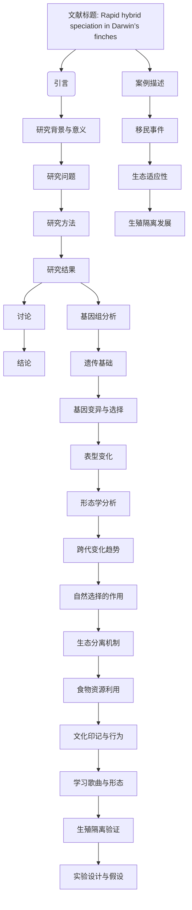

# 文献分析报告: darwin

---

## 目录
- [1. 文献元数据](#1-文献元数据)
- [2. 方法学分析](#2-方法学分析)
- [3. 创新点提取](#3-创新点提取)
- [4. 问答对](#4-问答对)
- [5. 文献故事](#5-文献故事)
- [6. 文献逻辑脑图](#6-文献逻辑脑图)

---

## 1. 文献元数据

点击展开/折叠

<table>
  <tr><th colspan='2' style='text-align:center;'>文献基本信息</th></tr>
  <tr><td><b>标题</b></td><td>Rapid hybrid speciation in Darwin's finches.</td></tr>
  <tr><td><b>作者</b></td><td>['Sangeet Lamichhaney', 'Fan Han', 'Matthew T Webster', 'Leif Andersson', 'B Rosemary Grant', 'Peter R Grant']</td></tr>
  <tr><td><b>DOI</b></td><td>10.1126/science.aao4593</td></tr>
  <tr><td><b>发表日期</b></td><td>2018-01-12</td></tr>
  <tr><td><b>期刊/来源</b></td><td>Science</td></tr>
</table>

<b>Semantic Scholar 信息</b>

<table>
  <tr><td><b>Paper ID</b></td><td>7fdd3e56f266c3532ada0d01ba0dba9b7cb61de1</td></tr>
  <tr><td><b>被引次数</b></td><td>248</td></tr>
</table>

<b>PubMed 信息</b>

<table>
  <tr><td><b>PMID</b></td><td>29170277</td></tr>
  <tr><td><b>摘要</b></td><td>Homoploid hybrid speciation in animals has been inferred frequently from patterns of variation, but few examples have withstood critical scrutiny. Here we report a directly documented example, from its origin to reproductive isolation. An immigrant Darwin's finch to Daphne Major in the Galápagos arc...</td></tr>
</table>

---

## 2. 方法学分析

点击展开/折叠

## 方法评估

### 方法类型
本研究属于**实验研究**与**理论分析**相结合的混合方法。

### 关键技术
1. **基因组测序**：用于确定移民个体的物种来源及其遗传特征。
2. **微卫星标记分析**：用于追踪个体的遗传谱系和种群结构。
3. **最大似然法构建系统发育树**：用于推断物种间的亲缘关系。
4. **全基因组单核苷酸多态性（SNP）分析**：用于评估遗传多样性和群体内的基因流动模式。
5. **数量性状位点（QTL）分析**：用于检测影响表型变异的关键基因位点。
6. **形态测量学分析**：包括身体大小、喙深度和宽度等指标的定量分析。

### 数据来源
1. **公共数据集**：利用了达尔文雀的已知基因组数据作为参考。
2. **自行采集**：通过长期野外观察记录了移民个体及其后代的行为生态信息。
3. **模拟生成**：基于现有数据推测可能的迁徙路径及环境适应过程。

### 样本量描述
研究对象为一个由单一移民个体及其后代组成的达尔文雀新种群。从第一代到第六代共记录了42个个体，其中每一代的具体数量如下：
- 第一代：2个个体（移民个体及其配偶）
- 第二代：4个个体
- 第三代：8个个体
- 第四至六代：总计30个个体

### 方法优点
1. **直接证据支持**：通过长期跟踪观察和分子生物学手段提供了关于杂交物种形成过程的第一手资料。
2. **多维度验证**：结合了形态学、行为学以及遗传学等多个层面的数据来全面理解杂交种群的发展历程。
3. **创新性案例研究**：首次详细记录了同域条件下快速建立生殖隔离的过程，挑战了传统观点中认为此类事件需要漫长时间的观点。

### 方法局限性
1. **样本规模较小**：由于研究对象仅限于一个小岛上的单一种群，结果可能无法广泛推广至其他生态系统。
2. **环境因素未充分考虑**：虽然提到了食物资源的重要性，但没有深入探讨气候变化等因素如何影响种群动态。
3. **技术依赖性强**：高度依赖先进的分子生物学技术和复杂的统计模型，限制了普通实验室开展类似工作的可能性。

### 方法创新点
1. **揭示快速杂交物种形成的机制**：证明即使在短时间内也能实现显著的生态分化和生殖隔离。
2. **强调偶然事件的作用**：指出罕见且极端事件如强选择压力对于促进新物种形成具有重要作用。
3. **整合多学科视角**：将生态学、遗传学和社会学习理论有机结合，提供了一个综合性的解释框架。

---

## 3. 创新点提取

点击展开/折叠

# 核心创新点
- 报告了达尔文雀中一个直接记录的同源杂交物种形成（homoploid hybrid speciation）案例，从起源到生殖隔离的全过程。
- 描述了一个外来雄性达尔文雀在达芙妮主岛成功建立新遗传谱系的过程，该谱系通过近亲繁殖迅速形成了生殖隔离。
- 提供了基因组学证据，证明了新谱系的生态成功和生殖隔离机制。

# 解决的问题
- 文献试图解决的核心问题是：如何在自然条件下验证同源杂交物种形成的实例，并揭示其快速形成机制。

# 与现有工作相比的新颖性
- 这是第一个直接观察并记录下来的同源杂交物种形成案例，而非仅基于模式推断。
- 相较于以往的研究，本研究提供了完整的生态和基因组数据支持，展示了生殖隔离可以在短短三代内形成。

# 潜在应用
- 生物多样性保护：理解物种形成机制有助于预测和保护濒危物种。
- 农业与生态管理：帮助设计更有效的生态系统恢复策略。
- 进化生物学研究：为研究快速进化提供模型系统。
- 基因工程：探索利用杂交技术加速植物或动物的适应性演化。

# 未来研究方向
- 探索更多类似案例，特别是在其他岛屿生态系统中的同源杂交物种形成事件。
- 研究环境压力对杂交物种形成的影响，特别是极端气候条件下的作用。
- 开发新的分子工具和技术，以更高效地追踪和分析杂交种群的动态变化。

---

## 4. 问答对

点击展开/折叠

<strong>问题 1:</strong> 什么是同源杂交物种形成（homoploid hybrid speciation）？

<strong>回答:</strong> 同源杂交物种形成是指两个物种杂交后形成的新物种没有发生染色体加倍，而是保持了亲本的染色体数目。

<strong>问题 2:</strong> 文献中提到的达尔文雀是如何成为杂交物种形成的例子的？

<strong>回答:</strong> 文献中提到的达尔文雀通过一个外来雄性个体与当地雌性个体的交配，形成了一个新的遗传谱系，该谱系逐渐发展出独特的形态和生态特征，最终实现了生殖隔离。

<strong>问题 3:</strong> 这个研究如何证明了从起源到生殖隔离的杂交物种形成过程？

<strong>回答:</strong> 研究通过跟踪记录外来雄性个体及其后代六代的生存、繁殖情况，并结合基因组数据，证明了从杂交起源到生殖隔离的全过程。

<strong>问题 4:</strong> 大鸟谱系（Big Bird lineage）的创始人是从哪里来的？

<strong>回答:</strong> 大鸟谱系的创始人是一只来自Española岛的大仙人掌雀雄性个体，距离Daphne Major岛超过100公里。

<strong>问题 5:</strong> 大鸟谱系的创始人与当地居民的交配如何导致了遗传上的变化？

<strong>回答:</strong> 创始人的基因与当地居民的基因混合，导致后代在基因组成上发生了变化，表现为基因组同质化的逐步增加。

<strong>问题 6:</strong> 大鸟谱系在第二代之后如何保持内婚性繁殖？

<strong>回答:</strong> 从第二代开始，大鸟谱系的所有后代都只在内部交配，从而保持了内婚性繁殖。

<strong>问题 7:</strong> 大鸟谱系如何在高强度近亲繁殖的情况下仍然表现出高适应性？

<strong>回答:</strong> 尽管存在高强度近亲繁殖，大鸟谱系的成员仍表现出高适应性，这可能得益于其独特的喙形态和身体大小。

<strong>问题 8:</strong> 大鸟谱系的生态成功主要归因于哪些因素？

<strong>回答:</strong> 大鸟谱系的生态成功主要归因于其较大的喙和身体大小以及独特的歌声。

<strong>问题 9:</strong> 大鸟谱系的喙形态如何表现出超显性分离（transgressive segregation）？

<strong>回答:</strong> 大鸟谱系的喙形态表现出超显性分离，即后代的喙形态超越了亲本的范围，可能是由于不同基因位点的互补效应。

<strong>问题 10:</strong> 大鸟谱系的创始人被确认为哪种特定的达尔文雀种类？

<strong>回答:</strong> 大鸟谱系的创始人被确认为大仙人掌雀（Geospiza conirostris）。

<strong>问题 11:</strong> 大鸟谱系的基因组测序揭示了哪些关于其起源和遗传多样性的信息？

<strong>回答:</strong> 基因组测序显示，大鸟谱系的创始人是大仙人掌雀，且其后代经历了基因组同质化和遗传多样性下降的过程。

<strong>问题 12:</strong> 大鸟谱系的基因组中观察到的同质化（homozygosity）增加是如何随着时间推移发生的？

<strong>回答:</strong> 随着世代的推移，由于小种群规模导致的遗传漂变，大鸟谱系的基因组同质化水平逐渐增加。

<strong>问题 13:</strong> 大鸟谱系的基因组中观察到的连锁不平衡（linkage disequilibrium）如何支持其杂交起源？

<strong>回答:</strong> 广泛的连锁不平衡表明大鸟谱系经历了一个近期的杂交事件，支持其杂交起源的假设。

<strong>问题 14:</strong> 大鸟谱系的喙尺寸和身体大小如何与其亲本物种进行比较？

<strong>回答:</strong> 大鸟谱系的喙尺寸和身体大小介于其亲本物种之间，但在某些方面更接近于大仙人掌雀。

<strong>问题 15:</strong> 大鸟谱系的ALX1基因座如何影响喙的形状？

<strong>回答:</strong> ALX1基因座的变异与喙形状有关，其中BI和B2两种等位基因的不同组合影响了喙的具体形态。

<strong>问题 16:</strong> 大鸟谱系的HMGA2基因如何与喙的尺寸相关联？

<strong>回答:</strong> HMGA2基因的变异与喙尺寸相关，其中L等位基因与较大的喙尺寸相关联。

<strong>问题 17:</strong> 大鸟谱系的喙深度如何随世代变化，并且这种变化可能由什么驱动？

<strong>回答:</strong> 大鸟谱系的喙深度随世代增加，这种变化可能由自然选择驱动，因为喙深度较大的个体存活率更高。

<strong>问题 18:</strong> 大鸟谱系如何通过行为特征（如歌声和形态）实现与其他物种的生殖隔离？

<strong>回答:</strong> 大鸟谱系通过独特的歌声和形态特征，避免了与其他物种的杂交，从而实现了生殖隔离。

<strong>问题 19:</strong> 大鸟谱系的歌声如何帮助它避免与其他物种的杂交？

<strong>回答:</strong> 大鸟谱系的歌声与亲本物种不同，这帮助它避免了与其他物种的杂交。

<strong>问题 20:</strong> 大鸟谱系的生态成功是否依赖于未被其他物种利用的食物资源？

<strong>回答:</strong> 是的，大鸟谱系的生态成功部分依赖于未被其他物种充分利用的食物资源。

<strong>问题 21:</strong> 同源杂交物种形成通常被认为是一个缓慢的过程，但这个案例展示了什么例外？

<strong>回答:</strong> 这个案例展示了同源杂交物种形成可以在短短三代内完成，而不是通常认为的数百代。

<strong>问题 22:</strong> 大鸟谱系的成功是否依赖于罕见事件或偶然因素？

<strong>回答:</strong> 是的，大鸟谱系的成功依赖于罕见事件，如创始人为雄性且具有独特歌声，以及竞争对手物种的自然选择压力。

<strong>问题 23:</strong> 大鸟谱系的扩张如何受到选择压力的影响？

<strong>回答:</strong> 大鸟谱系的扩张受到选择压力的影响，例如对较大喙尺寸的选择压力促进了其适应性。

<strong>问题 24:</strong> 大鸟谱系的案例如何挑战了对同源杂交物种形成速度的传统认识？

<strong>回答:</strong> 大鸟谱系的案例表明，同源杂交物种形成可以快速发生，挑战了传统上认为这是一个缓慢过程的观点。

<strong>问题 25:</strong> 在小岛或类似环境中，同源杂交物种形成的发生可能性是否比预期更高？

<strong>回答:</strong> 是的，在小岛或类似环境中，同源杂交物种形成的概率可能比预期更高，因为种群规模较小且环境压力较大。

---

## 5. 文献故事

点击展开/折叠

# 大鸟的传奇：达尔文雀中的快速杂交物种形成

在遥远的加拉帕戈斯群岛中，有一个名叫达芙妮的小岛，面积只有0.34平方公里。这里生活着各种各样的达尔文雀，它们是岛上最著名的居民之一。这些小鸟以其独特的喙形闻名于世，而这些喙形正是它们适应不同食物来源的关键。然而，在1981年的一天，一件意想不到的事情发生了——一只陌生的雄性达尔文雀从远方飞来，开启了这段关于进化与奇迹的故事。

## 奇异的移民者

这只雄性达尔文雀看起来像是中等体型的地雀（Geospiza fortis），但它的体型却比同类大了70%，并且唱着一种与众不同的歌曲。通过微卫星标记的分析，科学家们推测它可能是一只来自邻近圣克鲁斯岛的杂交后代，但进一步的研究揭示了更令人惊讶的事实：这是一只来自埃斯帕诺拉岛的大仙人掌地雀（Geospiza conirostris），距离达芙妮岛超过100公里！这种长途迁徙不仅罕见，而且完全出乎人们的意料。

## 新家族的诞生

这只雄性地雀在达芙妮岛上找到了一位伴侣——一只本地的地雀雌鸟。从第二代开始，这个新形成的家族便开始了近亲繁殖的生活方式。尽管如此，它们却展现出了惊人的生态成功，并且后代的喙形态出现了超越父母范围的变化。这种现象被称为“超显性分离”，意味着即使是在高度近亲繁殖的情况下，基因组合仍然能够产生新的特征。

## 快速的隔离进程

通常情况下，生殖隔离需要数百代才能形成，但在这一案例中，仅仅三代就完成了这一过程。研究人员观察到，随着每一代的发展，这个新家族逐渐形成了自己独特的特征，包括更大的喙和身体尺寸以及独特的歌声。这些特征成为了它们与其他地雀种类之间的重要区分标志，从而实现了有效的生殖隔离。

## 科学探索的背后

为了更好地理解这一过程，科学家们结合了形态测量数据和全基因组测序技术，对几乎所有个体进行了详细分析。他们确认了创始个体的身份，并追踪了基因在各代之间的传递模式。此外，还评估了遗传多样性，并寻找可能导致该家族成功的遗传线索。最终，他们将这个新家族命名为“大鸟家族”。

## 结论与启示

这个故事展示了杂交物种形成的潜力，尤其是在小岛屿或类似环境中。尽管杂交物种形成通常被认为是一个缓慢的过程，但在这个例子中，它仅用了三代时间就完成了。这表明，在某些条件下，这种进化路径可能是实现新物种形成的一种有效途径。

---

通过这样一个生动的故事，我们不仅看到了自然界的奇妙之处，也感受到了科学研究的魅力所在。每一次发现都让我们更加敬畏生命的多样性和复杂性。

---

## 6. 文献逻辑脑图

点击展开/折叠

<footer>

<b>报告生成时间:</b> 2025-05-15 01:14:30

<i>此报告由 SLAIS (Scientific Literature AI Insight System) 自动生成</i>

</footer>