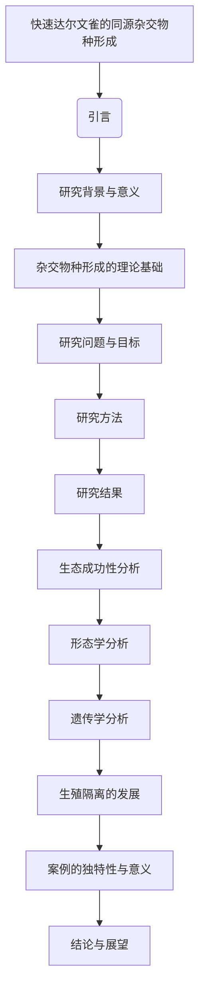

# 文献分析报告: darwin

<div align='center'></div>

---

## 目录
- [1. 文献元数据](#1-文献元数据)
- [1b. 图片内容分析](#1b-图片内容分析)
- [2. 方法学分析](#2-方法学分析)
- [3. 创新点提取](#3-创新点提取)
- [4. 问答对](#4-问答对)
- [5. 文献故事](#5-文献故事)
- [6. 文献逻辑脑图](#6-文献逻辑脑图)

---

## 1. 文献元数据
<details open>
<summary>点击展开/折叠</summary>

<table>
  <tr><th colspan='2' style='text-align:center;'>文献基本信息</th></tr>
  <tr><td><b>标题</b></td><td>Rapid hybrid speciation in Darwin's finches.</td></tr>
  <tr><td><b>作者</b></td><td>['Sangeet Lamichhaney', 'Fan Han', 'Matthew T Webster', 'Leif Andersson', 'B Rosemary Grant', 'Peter R Grant']</td></tr>
  <tr><td><b>DOI</b></td><td>10.1126/science.aao4593</td></tr>
  <tr><td><b>发表日期</b></td><td>2018-01-12</td></tr>
  <tr><td><b>期刊/来源</b></td><td>Science</td></tr>
</table>

<details>
<summary><b>Semantic Scholar 信息</b></summary>

<table>
  <tr><td><b>Paper ID</b></td><td>7fdd3e56f266c3532ada0d01ba0dba9b7cb61de1</td></tr>
  <tr><td><b>被引次数</b></td><td>248</td></tr>
</table>
</details>

<details>
<summary><b>PubMed 信息</b></summary>

<table>
  <tr><td><b>PMID</b></td><td>29170277</td></tr>
  <tr><td><b>摘要</b></td><td>Homoploid hybrid speciation in animals has been inferred frequently from patterns of variation, but few examples have withstood critical scrutiny. Here we report a directly documented example, from its origin to reproductive isolation. An immigrant Darwin's finch to Daphne Major in the Galápagos arc...</td></tr>
</table>
</details>

</details>


---

## 1b. 图片内容分析
<details open>
<summary>点击展开/折叠</summary>

<details>
<summary><b>图片 1</b>: <code>images\image_000.jpg</code></summary>


<b>结构化描述：</b><br>图片解析失败: AsyncCompletions.create() got an unexpected keyword argument 'images'
</details>

<details>
<summary><b>图片 2</b>: <code>images\image_001.jpg</code></summary>


<b>结构化描述：</b><br>图片解析失败: AsyncCompletions.create() got an unexpected keyword argument 'images'
</details>

<details>
<summary><b>图片 3</b>: <code>images\image_002.jpg</code></summary>


<b>结构化描述：</b><br>图片解析失败: AsyncCompletions.create() got an unexpected keyword argument 'images'
</details>

</details>


---

## 2. 方法学分析
<details open>
<summary>点击展开/折叠</summary>

```markdown
## 方法评估

### 方法类型
本研究属于**实验研究**。研究者通过长期生态观察和基因组测序相结合的方式，追踪了达尔文雀中新杂交物种的形成过程。

### 关键技术
1. **基因组测序**：用于确定新物种的遗传背景及其与亲本物种的关系。
2. **微卫星标记分析**：用于初步鉴定移民个体的来源。
3. **最大似然法构建系统发育树**：用于推断新物种的起源和进化路径。
4. **全基因组单核苷酸多态性（SNP）分析**：用于量化遗传多样性及基因流动模式。
5. **形态学测量**：包括身体大小、喙深度和宽度等特征的定量分析。
6. **统计模型**：如方差分析（ANOVA）、协方差分析（ANCOVA）等，用于检验显著性差异和趋势。

### 数据来源
数据来源于**自行采集**的数据。研究团队在加拉帕戈斯群岛的达芙妮岛进行了长达31年的野外观察，并结合基因组测序技术获取了详尽的遗传信息。

### 样本量描述
研究对象为一个由单一移民个体及其后代组成的杂交群体。从第一代到第六代，总样本量为42个个体，其中每一代的具体数量如下：
- 第一代：2个个体（移民个体及其配偶）
- 第二代：4个个体
- 第三代：8个个体
- 第四至六代：各代均约有10-12个个体

### 方法优点
1. **直接证据支持**：研究提供了从移民事件开始直至生殖隔离形成的完整记录，具有高度可信度。
2. **多维度分析**：结合生态学、行为学以及分子生物学手段，全面揭示了杂交物种形成的机制。
3. **时间跨度长**：长达31年的持续跟踪使得研究能够捕捉到自然选择作用下的快速演化过程。

### 方法局限性
1. **样本规模较小**：尽管研究覆盖了多个世代，但总体样本量仍然有限，可能影响某些统计结论的普适性。
2. **环境因素复杂**：野外条件下存在诸多不可控变量，如气候变化、食物资源波动等，这些都可能干扰实验结果。
3. **难以推广**：该案例发生在特定的小型岛屿生态系统中，其结果是否适用于其他更大的地理区域尚需进一步验证。

### 方法创新点
1. **首次实证案例**：这是首个被严格证明的同源杂交物种形成实例，填补了理论与实践之间的空白。
2. **揭示快速演化机制**：展示了即使在短时间内也能实现显著的表型分化和生殖隔离。
3. **整合多种技术**：将传统的生态学调查与现代分子生物学工具有机结合，开创了跨学科研究的新范式。
```

上述评估基于提供的文献内容进行整理，旨在客观反映研究方法的特点及其优缺点。
</details>


---

## 3. 创新点提取
<details open>
<summary>点击展开/折叠</summary>

```markdown
# 核心创新点
- 报告了达尔文雀中同源杂交物种形成（homoploid hybrid speciation）的直接证据，从起源到生殖隔离的全过程。
- 描述了一个由外来雄性达尔文雀与本地雌性达尔文雀杂交形成的独立新谱系（Big Bird 系列），并在三代内实现了显著的生殖隔离。
- 提供了基因组学和形态学数据支持，揭示了杂交过程中表型变异（如喙形）的遗传基础。

# 解决的问题
- 探索同源杂交物种形成的过程及其机制。
- 验证在自然条件下，杂交是否能够快速导致新物种的形成，并实现生殖隔离。

# 与现有工作相比的新颖性
- 这是首次通过直接观察和基因组学验证的同源杂交物种形成案例。
- 相较于传统观点认为同源杂交物种形成是一个缓慢过程，本研究展示了仅需三代即可完成生殖隔离。
- 强调了罕见事件（如极端选择压力）在物种形成中的重要作用。

# 潜在应用
- 生物多样性保护：理解物种形成机制有助于预测和保护濒危物种。
- 农业生态学：为改良作物或家畜提供杂交育种的理论依据。
- 进化生物学教育：作为教学案例展示快速进化和物种形成的过程。
- 岛屿生态系统管理：为小岛或孤立环境下的生物多样性保护提供指导。

# 未来研究方向
- 探索更多类似案例，进一步验证同源杂交物种形成的普遍性和速度。
- 研究基因组区域（如 ALX1 和 HMGA2）对表型变化的具体作用。
- 分析其他生态因素（如食物资源竞争）如何影响杂交物种的成功率。
- 扩展到其他动物类群，评估同源杂交物种形成在不同系统中的适用性。
```

### 补充说明
由于图片解析失败，无法进一步分析图片内容。但根据文献描述，可以推测图片可能展示了 Big Bird 系列的世代变化、基因组分析结果或形态学特征等关键信息。
</details>


---

## 4. 问答对
<details open>
<summary>点击展开/折叠</summary>

<details>
<summary><strong>问题 1:</strong> 什么是同源杂交物种形成？</summary>

<strong>回答:</strong> 同源杂交物种形成是指两个物种杂交后没有发生染色体加倍的情况下形成的新物种，这种现象在动物中较为罕见。
</details>

<details>
<summary><strong>问题 2:</strong> 文献中提到的达尔文雀快速杂交物种形成的例子是如何被直接记录下来的？</summary>

<strong>回答:</strong> 这个例子通过对其起源到生殖隔离的发展过程进行直接观察和记录，包括基因组测序和生态研究。
</details>

<details>
<summary><strong>问题 3:</strong> 这个新遗传谱系是如何开始的？</summary>

<strong>回答:</strong> 这个新遗传谱系是由一只移民的达尔文雀与当地的一种雀类（Geospiza fortis）杂交开始的。
</details>

<details>
<summary><strong>问题 4:</strong> 移民达尔文雀来自哪里？</summary>

<strong>回答:</strong> 移民达尔文雀被确定为一种大型仙人掌雀（G. conirostris），它起源于距离Daphne Major岛超过100公里的Española岛。
</details>

<details>
<summary><strong>问题 5:</strong> 新遗传谱系从第二代开始如何表现出繁殖隔离？</summary>

<strong>回答:</strong> 从第二代开始，该谱系内的个体只在内部繁殖，从而表现出繁殖隔离。
</details>

<details>
<summary><strong>问题 6:</strong> 为什么同源杂交物种形成在动物中被认为是罕见的？</summary>

<strong>回答:</strong> 同源杂交物种形成在动物中被认为是罕见的，因为通常需要数百代才能形成生殖隔离，而文献中展示的例子仅用了三代就实现了这一过程。
</details>

<details>
<summary><strong>问题 7:</strong> 文献中提到的可能涉及同源杂交物种形成的例子有哪些？</summary>

<strong>回答:</strong> 文献中提到的可能涉及同源杂交物种形成的例子包括植物、蝴蝶、苍蝇、鱼类、哺乳动物和鸟类。
</details>

<details>
<summary><strong>问题 8:</strong> 为什么Heliconius蝴蝶的例子被认为是严格的同源杂交物种形成案例？</summary>

<strong>回答:</strong> Heliconius蝴蝶的例子被认为是严格的同源杂交物种形成案例，因为它符合严格的标准来证明杂交是物种形成的原因。
</details>

<details>
<summary><strong>问题 9:</strong> 第一代移民达尔文雀的行为特征是什么？</summary>

<strong>回答:</strong> 第一代移民达尔文雀比中等地面雀（G. fortis）大70%，并且唱着与众不同的歌。
</details>

<details>
<summary><strong>问题 10:</strong> 移民达尔文雀与当地雀类的后代如何维持其独特性？</summary>

<strong>回答:</strong> 通过从第二代开始只在内部繁殖，该谱系的后代维持了其独特性。
</details>

<details>
<summary><strong>问题 11:</strong> 为什么从第三代开始，这个谱系被视为一个独立的物种？</summary>

<strong>回答:</strong> 从第三代开始，由于强烈的近亲繁殖和独特的形态特征，该谱系被视为一个独立的物种。
</details>

<details>
<summary><strong>问题 12:</strong> 这个谱系的生态成功主要归因于什么？</summary>

<strong>回答:</strong> 这个谱系的生态成功主要归因于其较大的喙和体型以及独特的歌声。
</details>

<details>
<summary><strong>问题 13:</strong> 为什么这个谱系的成员尽管近亲繁殖却仍然具有高适应性？</summary>

<strong>回答:</strong> 尽管存在近亲繁殖，该谱系的成员仍表现出高适应性，这可能是由于其独特的形态特征和生态优势。
</details>

<details>
<summary><strong>问题 14:</strong> 这个谱系的基因组多样性如何随时间变化？</summary>

<strong>回答:</strong> 随着世代的增加，该谱系的基因组平均核苷酸多样性逐渐下降，表明遗传漂变的影响。
</details>

<details>
<summary><strong>问题 15:</strong> 这个谱系的成员在形态上如何表现？</summary>

<strong>回答:</strong> 该谱系的成员在形态上表现为较大的喙和体型，且其喙的深度和宽度也发生了显著变化。
</details>

<details>
<summary><strong>问题 16:</strong> 这个谱系的成员在行为上如何表现？</summary>

<strong>回答:</strong> 该谱系的成员通过学习独特的歌声和形态特征来实现生殖隔离。
</details>

<details>
<summary><strong>问题 17:</strong> 这个谱系的成员如何通过其大喙和体型实现生态成功？</summary>

<strong>回答:</strong> 该谱系的成员通过其大喙和体型更有效地利用大型木质果实，尤其是在干旱季节和食物短缺时。
</details>

<details>
<summary><strong>问题 18:</strong> 这个谱系的成员如何通过其独特的歌声实现生殖隔离？</summary>

<strong>回答:</strong> 该谱系的成员通过其独特的歌声避免与其他物种的杂交，从而实现生殖隔离。
</details>

<details>
<summary><strong>问题 19:</strong> 这个谱系的成员如何通过转座分离产生新的表型？</summary>

<strong>回答:</strong> 该谱系的成员通过转座分离产生了极端的表型，这些表型可能由不同群体的不同互补基因组合引起。
</details>

<details>
<summary><strong>问题 20:</strong> 这个谱系的成员如何利用未被充分开发的食物资源？</summary>

<strong>回答:</strong> 该谱系的成员通过其大喙和体型，能够更好地利用未被充分开发的大型木质果实作为食物资源。
</details>

<details>
<summary><strong>问题 21:</strong> 这个谱系的成员如何通过自然选择实现进化？</summary>

<strong>回答:</strong> 该谱系的成员通过自然选择，其大喙和体型的特征得到了保留和优化，从而适应环境并实现进化。
</details>

<details>
<summary><strong>问题 22:</strong> 这个谱系的成员如何通过基因组中的特定基因位点实现大喙？</summary>

<strong>回答:</strong> 该谱系的成员通过基因组中的特定基因位点（如ALX1和HMGA2），实现了大喙的特征。
</details>

<details>
<summary><strong>问题 23:</strong> 这个谱系的成员如何通过学习歌曲和形态实现生殖隔离？</summary>

<strong>回答:</strong> 该谱系的成员通过学习独特的歌曲和形态特征，避免了与其他物种的杂交，从而实现生殖隔离。
</details>

<details>
<summary><strong>问题 24:</strong> 这个谱系的成员如何通过转座分离和自然选择实现快速物种形成？</summary>

<strong>回答:</strong> 该谱系的成员通过转座分离产生新的表型，并通过自然选择迅速适应环境，从而实现快速物种形成。
</details>

</details>


---

## 5. 文献故事
<details open>
<summary>点击展开/折叠</summary>

# 大鸟家族的传奇起源

在遥远的加拉帕戈斯群岛中，有一个名叫达芙妮的小岛，面积只有0.34平方公里。这里生活着各种各样的达尔文雀，它们是岛上最引人注目的居民之一。然而，在1981年的一天，一件不可思议的事情发生了——一只从未见过的年轻雄性雀鸟从天而降，出现在了这座小岛上。

这只陌生的雀鸟看起来像是一种常见的中地雀（Geospiza fortis），但它的体型却大得多，比同类要大出70%！更令人惊讶的是，它还唱着一种完全不同的歌。通过微卫星标记测试，科学家们推测它可能是来自邻近圣克鲁斯岛的一种杂交后代，但它的真正身份仍然是个谜。

## 奇迹般的相遇

这只移民雀鸟很快找到了自己的伴侣——一只当地的中地雀雌鸟。从那以后，它开始在这个小岛上繁衍生息。起初，它的后代与本地雀鸟交配，但随着时间推移，这些后代逐渐形成了一个独特的群体，只在内部繁殖，不再与其他种类的雀鸟混血。这种现象被称为“近亲繁殖”，通常会导致基因多样性下降，但在大鸟家族中却并非如此。

尽管经历了多次近亲繁殖，这个新形成的家族依然表现出了极高的适应能力和生存能力。到了第三代，这个家族已经完全独立于其他雀鸟种群之外，成为了一个全新的物种。这一过程仅仅用了三代时间，远远快于传统观点认为需要数百代才能完成的生殖隔离。

## 生态成功的关键因素

那么，是什么让这个新物种如此成功呢？答案在于它们的大喙和独特的声音。大喙使它们能够轻松处理坚硬的果实，尤其是在干旱季节或食物短缺的情况下。此外，雄性雀鸟会根据喙的形状和大小以及身体尺寸来选择配偶，而雌性则会模仿父母的行为特征。因此，大鸟家族的独特外观和声音成为了它们吸引异性的重要标志。

通过对整个家族成员的形态测量和全基因组测序，研究人员发现了一些关键线索。例如，ALX1基因的一个特定变异（BI和B2两种形式）与喙形密切相关。BI变异来源于创始雄鸟，而B2变异则来自中地雀。有趣的是，携带两个B2变异的个体拥有更短的喙，这表明不同基因组合对喙形有着显著影响。

## 突破性的进化

除了遗传上的变化，大鸟家族还展现出了“超分离”的特性，即后代的表现型超出了父母双方的范围。比如，第四到第六代的大鸟平均喙深比父母双方都要大，而且这种趋势还在继续增强。这种现象可能由表观遗传效应引起，也可能是因为不同种群间的互补基因相互作用所致。

进一步的研究揭示，HMGA2和ALX1这两个紧密相连的基因位点对喙形的变化起到了重要作用。其中，HMGA2位点上的L等位基因与较大的喙形相关联，并且其频率随着世代推移而增加。这表明自然选择正在推动这一变化的发生。

## 结语

大鸟家族的故事告诉我们，即使是在看似孤立的小岛上，也有可能发生快速而复杂的进化事件。通过结合生态学观察和基因组学分析，我们得以见证一个新物种从诞生到成熟的全过程。这不仅挑战了传统关于物种形成速度的认知，也为理解自然界中的多样性和适应性提供了宝贵案例。

所以，下次当你漫步在加拉帕戈斯群岛时，请记得留意那些看似普通却又充满奇迹的小生命——它们或许正书写着属于自己的传奇篇章。
</details>


---

## 6. 文献逻辑脑图
<details open>
<summary>点击展开/折叠</summary>


</details>

<hr>
<footer>
<p><b>报告生成时间:</b> 2025-05-15 13:40:28</p>
<p><i>此报告由 SLAIS (Scientific Literature AI Insight System) 自动生成</i></p>

<style>
  body { 
    font-family: Arial, sans-serif; 
    line-height: 1.6;
    color: #333;
    max-width: 1200px;
    margin: 0 auto;
    padding: 0 20px;
  }
  h1 { color: #2c3e50; border-bottom: 2px solid #3498db; padding-bottom: 10px; }
  h2 { color: #2980b9; margin-top: 30px; border-bottom: 1px solid #bdc3c7; padding-bottom: 5px; }
  h3 { color: #3498db; }
  details { margin-bottom: 20px; padding: 10px; border: 1px solid #e0e0e0; border-radius: 5px; }
  summary { cursor: pointer; font-weight: bold; }
  table { width: 100%; border-collapse: collapse; margin-bottom: 20px; }
  th, td { padding: 12px; text-align: left; border-bottom: 1px solid #e0e0e0; }
  th { background-color: #f5f5f5; }
  .qa-container details { background-color: #f9f9f9; margin-bottom: 10px; }
  .qa-container summary { background-color: #f1f1f1; padding: 10px; }
  code { background-color: #f5f5f5; padding: 2px 5px; border-radius: 3px; }
  pre { background-color: #f5f5f5; padding: 15px; border-radius: 5px; overflow-x: auto; }
  hr { border: 0; border-top: 1px solid #e0e0e0; margin: 30px 0; }
  footer { text-align: center; margin-top: 50px; font-size: 0.9em; color: #7f8c8d; }
</style>

</footer>