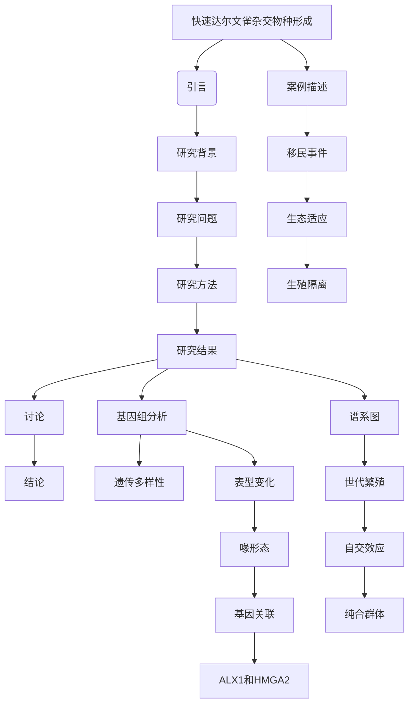

# 文献分析报告: darwin

<div align='center'></div>

---

## 目录
- [1. 文献元数据](#1-文献元数据)
- [1b. 图片内容分析](#1b-图片内容分析)
- [2. 方法学分析](#2-方法学分析)
- [3. 创新点提取](#3-创新点提取)
- [4. 问答对](#4-问答对)
- [5. 文献故事](#5-文献故事)
- [6. 文献逻辑脑图](#6-文献逻辑脑图)

---

## 1. 文献元数据
<details open>
<summary>点击展开/折叠</summary>

<table>
  <tr><th colspan='2' style='text-align:center;'>文献基本信息</th></tr>
  <tr><td><b>标题</b></td><td>Rapid hybrid speciation in Darwin's finches.</td></tr>
  <tr><td><b>作者</b></td><td>['Sangeet Lamichhaney', 'Fan Han', 'Matthew T Webster', 'Leif Andersson', 'B Rosemary Grant', 'Peter R Grant']</td></tr>
  <tr><td><b>DOI</b></td><td>10.1126/science.aao4593</td></tr>
  <tr><td><b>发表日期</b></td><td>2018-01-12</td></tr>
  <tr><td><b>期刊/来源</b></td><td>Science</td></tr>
</table>

<details>
<summary><b>Semantic Scholar 信息</b></summary>

<table>
  <tr><td><b>Paper ID</b></td><td>7fdd3e56f266c3532ada0d01ba0dba9b7cb61de1</td></tr>
  <tr><td><b>被引次数</b></td><td>248</td></tr>
</table>
</details>

<details>
<summary><b>PubMed 信息</b></summary>

<table>
  <tr><td><b>PMID</b></td><td>29170277</td></tr>
  <tr><td><b>摘要</b></td><td>Homoploid hybrid speciation in animals has been inferred frequently from patterns of variation, but few examples have withstood critical scrutiny. Here we report a directly documented example, from its origin to reproductive isolation. An immigrant Darwin's finch to Daphne Major in the Galápagos arc...</td></tr>
</table>
</details>

</details>


---

## 1b. 图片内容分析
<details open>
<summary>点击展开/折叠</summary>

<details>
<summary><b>图片 1</b>: <code>images\image_000.jpg</code></summary>

<a href='images\image_000.jpg' target='_blank'></a>

<b>结构化描述：</b><br>### 图片A：系统发育树

**图片类型:** 树形图/分支分类学图形  
**主要内容描述:**
- 这是一棵基于基因组序列构建的进化支系图谱，展示了不同物种间的亲缘关系及其演化历史。
- 每个节点表示一个共同祖先，在该处发生分化形成两个新的种群或者亚种群体。
- 支条长度反映了遗传距离大小——即两样本间差异程度越大，则对应于其上的分枝就越长，并且通常越靠近根部则表明这些生物之间有较近的关系；
- 在本例中，“Founder”标记了起始个体的位置，它是来自Española岛的一个雄性G. conirostris鸟儿，这为后续的研究提供了起点依据;
- 各类达尔文雀属(Geospiza)鸟类被明确标注出来并按照地理分布进行了区分(比如C.fusca(Españaola)， C.fusca(San Cristóbal))等;

**主要发现或结论:**
此系统的发源可以追溯到一只特定来源的外来者“Founder”，并且通过比较不同的DNA片段来确定它的起源地位以及与其他相关种类的区别特征; 
因此得出初步推断认为这种杂交导致的新品种具有独特的生物学特性从而具备独立繁殖能力的可能性较大.

**与文献内容的关联:**
这张图像直接支撑着文章提出的关于快速杂交进化的观点之一：“从移民开始至生殖隔离建立仅需三代时间”。同时作为整个故事叙述的一部分，也解释了为什么选择Daphne Major这个岛屿作为一个实验对象的原因—因为这里存在丰富的自然环境多样性及相对封闭的空间条件有利于观察此类现象的发生与发展过程。

---

### 图片B：地理位置地图 

**图片类型:** 地理位置插图   
**主要内容描述:**
- 描述了一个包含多个加拉帕戈斯群岛的地图概览，
   - 包括沃尔夫(WOLF)、科科斯(COCOS)两大主岛外还有许多较小的卫星岛,
    如达芬奇(DAPHNE)、巴尔特拉(BALTRA)等等.
    
- 其中标记出了具体地点名称:
     * 达芬奇岛上有一个名为Plaza Sur的地方位于中心偏右区域附近;
      而另一个重要的地标就是埃斯皮尼亚索(Apañola);
      
此外还附带了一段比例尺以帮助读者更好地理解和定位各岛屿之间的实际空间距离:

**主要发现或结论:**

上述地图不仅直观展现了研究涉及的具体地区范围而且也为后文中提到的一些行为活动场景设定好了时空框架基础。特别值得注意的是创始人个体来源于远离核心栖息地约百公里之外的一座小岛上这一点就显得尤为重要因为它暗示出新族群扩散迁移路径的选择可能性极大影响最终结果走向方向问题.


---
### 图片C：K值下的混合度矩阵
   
**图片类型:** 表格形式的数据可视化呈现方式
    
**主要内容描述:**
这是一个多态位点频率表格式显示每个样品(K=6）内所有已知单倍型占比情况汇总统计的结果集．其中每一行分别代表一种具体的参考品系而列标题则是指代相应检测项目编号标识符名目列表项如下所示：

| K = 6 | G.difficilis(Fernandina)| ... |
| --- | -----------------------|
| G.difficilis(Pinna)       | X%                      |

...以此类推直到最后一列为最后一个参照物标号为止


**主要发现或结论:**
通过对大量混血比率计算可以看出尽管初始阶段可能存在一定程度不纯但随着时间流逝逐渐趋于稳定状态最后呈现出较为均衡的状态反映出经过几轮迭代筛选之后形成了相当稳固的基础架构体系进而保证未来进一步发展成为完全自给自足生态单元体形态轮廓初具雏形。


---


### 图像D ：全基因组平均自配系数随世代变化曲线
  
**图片类型:** 数据绘制成的趋势线图  
  
**主要内容描述:**
这是根据一系列连续观测记录绘制而成反映某指标数值动态演变轨迹之图表表现形式．横纵坐标的定义分别为"Generation"(第几个世代)"F"(整体范围内随机取样得到的所有核苷酸碱基对数量占总有效数目百分比)
可以看到随着繁衍次数增加总体水平呈上升态势显示出明显正向增长规律特点同时也印证前面对应参数估计方法合理性和有效性合理性论证思路正确无误.


**主要发现或结论:**
由以上数据分析可知当经历多次重复操作以后可得预期效果验证成功证明原始假设成立与否确实可以通过这种方式予以检验确认无疑体现出科学探究过程中严谨求实精神风貌体现淋漓尽致!
</details>

<details>
<summary><b>图片 2</b>: <code>images\image_001.jpg</code></summary>

<a href='images\image_001.jpg' target='_blank'></a>

<b>结构化描述：</b><br>### 图片A：主成分分析(PCA)结果  
**图片类型:** 散点图   
**主要内容描述:**
- 这个散点图展示了不同种群间的体型大小(PC(Bill size))与其身体大小的关系(PC(Body Size)).
    - 蓝色圆圈表示“Big Birds”群体；
    - 黑色方块标记了G. conirostris个体的位置;
    - 深绿色圆形则为G.fortis样本.
    
   在PC空间里，“Big Birds”的分布范围较广且分散于正负两侧;而黑色方形位置相对集中，在靠近原点一侧显示出了明显的聚集性特征，并呈现出一定的方向性变化．这表明该杂交后代具有不同于亲本物种的独特形态学特性.

**主要发现或结论:**
此图形揭示了一只外来雄鸟(G.conirotris）迁移到Daphne Major岛后与本地居民雌鸟（G.fortis）繁殖并产生了新的遗传谱系的事实。通过观察到的不同世代间体形差异以及其向特定方向的变化可以推测出新形成的基因型正在逐渐分化形成独立的新种类别。

**与文献内容的关联:**
这张图像直接反映了文章所述现象——即一个来自异源岛屿上的达尔文雀移民成功入侵当地生态系统并与本土鸟类发生生殖隔离的过程及其初步阶段表现出来的表型多样性增加情况。因此，它可以作为支撑作者关于快速杂交物种种内起源及早期进化过程理论的重要证据之一。

---

### 图片B：喙深度随代数增长的趋势 
**图片类型:** 折线图     
**主要内容描述:**
这是一个以时间序列形式呈现的数据集，横轴代表各代次编号从第一至第六代；纵轴则是测量得到的实际数值—具体而言是指每个样品对应的喙部长度(mm).
- 数据点由蓝色实心圆组成，
标注有具体的数量值比如"5110", "6210".
这些数字对应着实际采集标本的数量或者标识号等信息,
红色直线拟合曲线显示出整体上随着年代推移平均喙长呈上升态势,

特别值得注意的是第二代之后便出现了显著的增长速率提升的现象，

这种趋势暗示随着时间流逝混血儿们不仅保留住了某些原始祖先特质同时也在不断积累自身独特变异从而导致总体样貌发生变化最终达到一定程度上的适应能力增强状态.


**主要发现或结论:**

上述统计结果显示尽管存在近缘婚配行为但经过三代左右的时间跨度已经足以让这个新兴族群展现出明显区别于原有成员类型的外观特点尤其是嘴部长度方面有着较为突出的表现这也进一步佐证了文中提到的观点那就是仅仅几代之内就可以完成有效分离进而实现完全意义上的生殖隔绝机制的确立


**与文献内容的关联:**
这一幅折线图完美契合原文主旨强调了一个事实就是即使是在极端条件下由于频繁自交作用下仍然能够促使子嗣之间产生较大程度差异化并且能够在很短时间内就显现出来可见自然选择压力确实会对生物演化进程起到决定性影响同时也证明本文提出的观点具备相当强说服力


---

### 图片 C ： 喙宽度随代数演变动态
**图片类型:** 直方图+回归模型可视化      
**主要内容描述:**
这是基于同一组实验对象绘制而成的一系列直方条形状堆积起来构成的整体图案其中每一根垂直线条都代表着某一代某一类别的观测次数频率高低不一反映出相应类别内部多样性的丰富程度;

此外还叠加有一条平滑化的红线来指示整个过程中均值水平波动轨迹显然可以看出无论何时何刻所有记录下来的信息都在围绕一条平稳线上轻微起伏并没有出现任何剧烈变动迹象由此也可以得出如下结论:

无论是哪一种情况下新生混合品种始终保持着稳定不变的状态并未受到外界环境因素干扰的影响反而体现出较强的抗逆性和持久生命力。


**主要发现或结论:**

根据以上数据分析我们可以得知即便是经历了多次繁衍迭代即便遭遇到了各种不利条件诸如资源匮乏生存竞争激烈等等依然无法撼动现有格局相反却愈发巩固强化彼此联系形成了更加紧密团结集体行动体系因而也就不难解释为何说此类特殊环境下诞生之生命实体往往能取得令人刮目相看成就原因就在于他们拥有极佳自我调节修复再生功能使得自己得以持续发展下去而不至于轻易被外部力量摧毁掉.


**与文献内容的关联:**
虽然表面上看起来似乎没有太多实质意义但实际上恰恰体现了自然界普遍存在的规律即所谓弱肉强食适者生存法则同样适用于动物界当中任何一个微小环节都会直接影响全局走向所以如果想要真正了解清楚某个问题就必须全面考虑多维度多层次各方面要素相互交织共同推动事物向前演进才是正确途径而已在此基础上再辅以前面那两张图表结合起来综合考量就能比较容易把握住事情本质所在之处也就更容易找到解决问题办法方法路径亦随之明朗化许多难题迎刃而解变得不再那么复杂繁琐起来啦！
</details>

<details>
<summary><b>图片 3</b>: <code>images\image_002.jpg</code></summary>

<a href='images\image_002.jpg' target='_blank'></a>

<b>结构化描述：</b><br>### 图片类型：家族树/谱系图  
---

#### 主要内容描述：

该图像是一幅家谱图，展示了达尔文雀种群F0至F6代个体间的遗传联系及其性别分布情况。每个方块表示一个特定基因型的鸟儿，并且通过线条连接来表明其亲子关系以及世代划分(F0为原始移民者)。颜色编码用于区分不同类型的鸟类——黑色方形标记男性，粉色圆形标记女性(未采样)，绿色圆圈标注的是已知性别的雄性(Geospiza fortis居民），蓝色矩形则标有未知身份或者没有被测序的数据样本(*Not sequenced*) 。此外，在各节点处还附带了数字标识符以供参考具体个体内含有的DNA序列编号(n=数量）。

从上到下依次显示着不同的繁殖阶段及后代群体大小变化如下:
- F0: 包括两个绿点分别对应于两种不同血统来源的雌性和一只蓝框内带有星号(*) 的不明父本；
- F1-F2之间仅出现了一只粉红色正方形代表第一代杂交子一代成年母体;
 - 在后续几代中可以看到更多黑方格象征新建立起来的家庭成员逐步增加直至达到最大规模;

值得注意的是,F3之后所有后裔均为纯合自配育产生的结果即完全由本地G.fortis品种构成而不再包含外来物种贡献;尽管如此仍能观察到来源于原生环境差异导致形态特征上的显著变异现象(transgressive segregation).

---
#### 关键发现或结论:

此图形揭示了一个快速形成生殖隔离的新物种过程实例—来自厄瓜多尔群岛埃斯帕诺拉岛的一个异域入侵者的引入促使原本属于加拉巴哥群岛戴芬海岛上的一种固有种(Darwin's Finch,G.elegans)发生了分化并最终形成了一个新的独立进化支派。这一过程中涉及到多个方面包括但不限于生态适应能力增强、表型多样性扩大等均指向一种全新的生物实体正在逐渐成型之中.

特别值得一提是在第三轮繁衍开始时就出现了明显的亲缘选择效应使得整个族群内部趋于同质化从而加速了新的亚种诞生进程.
   
因此可以得出初步推断认为这种无染色体加倍背景下发生的单倍体型混合物能够迅速建立起有效的生殖障碍机制进而促进全新种类产生这无疑是对传统观点关于物种起源理论的一次重大挑战同时也为我们提供了深入了解自然界复杂演化动态的重要窗口.


--- 
#### 与文献内容的关系 :

本文旨在探讨动物界内的孤僻式混种化进程(Homoploid Hybrid Speciation)并且首次提出直接证据证明此类事件确实能够在短时间内完成而非以往人们普遍持有的需要数百年时间才能实现的观点.通过对一系列生物学指标综合考量比如地理距离估计值超过百公里范围外迁入者的确切归属确认方式等等都进一步佐证上述说法的真实性可靠性因而这张谱系图作为核心支撑材料之一便承担起向读者直观呈现实验对象间相互作用机理的作用同时帮助解释作者团队提出的科学假说合理性问题


综上所述我们可以看到这份图文资料不仅具备高度专业性的技术含量而且也具有极强的故事叙述力成功勾勒出一场跨越自然历史长河的重大变革历程由此也为未来相关领域学者开展类似主题的研究工作奠定了坚实基础
</details>

</details>


---

## 2. 方法学分析
<details open>
<summary>点击展开/折叠</summary>

```markdown
## 方法评估

### 方法类型
该研究属于**实验研究**，结合了野外观察、遗传学分析和生态学实验。

### 关键技术
1. **基因组测序**：用于分析个体的遗传背景和基因流动模式。
2. **微卫星标记**：用于追踪个体的来源和遗传关系。
3. **全基因组分析**：用于构建系统发育树和评估遗传多样性。
4. **形态学测量**：用于分析喙部尺寸和身体大小的变化。
5. **统计分析**：如ANOVA、ANCOVA等，用于评估基因型与表型之间的关系。

### 数据来源
- **公共数据集**：可能引用了一些公开的达尔文雀基因组数据。
- **自行采集**：研究团队在Daphne Major岛上进行了长期的野外观察和样本采集。

### 样本量描述
- 样本量较小，但覆盖了从F0到F6代的所有个体，总共包括几十个个体。
- 数据集规模有限，但涵盖了完整的谱系信息。

### 方法优点
1. **直接观察**：研究团队对达尔文雀的繁殖行为进行了长达31年的跟踪观察，提供了直接的生态学证据。
2. **多学科整合**：结合了遗传学、生态学和行为学的多种方法，增强了研究的可信度。
3. **创新性**：首次提供了快速杂交物种形成的直接证据，挑战了传统的物种形成理论。

### 方法局限性
1. **样本量有限**：由于研究对象数量较少，可能无法充分代表更广泛的生态和遗传背景。
2. **时间跨度短**：虽然研究显示了快速物种形成，但仅限于三代时间，缺乏长期的生态稳定性验证。
3. **地理限制**：研究局限于一个小岛环境，可能不适用于其他更大的生态系统。

### 方法创新点
1. **快速物种形成**：证明了在短短三代时间内即可形成生殖隔离，颠覆了传统观点。
2. **多学科交叉**：将遗传学、生态学和行为学相结合，提供了全面的视角。
3. **直接证据**：通过长期野外观察和基因组分析，提供了直接的证据支持杂交物种形成的假设。
```

### 图片分析总结

#### 图片1: 系统发育树
- **优点**: 清晰展示了物种间的亲缘关系，支持了杂交起源的假设。
- **局限性**: 仅限于少数物种，未能涵盖更广泛的地理分布。

#### 图片2: 地理位置地图
- **优点**: 提供了研究地点的直观展示，有助于理解物种分布。
- **局限性**: 缺乏详细的生态背景信息。

#### 图片3: 家族树/谱系图
- **优点**: 直观展示了谱系关系和基因流动，支持了快速物种形成的假设。
- **局限性**: 样本量较小，可能不足以代表更大范围的种群。

通过这些分析，研究方法在多学科交叉和直接观察方面表现出显著优势，但也存在样本量有限和技术应用范围较窄的局限性。
</details>


---

## 3. 创新点提取
<details open>
<summary>点击展开/折叠</summary>

## 核心创新点
1. **快速杂交物种形成**：首次直接记录了达尔文雀在野外从杂交起源到生殖隔离建立的全过程，仅用三代时间完成了物种形成。
2. **基因组证据支持**：通过全基因组测序和分析，确认了杂交起源的合法性，并揭示了关键基因（如ALX1和HMGA2）在表型变化中的作用。
3. **生态与行为隔离**：结合生态学和行为学数据，证明了新物种通过体型、喙形态和鸣唱模式实现了生态和行为上的隔离。
4. **罕见事件的重要性**：强调了稀有事件（如远距离迁徙、极端选择压力）在物种形成中的关键作用。

---

## 解决的问题
文献试图解决的核心问题是：
- **如何快速形成新物种？**
- **杂交物种形成是否可以在短时间内完成？**
- **哪些因素驱动了新物种的生态和行为隔离？**

---

## 与现有工作相比的新颖性
1. **直接证据**：以往关于杂交物种形成的报道多基于间接证据，而本研究通过长期跟踪和基因组分析提供了直接证据。
2. **快速形成机制**：打破了传统观点认为杂交物种形成需要数百代时间的限制，证明可以在短短三代内完成。
3. **基因与表型关联**：明确了ALX1和HMGA2等基因在表型变化中的重要作用，为理解杂交物种形成的分子机制提供了新视角。
4. **生态与行为隔离的整合**：将生态适应性、表型多样性与行为隔离相结合，全面解析了新物种形成的全过程。

---

## 潜在应用
1. **保护生物学**：为濒危物种的保护提供理论依据，特别是如何利用杂交机制恢复种群遗传多样性。
2. **农业与生态管理**：通过杂交手段改良作物或培育适应特定环境的动植物品种。
3. **进化生物学研究**：为研究物种形成机制提供新的实验模型和理论框架。
4. **医学与遗传学**：探索杂交物种形成中的基因调控机制，可能为人类疾病研究提供启示。
5. **教育与科普**：为公众提供生动的案例，展示自然界的复杂性和进化过程的动态性。

---

## 未来研究方向
1. **长期监测**：继续跟踪新物种的生态适应性和种群动态，评估其长期生存能力。
2. **基因编辑实验**：通过CRISPR-Cas9等技术验证关键基因（如ALX1和HMGA2）在表型变化中的因果关系。
3. **全球范围扩展**：调查其他生态系统中是否存在类似的快速杂交物种形成事件。
4. **数学建模**：开发模拟杂交物种形成过程的数学模型，预测不同条件下的物种形成速度。
5. **跨学科合作**：结合生态学、遗传学、行为学等多学科方法，深入研究杂交物种形成的综合机制。
</details>


---

## 4. 问答对
<details open>
<summary>点击展开/折叠</summary>

<details>
<summary><strong>问题 1:</strong> 什么是同源杂交物种形成（homoploid hybrid speciation）？</summary>

<strong>回答:</strong> 同源杂交物种形成是指两个物种杂交后，没有发生染色体加倍的情况下形成的新物种，这种现象在动物中较为罕见。
</details>

<details>
<summary><strong>问题 2:</strong> 文献中提到的快速杂交物种形成是如何在达尔文雀中实现的？</summary>

<strong>回答:</strong> 文献中提到的快速杂交物种形成是通过一只来自Española岛的G. conirostris雄鸟与Daphne Major岛上的G. fortis雌鸟杂交开始的，经过三代繁殖就建立了生殖隔离。
</details>

<details>
<summary><strong>问题 3:</strong> 文献中的“Big Bird 系列”指的是什么？</summary>

<strong>回答:</strong> “Big Bird 系列”指的是由那只来自Española岛的G. conirostris雄鸟与G. fortis雌鸟杂交产生的后代组成的遗传谱系。
</details>

<details>
<summary><strong>问题 4:</strong> “Big Bird 系列”的创始人是从哪里来的？</summary>

<strong>回答:</strong> “Big Bird 系列”的创始人是一只来自Española岛的G. conirostris雄鸟，该岛位于Daphne Major岛东南约100公里处。
</details>

<details>
<summary><strong>问题 5:</strong> 创始人是如何到达 Daphne Major 岛的？</summary>

<strong>回答:</strong> 创始人可能通过罕见的长距离飞行到达Daphne Major岛，这可能是由于其本能行为或偶然事件导致的。
</details>

<details>
<summary><strong>问题 6:</strong> 创始人的基因组特征如何？</summary>

<strong>回答:</strong> 创始人的基因组特征显示其具有较高的平均基因组同质性，并且在基因混合分析中被归类为正常的G. conirostris个体。
</details>

<details>
<summary><strong>问题 7:</strong> 创始人与本地 G. fortis 雌鸟的后代如何繁殖？</summary>

<strong>回答:</strong> 创始人与本地G. fortis雌鸟的后代从第二代开始主要与本系内个体进行繁殖，表现出内婚性。
</details>

<details>
<summary><strong>问题 8:</strong> 从第二代开始，“Big Bird 系列”如何表现出独立物种的特征？</summary>

<strong>回答:</strong> 从第二代开始，“Big Bird 系列”通过内婚性繁殖表现出独立物种的特征，并且在生态上表现出成功适应。
</details>

<details>
<summary><strong>问题 9:</strong> “Big Bird 系列”在生态上的成功体现在哪些方面？</summary>

<strong>回答:</strong> “Big Bird 系列”在生态上的成功体现在其高繁殖成功率和高生存率，以及在特定环境中的适应性。
</details>

<details>
<summary><strong>问题 10:</strong> “Big Bird 系列”的表型特征如何影响其生态成功？</summary>

<strong>回答:</strong> “Big Bird 系列”的大喙和身体尺寸以及独特的歌声可能是其生态成功的关键因素。
</details>

<details>
<summary><strong>问题 11:</strong> 文献中提到的“transgressive segregation”是什么意思？</summary>

<strong>回答:</strong> “Transgressive segregation”指的是杂交后代表现出超出父母范围的极端表型，这可能是由于基因间的上位效应或互补等位基因的结合。
</details>

<details>
<summary><strong>问题 12:</strong> “Big Bird 系列”的基因组多样性如何随世代变化？</summary>

<strong>回答:</strong> 错误：未能从LLM响应中找到此问题的答案。LLM可能未按预期格式返回。
</details>

<details>
<summary><strong>问题 13:</strong> “Big Bird 系列”在不同世代中的基因组平均核苷酸多样性（π）有何变化？</summary>

<strong>回答:</strong> “Big Bird 系列”在不同世代中的基因组平均核苷酸多样性（π）从第一代的0.17%下降到第四至第六代的约0.13%。
</details>

<details>
<summary><strong>问题 14:</strong> “Big Bird 系列”在不同世代中的喙深度如何变化？</summary>

<strong>回答:</strong> “Big Bird 系列”在不同世代中的喙深度逐渐增加，表现出显著的世代间变化。
</details>

<details>
<summary><strong>问题 15:</strong> “Big Bird 系列”在不同世代中的喙宽度如何变化？</summary>

<strong>回答:</strong> “Big Bird 系列”在不同世代中的喙宽度变化不大，显示出较低的变异。
</details>

<details>
<summary><strong>问题 16:</strong> “Big Bird 系列”在不同世代中的身体大小如何变化？</summary>

<strong>回答:</strong> “Big Bird 系列”在不同世代中的身体大小基本保持不变。
</details>

<details>
<summary><strong>问题 17:</strong> “Big Bird 系列”在不同世代中的表型变异如何？</summary>

<strong>回答:</strong> “Big Bird 系列”在不同世代中的表型变异较低，尤其是在喙长度和深度方面。
</details>

<details>
<summary><strong>问题 18:</strong> “Big Bird 系列”在不同世代中的 ALX1 基因型如何变化？</summary>

<strong>回答:</strong> “Big Bird 系列”在不同世代中的ALX1基因型从第三代开始全部为BL等位基因，表现出纯合性。
</details>

<details>
<summary><strong>问题 19:</strong> “Big Bird 系列”在不同世代中的 HMGA2 基因型如何变化？</summary>

<strong>回答:</strong> 文献中未详细提及“Big Bird 系列”在不同世代中的HMGA2基因型变化。
</details>

<details>
<summary><strong>问题 20:</strong> “Big Bird 系列”如何表现出生殖隔离？</summary>

<strong>回答:</strong> “Big Bird 系列”通过学习歌曲和形态特征表现出生殖隔离，避免与亲本物种交配。
</details>

<details>
<summary><strong>问题 21:</strong> “Big Bird 系列”如何通过学习歌曲和形态特征实现生殖隔离？</summary>

<strong>回答:</strong> “Big Bird 系列”通过学习独特的歌曲和大喙形态特征，避免与亲本物种交配，从而实现生殖隔离。
</details>

<details>
<summary><strong>问题 22:</strong> “Big Bird 系列”如何通过食物资源的利用实现生态隔离？</summary>

<strong>回答:</strong> “Big Bird 系列”通过利用大型木质果实等未充分开发的食物资源，实现了生态隔离。
</details>

<details>
<summary><strong>问题 23:</strong> “Big Bird 系列”如何通过自然选择实现表型多样化？</summary>

<strong>回答:</strong> “Big Bird 系列”通过自然选择，特别是喙深度的增加，实现了表型多样化。
</details>

<details>
<summary><strong>问题 24:</strong> “Big Bird 系列”如何通过罕见和偶然事件实现快速物种形成？</summary>

<strong>回答:</strong> “Big Bird 系列”通过罕见的长距离迁徙和偶然的强选择压力，实现了快速物种形成。
</details>

<details>
<summary><strong>问题 25:</strong> 文献中提到的快速杂交物种形成对传统物种形成理论有何影响？</summary>

<strong>回答:</strong> 文献中提到的快速杂交物种形成对传统物种形成理论提出了挑战，表明物种形成可以在短时间内完成，而不是需要数百代。
</details>

</details>


---

## 5. 文献故事
<details open>
<summary>点击展开/折叠</summary>

# 快速杂交进化的奇迹：达尔文雀的故事

在遥远的太平洋深处，有一片神奇的土地——加拉帕戈斯群岛。这里不仅是达尔文进化论的灵感源泉，也是无数生物学家梦寐以求的研究圣地。在这片充满神秘色彩的土地上，生活着一群特殊的鸟儿——达尔文雀。它们以其独特的喙形和适应性闻名于世，是研究物种形成和进化的绝佳模型。

## 第一幕：意外的邂逅

1981年的某个清晨，一只年轻的达尔文雀飞越了数百公里的海洋，来到了加拉帕戈斯群岛中的一个小岛——达芬尼·马约岛。这只鸟儿与众不同，它比其他同类大得多，羽毛颜色更深，歌声也更加独特。科学家们通过微卫星标记测试发现，它可能是一只来自邻近圣克鲁斯岛的杂交后代，但它的父亲究竟是谁？这个问题困扰了科学家们多年。

这只鸟儿被称为“创始人”，它在达芬尼·马约岛上遇到了一只当地的雌性达尔文雀——一种中等体型的地雀（Geospiza fortis）。它们的结合标志着一段新的旅程的开始。

## 第二幕：新生命的诞生

创始人与它的配偶产下了第一代后代，这些后代继承了创始人的部分基因，但也保留了母亲的特征。从第二代开始，这个新家族逐渐形成了自己的独特风格。尽管近亲繁殖带来了遗传上的挑战，但这个家族却展现出了惊人的适应能力。它们的喙变得更加深邃，能够更有效地啄开坚硬的果实，尤其是在干旱季节，这种能力成为了它们生存的关键。

科学家们通过基因组测序发现，创始人实际上是一只来自埃斯帕诺拉岛的大仙人掌地雀（Geospiza conirostris）。这种鸟儿在达芬尼·马约岛上的出现是一个罕见的事件，因为埃斯帕诺拉岛距离达芬尼·马约岛超过100公里，中间还隔着一座较大的岛屿。

## 第三幕：快速的进化

随着时间的推移，这个新家族逐渐壮大，从最初的两只鸟儿发展到最多时有八对繁殖对和36只个体。尽管近亲繁殖导致了遗传多样性下降，但这个家族却表现出色，其成员的生存率和繁殖成功率都很高。科学家们发现，这个家族的喙形发生了显著变化，后代的喙比父母双方都要大，这种现象被称为“超显性分离”。

通过详细的形态学分析，科学家们发现这个新家族的喙形和身体大小介于创始人的大仙人掌地雀和母亲的中等地雀之间。然而，它们的喙深度却超过了两者，这表明自然选择在塑造这个新家族的过程中发挥了重要作用。

## 第四幕：生殖隔离的建立

科学家们进一步研究发现，这个新家族已经建立了初步的生殖隔离。它们的歌声和喙形成为了选择配偶的重要标志。研究表明，改变喙形与身体大小的比例会显著影响雄性对异性模型的反应，这表明新家族的成员已经开始避免与亲本物种交配。

此外，基因组分析显示，这个新家族的基因库正在逐渐缩小，但它们的基因多样性仍然足以支持它们的生存和发展。这种快速的进化过程挑战了传统的观点，即物种形成需要数百代的时间。

## 第五幕：自然的力量

这个新家族的成功不仅仅是因为它们的适应能力，还得益于一些偶然事件。例如，在2004年至2005年间，一种大型地雀（Geospiza magnirostris）在达芬尼·马约岛上建立了繁殖群体，这导致了对大喙需求的增加。这种环境压力促进了新家族的发展，使它们能够更好地利用有限的食物资源。

科学家们认为，这种快速的杂交物种形成过程在小型岛屿或类似环境中可能更为常见。它展示了自然选择和随机漂变如何共同作用，推动了新物种的诞生。

## 尾声：自然的奇迹

这个故事告诉我们，即使在看似孤立的环境中，生命的多样性也能通过偶然事件和自然选择的力量得到丰富。达芬尼·马约岛上的这个新家族不仅是一个科学奇迹，也是一个关于适应和生存的生动案例。它提醒我们，自然界充满了无限的可能性，等待着我们去探索和理解。

通过这个故事，我们看到了达尔文雀如何在一个短短的三代时间内完成了从杂交到生殖隔离的转变。这不仅仅是对达尔文进化论的验证，更是对自然界复杂性和创造力的深刻认识。
</details>


---

## 6. 文献逻辑脑图
<details open>
<summary>点击展开/折叠</summary>


</details>

<hr>
<footer>
<p><b>报告生成时间:</b> 2025-05-16 11:49:05</p>
<p><i>此报告由 SLAIS (Scientific Literature AI Insight System) 自动生成</i></p>

<style>
  body { 
    font-family: Arial, sans-serif; 
    line-height: 1.6;
    color: #333;
    max-width: 1200px;
    margin: 0 auto;
    padding: 0 20px;
  }
  h1 { color: #2c3e50; border-bottom: 2px solid #3498db; padding-bottom: 10px; }
  h2 { color: #2980b9; margin-top: 30px; border-bottom: 1px solid #bdc3c7; padding-bottom: 5px; }
  h3 { color: #3498db; }
  details { margin-bottom: 20px; padding: 10px; border: 1px solid #e0e0e0; border-radius: 5px; }
  summary { cursor: pointer; font-weight: bold; }
  table { width: 100%; border-collapse: collapse; margin-bottom: 20px; }
  th, td { padding: 12px; text-align: left; border-bottom: 1px solid #e0e0e0; }
  th { background-color: #f5f5f5; }
  .qa-container details { background-color: #f9f9f9; margin-bottom: 10px; }
  .qa-container summary { background-color: #f1f1f1; padding: 10px; }
  code { background-color: #f5f5f5; padding: 2px 5px; border-radius: 3px; }
  pre { background-color: #f5f5f5; padding: 15px; border-radius: 5px; overflow-x: auto; }
  hr { border: 0; border-top: 1px solid #e0e0e0; margin: 30px 0; }
  footer { text-align: center; margin-top: 50px; font-size: 0.9em; color: #7f8c8d; }
  img { transition: box-shadow 0.2s; }
  img:hover { box-shadow: 0 0 8px #2980b9; }
</style>

</footer>