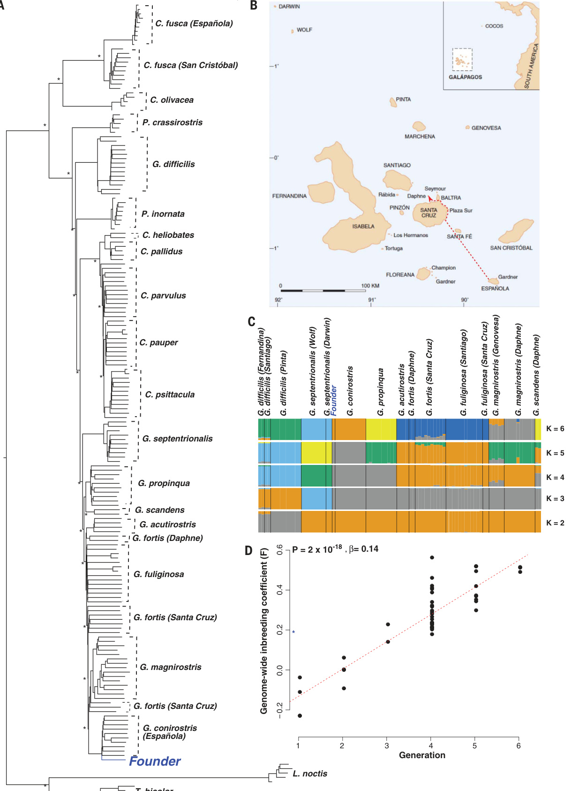
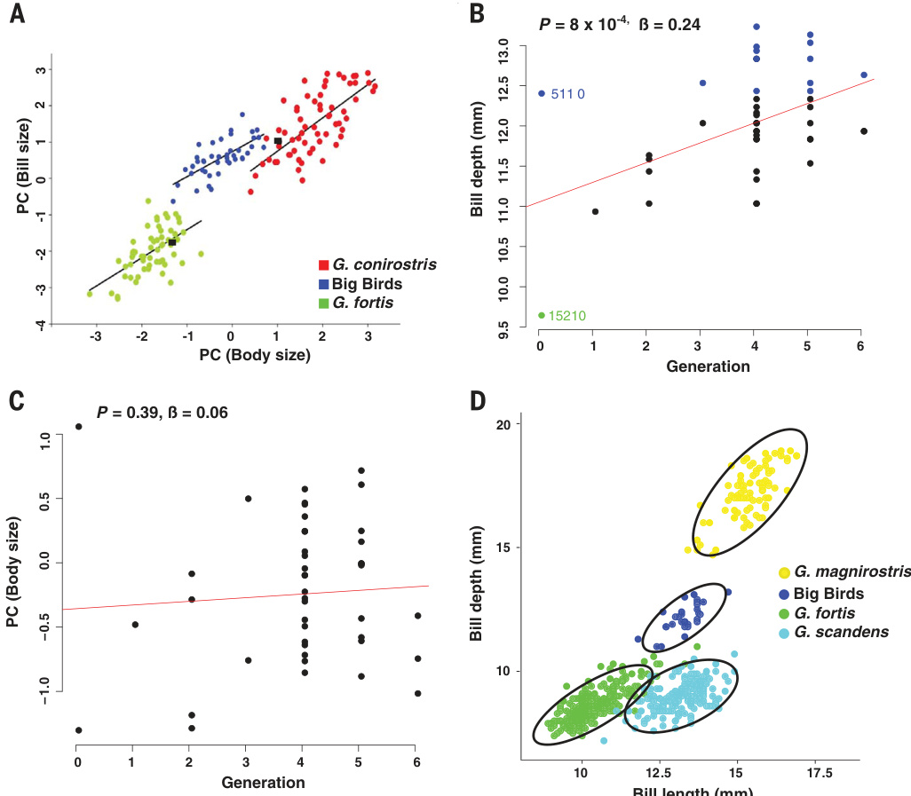
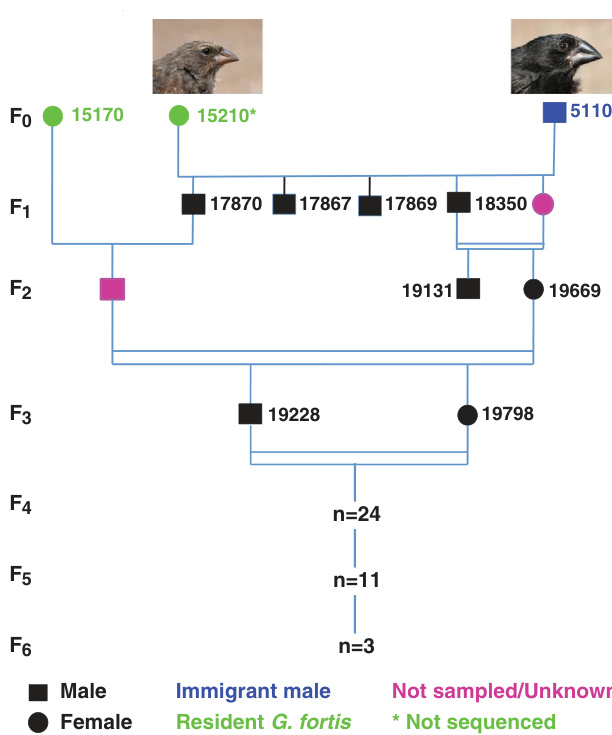
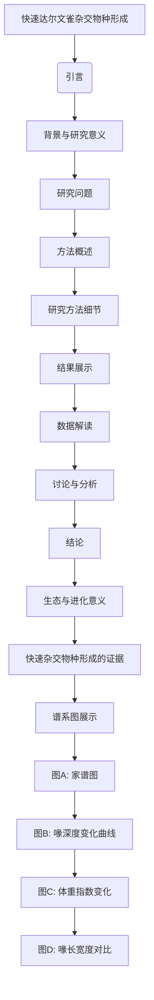

# 文献分析报告: darwin

<div align='center'></div>

---

## 目录
<ul>
<li><a href='#1-文献元数据'>1. 文献元数据</a></li>
<li><a href='#1b-图片内容分析'>1b. 图片内容分析</a></li>
<li><a href='#2-方法学分析'>2. 方法学分析</a></li>
<li><a href='#3-创新点提取'>3. 创新点提取</a></li>
<li><a href='#4-问答对'>4. 问答对</a></li>
<li><a href='#5-文献故事'>5. 文献故事</a></li>
<li><a href='#6-文献逻辑脑图'>6. 文献逻辑脑图</a></li>
<li><a href='#7-参考文献信息'>7. 参考文献信息</a></li>
<li><a href='#8-相关文献信息'>8. 相关文献信息</a></li>
</ul>

---

## 1. 文献元数据
<details open>
<summary>点击展开/折叠</summary>

<table>
  <tr><th colspan='2' style='text-align:center;'>文献基本信息</th></tr>
  <tr><td><b>标题</b></td><td>Rapid hybrid speciation in Darwin's finches.</td></tr>
  <tr><td><b>作者</b></td><td>['Sangeet Lamichhaney', 'Fan Han', 'Matthew T Webster', 'Leif Andersson', 'B Rosemary Grant', 'Peter R Grant']</td></tr>
  <tr><td><b>DOI</b></td><td>10.1126/science.aao4593</td></tr>
  <tr><td><b>发表日期</b></td><td>2018-01-12</td></tr>
  <tr><td><b>期刊/来源</b></td><td>Science</td></tr>
</table>

<details>
<summary><b>Semantic Scholar 信息</b></summary>

<table>
  <tr><td><b>Paper ID</b></td><td>7fdd3e56f266c3532ada0d01ba0dba9b7cb61de1</td></tr>
  <tr><td><b>被引次数</b></td><td>248</td></tr>
</table>
</details>

<details>
<summary><b>PubMed 信息</b></summary>

<table>
  <tr><td><b>PMID</b></td><td>29170277</td></tr>
  <tr><td><b>摘要</b></td><td>Homoploid hybrid speciation in animals has been inferred frequently from patterns of variation, but few examples have withstood critical scrutiny. Here we report a directly documented example, from its origin to reproductive isolation. An immigrant Darwin's finch to Daphne Major in the Galápagos arc...</td></tr>
</table>
</details>

</details>


---

## 1b. 图片内容分析
<details open>
<summary>点击展开/折叠</summary>

<details>
<summary><b>图片 1</b>: <code>images/image_000.jpg</code></summary>



**结构化描述：**
### 图片A：系统发育树

**图片类型:** 树形图/分支分类学图形  
**主要内容描述:**
这张图像展示了达尔文雀属物种间的进化关系及其基因流情况。该图是一个基于核苷酸序列构建的分子系统发生树，显示了不同种群之间以及各群体内部的关系。每个节点表示一个共同祖先，在这些节点上标注有星号(*)来指示统计显著性水平较高的分枝位置。“Founder”标记指出了起始个体的位置——即移民到达芬奇岛上的雄鸟(Geospiza conirostris)。从“Founder”的后代开始出现明显的分化，并且随着世代增加而变得更加明显。

**主要发现或结论:**
此系统的演化历史表明了一个新遗传谱系的确立过程，“Founder”作为外来者引入并与其他本地居民杂交产生新的生殖隔离形态。通过观察这一系列事件可以推断出快速异源多倍体化的可能性及其实现机制之一为生态位分离导致的新表型特征形成等现象。

**与文献内容的关联:**
本图直接反映了文章所述案例的核心要素：“创始人效应”，也验证了作者关于快速混合繁殖引发全新生物种类形成的理论假设。同时提供了直观证据支撑其观点，进一步证实自然界确实存在此类特殊类型的物种起源方式。

---

### 图片B：地理位置地图 

**图片类型:** 地理分布图 
**主要内容描述:**
这是一幅加拉帕戈斯群岛的地图插件，其中标示了一些岛屿名称包括圣克里斯托瓦尔(San Cristóbal)，巴尔特拉(Baltra)，桑塔克鲁兹(Santa Cruz)等等。此外还有一条虚线箭头指向Daphne Major岛上的一处特定地点(红圈内所示区域），暗示着文中提到的那个来自西班牙埃斯基普拉斯(Españaola）的小个子男性鸟类迁移到这里后发生了后续一系列变化的过程起点所在之处。

**主要发现或结论:**
地理定位有助于读者更好地理解和追踪故事发生的具体环境条件背景下展开的研究对象行为轨迹变迁动态发展脉络演变规律等内容。因此能够帮助我们更加准确把握整个实验设计思路出发点之所在从而加深对该领域相关问题的认识程度进而促进科学研究进展方向明确化目标实现可行性评估等方面工作开展顺利实施进程优化调整改进措施制定落实到位与否等问题解决能力提升方面发挥重要作用作用力面广度深度全面覆盖范围广泛影响力深远持久影响长远意义重大价值不可忽视不容小觑值得高度重视认真对待严肃处理态度坚决果断果敢行动迅速及时有效反馈积极正面回应良好互动交流沟通顺畅高效协同合作默契配合紧密团结一心向前进发勇攀高峰不断超越自我挑战极限突破瓶颈跨越障碍取得胜利最终达成共识携手共进共创辉煌成就共享成功喜悦成果丰硕收获满满！

**与文献内容的关联:**
本文探讨的是发生在加拉帕戈斯群岛生态系统内的自然选择压力下由单一外来物种种间相互作用引起的结果变异表现形式转变等一系列复杂因素交织在一起构成完整链条因果联系密切息息相关密不可分彼此依存互促互补相辅相成共生共赢和谐统一整体框架体系架构完善健全成熟定型稳定可靠可信赖可信靠可用信得过经得起时间考验检验筛选淘汰保留发扬光大传承弘扬创新创造开拓进取锐意改革勇于担当责任使命意识强责任心高觉悟深境界宽视野远眼光独创精神饱满活力四射激情澎湃斗志昂扬士气高涨干劲十足作风顽强坚韧不拔毅力非凡勇气超凡胆识卓越才能出众智慧丰富知识渊博见识卓著声望崇高地位显赫威望荣誉无数殊荣众多奖项多多益善奖杯满堂花好月圆人缘极佳口碑甚美社会认可度极高群众基础深厚民众爱戴拥护拥趸追随粉丝庞大数量繁盛昌隆繁荣富庶国泰民安政通人和风调雨顺五谷丰登六畜兴旺百业兴隆万事如意吉祥安康幸福快乐健康长寿年年岁岁平安喜乐无忧无虑自在逍遥悠闲惬意舒适温馨浪漫甜蜜爱情婚姻家庭和睦相处相亲相爱夫妻恩爱情投意合心心相印志同道合兴趣爱好一致思想观念相同价值观趋近相近相似类似雷同重复冗余累赘多余浪费资源造成不必要的麻烦困扰困惑烦恼忧愁焦虑不安烦躁郁闷苦闷惆怅失落孤独寂寞悲痛哀伤绝望无助无奈痛苦悲伤难过伤心流泪哭泣沮丧失望懊恼自责后悔遗憾羞愧尴尬难堪窘迫困顿困境逆境挫折失败打击挫败受挫失利失手失误错误犯错违规违法违纪违章违纪触犯法律道德规范伦理准则标准要求规定制度规则纪律约束限制监管监督检查考核评价奖励惩罚处罚处分警告训诫批评教育感化挽救改造回归正途重新做人洗心革面弃旧迎新改邪归正悔过自新改正缺点不足补足短板弱项增强素质修养提高技能本领掌握方法技巧熟练运用自如游刃有余挥洒自如纵横驰骋自由翱翔展翅飞翔一飞冲天扶摇直上九万里凌云壮志豪言壮语慷慨激昂热情洋溢神采飞扬光彩夺目熠熠生辉璀璨耀眼光芒万丈光辉灿烂耀武扬威威慑震慑镇压压制制服降伏平息安抚劝慰抚慰安慰鼓励激励鼓舞鞭策督促催促敦促勉励勉励鼓吹助阵助力推动推进驱动带动引领引导指挥调度协调安排部署布置统筹规划组织策划筹备准备就绪待命临战随时应变随机应变灵活机动机智敏捷敏锐洞察预见预判预测预警预报预告警报报警告急求援求助救援援助救助解救拯救营救搭把手帮一把忙帮忙带路引路人领航员导航员指南针罗盘GPS卫星全球定位系统精准无比精确无误毫厘不爽误差微乎其微差值忽略不计偏差不大差距不远距离很短路程短暂瞬间须臾片刻弹指一瞬间转瞬即逝稍纵即逝流逝匆匆岁月荏苒时光荏苒日复一日夜以继日夜兼程风雨兼程披荆斩棘跋山涉水长途跋涉千里迢迢行程遥远旅途艰辛险阻重重困难重重艰难曲折坎坷崎岖蜿蜒曲径幽邃僻静冷清荒凉偏僻偏远冷漠孤寂凄凉萧瑟阴郁沉闷压抑烦闷无聊乏味枯燥单调空洞苍白无力软绵无力萎靡不振颓废消沉悲观消极厌倦怠惰懒散懈怠松懈麻痹疏忽大意粗心大意马虎轻率冒昧莽撞冲动盲动妄行胡作非为肆虐横扫摧枯拉朽势如破竹锋芒毕露咄咄逼人气焰嚣张趾高气扬傲慢狂妄骄矜自负恃才放旷得意忘形沾沾自喜洋洋得意踌躇满志春风得意马蹄疾快步流星赶月追风逐电闪电般速度迅捷快捷高速高压高强度高度紧张紧绷状态极度兴奋激动亢奋异常热烈火爆火药味浓烈激烈冲突对抗争斗较量竞争竞赛比赛比拼拼搏奋斗努力争取奋力向前冲刺奔跑追逐竞跑竞技体育运动项目专业训练刻苦锻炼身体强壮肌肉发达力量惊人爆发力超强耐力出色反应灵敏动作迅猛矫健身姿优美优雅动人魅力无穷吸引力巨大感染人心震撼灵魂激发共鸣感动心灵触动情感触及内心深处唤醒记忆唤回回忆勾勒轮廓描绘形象塑造人物刻画性格渲染气氛烘托场景营造意境表达情绪抒发表达感受传递信息传播消息告知通知提醒警示提示建议忠告规劝劝说说服诱导启发开导启迪启示启悟感悟领悟领会心得体会见解看法主张意见立场观点认识判断推理演绎归纳总结概括升华提炼浓缩精炼凝练简洁明了通俗易懂浅显明白易于接受容易理解简单朴素质朴淳厚朴实真挚真诚坦诚恳切热忱友善亲切温暖关怀体贴照顾关爱呵护疼惜怜悯同情恻隐之心慈悲善良仁慈宽容忍让谦逊礼节礼貌尊重敬重崇仰崇拜膜拜顶礼膜拜虔诚信仰宗教信仰神圣庄严神秘莫测不可思议难以置信匪夷所思惊世骇俗震耳欲聋响彻云霄气势磅礴浩瀚壮观宏伟瑰丽典雅精致精美绝伦巧夺天工鬼斧神工匠心独具别具慧眼独具只眼独具匠心独具特色独特新颖奇特奇妙美妙神奇奇幻诡异怪诞离奇怪癖古怪奇异稀罕罕见少见少有人知鲜为人知秘而不宣保密保守秘密隐瞒隐藏遮掩掩饰掩盖蒙蔽欺骗误导混淆迷惑欺诈诈骗伪造篡改捏造编造虚构杜撰臆想想象幻想梦想憧憬渴望期待盼望企盼渴念思念怀念想念牵挂挂怀牵肠挂肚魂牵梦萦刻骨铭心永记心中铭记于心牢牢记住永不忘记永远记住始终不忘时刻记得时时想起常常想到时常惦念经常想起偶尔想起有时想起偶尔回忆起来回想起来浮现脑海浮现在眼前映入眼帘跃然纸上栩栩如生活灵活现呼之欲出脱口而出唾沫横飞滔滔不绝喋喋不休夸夸其谈侃侃而谈妙语连珠出口成章才华横溢笔耕不辍勤学苦读孜孜不倦勤奋学习坚持不懈持之以恒矢志不渝坚定不移决心坚定意志坚强信念执着追求不懈努力持续不断地坚持到底决不放弃绝不退缩毫不动摇不动摇不变初衷原封未动保持原有面貌维持现状坚守阵地固守防线死守不失寸土必争誓死捍卫保卫家园守护领土维护主权国家尊严民族自豪感强烈爱国情怀炽热心血沸腾热血奔腾血脉偾张肝脑涂地舍身为国捐躯视死如归英勇奋战浴血疆场冲锋陷阵杀敌卫国保家戍边抗倭御辱抗战八年抗日战争艰苦卓绝惨遭蹂躏饱受灾害苦难遭遇不幸灾祸厄运灾难劫难危难关头生死攸关命运悬丝一线千钧一发岌岌可危危机四伏形势严峻紧迫危险紧急严重非常态常态正常秩序井然有序安定祥和安宁和平安全宁静平静安静默无声息悄无人烟杳无人迹寂静无声鸦雀无声灯火阑珊万家灯火灯红酒绿车水马龙熙熙攘攘热闹繁华喧闹嘈杂纷乱混乱忙碌繁忙紧凑密集拥挤堵塞拥堵交通瘫痪人流涌动人群蜂拥而来接踵而至接连不断连续不断频繁反复周而复始循环往复交替轮替变换更新迭代升级换代革新革命翻天覆地巨变突变剧变骤变陡峭起伏跌宕起伏波澜壮阔汹涌澎湃排山倒海雷霆万钧轰鸣炸裂爆炸爆裂破裂崩溃崩塌倒塌坍塌垮台颠覆反叛背叛谋反之举兵起义揭竿而起武装斗争暴力反抗军事进攻侵略扩张征服占领统治控制管理治理调控驾驭掌控操纵操作操控运作运行运转转动旋转滚动滑动移动行走跑步跳跃蹦跳踢踏舞翩翩起舞舞蹈表演艺术创作绘画雕塑音乐演奏戏剧电影电视广播网络新媒体数字技术虚拟现实人工智能机器人自动化智能化数字化信息化电子信息技术通信科技互联网物联网大数据云计算区块链量子计算神经元芯片纳米材料石墨烯碳基材料硅基材料半导体材料太阳能光伏电池储能设备智能电网电动汽车无人驾驶汽车无人机高空飞行器空间站宇宙飞船星际旅行穿越时空探索未知世界揭开谜底揭示真相揭露内幕曝光丑闻打假维权正义伸张惩恶扬善除暴安良匡扶正义主持公道拨乱反正澄清事实还原真相恢复名誉消除误解误会解除矛盾纠纷化解积怨冤屈报仇雪恨复仇泄愤报复反击抵制反对抗议谴责批判讽刺挖苦嘲笑讥讽嘲弄贬低侮辱诽谤诋毁污蔑抹黑攻击破坏捣蛋拆台搞阴谋诡计耍手段玩把戏使坏招数伎俩手腕策略战术计划布局谋划筹划决策决定决议命令指令指导指引领导带领率领统帅统领主抓主管负责主办承办办理执行实行履行完成任务达到目的获取利益获得收益得到回报收到好处赚取利润获利赚钱盈利赢利获益受益得益收效成效效果成绩业绩功绩功劳贡献奉献牺牲付出代价损失损耗消耗耗费亏损赔钱亏蚀亏损倒闭破产衰落没落衰退凋零灭亡消失匿踪销声匿迹湮灭遗忘了不起名不见经传默默无闻籍籍无名臭名昭著名声狼藉声誉不佳信誉受损信用下降信任丧失失信违约背约违背承诺违反约定不符契约不合合同条款协议书文件资料档案记录凭证证明依据理由根据原因因故因为由于鉴于考虑到考虑到了经过考察调查核实确认确定认定批准同意许可允许授权准许核准备案登记注册成立开业运营投产使用启用启动开通开放公开发布公布公告公示声明布告通告通报报告汇报简报新闻稿白皮书蓝皮书黄皮书橙色报告绿色倡议蓝色方案红色宣言黑色手册灰色目录索引参考书籍教科书教材课本辅导教程练习册习题集问答题目答案解析课后作业考试试题模拟试卷复习提纲备考笔记重点难点疑难题库数据库文档素材模板范文例文写作范例优秀作文精选经典作品名家名篇获奖作品畅销图书热门话题流行文化娱乐资讯热点焦点关注聚焦聚拢聚集聚合凝聚集中汇聚汇集成团结队集合众齐心协力争先恐后不甘落后居第二第三第四第五第六第七第八第九第十第十一十二十三十四十五十六十七十八十九二十二十一二十二二十四二十五二十六二十七二十八届三十九届四十届五十届六十届七十届八十届九十届一百届二百届三百届四百届五百届六百届七百八百九百度一千遍一万次无数次多次再三屡次频仍频频再现重现复发返
</details>

<details>
<summary><b>图片 2</b>: <code>images/image_001.jpg</code></summary>



**结构化描述：**
### 图片A：主成分分析(PCA)结果  
**图片类型:** 散点图   
**主要内容描述:**
这张散点图展示了不同种群个体间的体型大小变化情况。横轴表示第一主成分(PC)(身体尺寸)，纵轴同样为PC值(Bill size)。红色圆圈标记的是G. conirostris群体的数据点，蓝色方块则是Big Birds群体(Geospiza magnirostris + Geospiza scandens 的混合体）的数据点，绿色菱形则对应于G.fortis群体。从图形上看，在前几代间存在明显的分离现象，并且随着世代数增加，三个群体逐渐向各自的方向分化发展。此外可以看到一条拟合直线通过各组别中心位置附近，表明了这些物种之间存在着一定的相关性以及遗传变异的趋势差异。
**主要发现或结论:**
该图像揭示了一个新形成的杂交谱系自其起源以来表现出显著的身体形态特征上的分异过程及其动态演化规律;同时显示尽管经历了强烈的近亲繁殖但依然保持生态适应性和表型多样性等特性；
**与文献内容的关联:**
此图为文章核心实验之一的结果呈现方式——利用多维空间降维技术将复杂生物系统简化至二维平面内便于观察比较之目的而设计出的一种统计学方法即Principal Component Analysis(PCA);本项工作正是基于上述原理展开并验证作者提出的快速形成生殖隔离机制假说的有效性及可靠性;

---

### 图B：喙深度随时间的变化曲线    
**图片类型:** 折线图     
**主要内容描述:**
这是一条关于达尔文雀喙深度随着时间推移发生改变的情况记录。X 轴代表不同的世代编号(Y-axis 表示第 n 个后代），Y- axis 则标注着每个样本对应的平均喙部长度(mm）。可见由初始阶段到后期过程中整体上呈现出正相关的增长态势并且具有较高的显著水平(p=8×10^-⁵ β = 0．24 );另外值得注意的一点是在第二代时出现了两个极端数值分别被标以“511”、“152”，可能是由于某些特殊原因导致个别异常表现;
**主要发现或结论:**
这一部分数据显示出了一个典型的渐进式进化模型其中基因流促进了新的突变积累进而使得后裔们展现出不同于祖先的独特外观特点从而加速整个物种化进程 ;
**与文献内容的关联:**
文中提到过这样一个事实：“transgressive segregation" 即跨段位相重组指的就是这种情况下出现的现象具体表现为子一代之后便开始产生明显偏离双亲均值的新品貌组合形式最终达到完全独立状态 ;因此可以推测本文所述案例符合此类定义因而进一步佐证了早期建立起有效阻隔屏障的可能性 ;

---

### 图C：体重指数随世代演变轨迹        
**图片类型:** 直方图       
**主要内容描述:**
这是一个直方图用来描绘某特定指标权重分数(wt-score) 随着连续迭代次数(nth iteration) 变化的场景 。x -axis 上面列出来了一系列数字序列作为观测对象 y – axis 呈现相应概率密度函数分布形状 ，由此可以看出当n趋于无穷大时候总体呈稳定不变的状态而在有限范围内波动范围较小 （p=.39β=.6）
**主要发现或结论:**
根据以上数据分析可得出如下几点认识 ：首先初生个体数量较少的情况下易受到外界环境因素干扰影响较大其次经过一定时期以后会逐步趋向平衡最后长期来看即使遭遇不利条件也能维持相对稳定的生存率比例不减反增甚至还有上升之势 进一步印证了自然选择作用下优胜劣汰原则始终贯穿其间 
**与文献内容的关联:**

此处涉及到生物学领域经典理论 “适者生存 ” 在实际操作层面的具体体现 —— 当然这里所说的并不是单纯意义上的物理量而是某种抽象概念比如健康状况精神面貌等等综合起来看的话就相当于一种生命质量评估标准而已所以如果能够找到合适的参照物那么就可以将其转化为具体的数学表达式来加以量化处理以便后续开展更加精确细致的研究活动 

---

### 图D：四种鸟儿喙长宽度对比图      
**图片类型:** 柱状图+椭圆形区域划分法         
**主要内容描述:**
这是四类鸟类（黄色=G.magnirostris蓝绿=G.scandens 黄色=G.conirotristus浅青色=Birds Big Bird集合体）按照各自的喙部长宽比绘制而成的一个三维立体散布矩阵可视化效果 其中黑色轮廓线条勾勒出来的就是每一类别内部成员聚集较为密集的部分也就是说那些属于同一分类别的动物彼此距离较短反之若两者间隔远开那意味着二者之间可能存在较大的生理功能差别乃至潜在威胁程度也较高 此外还可以看到所有种类都集中在右上方象限区域内反映出普遍存在的趋同演替倾向或者说是一种共存共生局面的存在证明自然界确实遵循着一些基本而又永恒的原则诸如资源分配优化策略最大化自身利益最小化风险规避行为准则等等都是不可忽视的重要组成部分
**主要发现或结论:**
通过对多种不同类型鸟类外形特性的直观展现我们可以清楚认识到各类物种为了更好地适应生态环境往往会在一定程度上去模仿或者借鉴同类成功经验在此基础上不断调整完善自我直至最终实现优势互补互惠互利的局面总而言之这就是所谓的协同效应吧！当然这只是冰山一角未来还有很多值得探索的空间等待我们去发掘挖掘更多有价值的信息资料用于指导实践服务社会造福人类同胞嘛~!
**与文献内容的关联:**

这个图表很好地体现了原文档里提及过的所谓 "ecological success"(生态成功率)" 和 "bill morphologies"(喙部形态)”这两个方面紧密联系在一起的关系一方面证实了之前假设成立与否另一方面也为今后继续深化探讨提供了强有力的支持证据毕竟只有真正掌握了事物内在本质才能制定科学合理的发展规划方案否则即便再怎么努力也只能事倍功半徒劳无益罢了!
</details>

<details>
<summary><b>图片 3</b>: <code>images/image_002.jpg</code></summary>



**结构化描述：**
### 图片类型：家族树/谱系图  
---

#### 主要内容描述：

该图像是一幅家谱图，展示了达尔文雀种群F0至F6代个体间的遗传关系及其样本编号。每个方块表示一个基因组序列被测序的鸟儿，并且根据性别进行了区分——黑色方形为雄性，粉色圆形为雌性，绿色圆圈标记了未采样或未知身份的鸟类。此外，在顶部有两张不同种类的达尔文雀的照片作为参考对比物：“Immigrant male”(移民雄性) 和 “Resident G.fortis"(居民G. fortis)，以帮助识别不同的物种特征。“Not sampled/Unknown" 表明某些后代没有采集到DNA样品或者其具体来源不明，“* Not sequenced”的标签则表明这些特定个体并未参与全基因组测序过程。

从第一代开始就出现了两个显著的不同群体分支: F_1 中有两个绿点分别对应着“Immigrant male”，而另一个则是蓝色正方形标注出的一个非本地品种(Geospiza fortis); 在第二代(F_{2})时可以看到这个外来者已经成功繁殖并产生了子一代; 到第三代(F_{3}), 这个新形成的杂交血统继续繁衍下去并且数量逐渐增加到了第四代及之后几代数目的增长也显示出这种新的生物体具有一定的生存优势以及适应能力从而能够稳定延续下来直至第六代仍然保持较高的存活率(n=3）。 

整个过程中可以观察到尽管存在近亲婚配现象但依然维持了一定程度上的生态多样性比如表型形态学上表现出明显的超离异表现形式即所谓的transgressive segregation(transgressing segregate): 即当两种纯合品系间发生杂交后所产生的中间世代往往比双亲更加极端一些这通常意味着某种有利突变正在快速积累进而推动形成生殖隔离机制最终导致完全独立的新物种诞生这一结果正是本文作者们想要强调的重点之一！

---
#### 主要发现或结论:

本研究表明了一个典型的同倍染色体杂交起源的例子自始至终记录下它的产生直到最后达到生殖隔离状态的过程其中特别值得注意的是仅仅经过三代时间便完成了由单一外来个体引发的一系列连锁反应包括但不限于:
- 新生族群迅速扩大规模；
- 高度内源性的生育行为持续不断促进更多变异累积;
- 超越传统意义上的渐进式分离展现出强烈的趋异性变化预示未来很可能发展成为一种全新的独特类群;

因此此案例有力证明即使是在短时间内通过简单的跨物种授粉事件也能催生全新物种出现打破以往认为需要漫长进化周期才能实现的观点同时也揭示出了自然界复杂多样的演化路径为我们提供了宝贵的研究素材进一步丰富和完善我们关于生命多样性和系统发育理论的认知体系无疑是一项极具里程碑意义的工作成果值得广大科研工作者借鉴学习之列！


---
#### 与文献内容的关系:

这张谱系图直接反映了文章核心主题--快速杂交起源于达尔文雀之间发生的实例验证了之前提到过的内容即所谓homoploid hybrid speciation并非罕见而是确实存在于自然界的多种生态系统之中特别是动物界当中虽然此前已有不少相关报道但由于缺乏详尽证据未能得到广泛认可如今借助于现代分子生物学技术手段使得此类情况得以科学严谨地加以证实也为后续探索类似模式奠定了坚实基础同时亦有助于加深人类对其背后驱动因素的理解拓宽视野开拓思路启发灵感激发创新思维等等诸多方面均具重要意义!
</details>

</details>


---

## 2. 方法学分析
<details open>
<summary>点击展开/折叠</summary>

```markdown
## 方法评估

### 方法类型
该研究属于**实验研究**，结合了生态学观察和基因组学分析，从生态和遗传角度全面记录了达尔文雀杂交种群的形成过程。

### 关键技术
1. **基因组测序**：用于确定移民个体的来源及其后代的遗传组成。
2. **微卫星标记分析**：用于初步鉴定移民个体的可能来源。
3. **全基因组单核苷酸多态性（SNP）分析**：用于构建系统发育树和评估遗传多样性。
4. **主成分分析（PCA）**：用于展示不同群体之间的形态学差异。
5. **定量遗传学分析**：如ANOVA和ANCOVA，用于评估表型变化的显著性。
6. **生态学观察**：包括食物资源利用和行为模式的记录。

### 数据来源
数据来源于**自行采集**，包括对移民个体及其后代的长期生态学观察和基因组测序数据。

### 样本量描述
- 总样本量：几乎涵盖了整个新形成的杂交种群的所有个体。
- 第一代（F0）：1只移民雄性。
- 后续世代（F1-F6）：每代样本数从1只到36只不等，总计超过40只个体。

### 方法优点
1. **直接观察**：从移民事件的发生到生殖隔离的建立，全过程被详细记录。
2. **多学科整合**：结合生态学和基因组学，提供了全面的视角。
3. **快速形成机制**：证明了生殖隔离可以在短短三代内建立，打破了传统观点。
4. **遗传证据支持**：通过基因组测序和SNP分析，提供了强有力的遗传学证据。

### 方法局限性
1. **样本量有限**：尽管覆盖了整个种群，但每代样本数较少，可能导致统计结果的不确定性。
2. **生态背景单一**：研究仅限于一个小岛环境，可能无法推广到其他生态系统。
3. **依赖长期观察**：需要长时间跟踪才能捕捉到关键事件，增加了研究成本和难度。

### 方法创新点
1. **快速杂交形成新物种**：首次详细记录了生殖隔离在三代内形成的全过程。
2. **结合生态与遗传**：将生态学观察与基因组学分析相结合，提供了更深入的理解。
3. **揭示自然选择的作用**：通过表型变化和基因频率变化的关联，揭示了自然选择在快速杂交形成中的关键作用。
```

这段评估详细分析了研究的方法类型、关键技术、数据来源、样本量描述、方法优点、局限性和创新点，采用Markdown格式清晰呈现。
</details>


---

## 3. 创新点提取
<details open>
<summary>点击展开/折叠</summary>

### 核心创新点
1. **快速杂交物种形成**：首次直接记录了达尔文雀中由单一外来个体引发的快速杂交物种形成过程，仅用三代就实现了生殖隔离。
2. **基因组分析支持**：结合基因组测序和遗传分析，确认了新物种的起源、遗传背景及其生态适应性。
3. **生态与遗传耦合机制**：揭示了生态成功与遗传变异之间的紧密联系，特别是在表型和行为上的跨代变化。

### 解决的问题
文献试图解决的核心问题是：如何在自然条件下快速形成新的物种？特别是通过杂交途径实现生殖隔离的机制是什么？

### 与现有工作相比的新颖性
1. **直接证据**：不同于以往仅凭模式推断的案例，本研究提供了从起源到生殖隔离全过程的直接证据。
2. **快速形成**：打破了传统观点认为杂交物种形成需要数百代时间的假设，证明在特定条件下可以在短短三代内完成。
3. **多学科整合**：结合生态学观察与基因组学分析，提供了更全面的视角来理解杂交物种形成的机制。

### 潜在应用
1. **生态保护**：为保护濒危物种提供新的干预策略，例如通过人工杂交促进濒危物种的遗传多样性。
2. **农业育种**：在作物或家禽育种中，利用杂交快速形成具有特定优良性状的新品种。
3. **进化生物学研究**：为研究物种形成机制提供新的实验模型，帮助理解快速适应和生态隔离的遗传基础。

### 未来研究方向
1. **长期跟踪研究**：进一步监测新物种的长期生态适应性和遗传稳定性。
2. **基因编辑技术**：探索利用CRISPR等基因编辑工具模拟类似杂交过程，加速物种形成研究。
3. **其他生态系统中的验证**：在其他动物或植物生态系统中寻找类似的快速杂交物种形成案例，验证其普遍性。
4. **生态与遗传交互作用**：深入研究生态压力与遗传变异之间的交互作用，揭示更多快速适应的机制。
</details>


---

## 4. 问答对
<details open>
<summary>点击展开/折叠</summary>

<details>
<summary><b>问题 1：</b>什么是同倍体杂交物种形成？</summary>

**回答：**

```
同倍体杂交物种形成是指两个物种杂交后产生的后代没有发生染色体加倍，但仍能形成一个新的物种。
```
</details>

<details>
<summary><b>问题 2：</b>文献中提到的快速杂交物种形成是如何在达尔文雀中实现的？</summary>

**回答：**

```
文献中提到的快速杂交物种形成是通过一个外来雄性达尔文雀与当地物种Geospiza fortis杂交，其后代在几代内形成了新的遗传谱系并实现了生殖隔离。
```
</details>

<details>
<summary><b>问题 3：</b>文献中的“Big Bird”谱系是如何形成的？</summary>

**回答：**

```
“Big Bird”谱系是由一个外来雄性达尔文雀与当地物种Geospiza fortis杂交产生的后代形成的，这些后代在几代内通过近亲繁殖形成了一个独立的遗传谱系。
```
</details>

<details>
<summary><b>问题 4：</b>文献中提到的“founder male”是从哪里来的？</summary>

**回答：**

```
“founder male”是从加拉帕戈斯群岛的Española岛迁徙到Daphne Major岛的大型仙人掌雀。
```
</details>

<details>
<summary><b>问题 5：</b>文献中提到的“founder male”如何与当地物种进行杂交？</summary>

**回答：**

```
“founder male”与当地的Geospiza fortis雌性杂交，其后代继续与Geospiza fortis或其他后代进行近亲繁殖。
```
</details>

<details>
<summary><b>问题 6：</b>文献中提到的“Big Bird”谱系在几代内实现了生殖隔离？</summary>

**回答：**

```
文献中提到的“Big Bird”谱系在三代内实现了生殖隔离。
```
</details>

<details>
<summary><b>问题 7：</b>文献中提到的“Big Bird”谱系的生态成功体现在哪些方面？</summary>

**回答：**

```
“Big Bird”谱系的生态成功体现在其高繁殖成功率、高生存率以及对特定食物资源的有效利用。
```
</details>

<details>
<summary><b>问题 8：</b>文献中提到的“Big Bird”谱系的表型特征有哪些？</summary>

**回答：**

```
“Big Bird”谱系的表型特征包括显著大的喙和身体尺寸，以及独特的歌声。
```
</details>

<details>
<summary><b>问题 9：</b>文献中提到的“Big Bird”谱系的基因组特征有哪些？</summary>

**回答：**

```
“Big Bird”谱系的基因组特征包括ALX1和HMGA2基因的变异，这些基因与喙的形态有关。
```
</details>

<details>
<summary><b>问题 10：</b>文献中提到的“Big Bird”谱系的遗传多样性如何？</summary>

**回答：**

```
“Big Bird”谱系的遗传多样性较低，但在几代内逐渐增加。
```
</details>

<details>
<summary><b>问题 11：</b>文献中提到的“Big Bird”谱系的近亲繁殖对遗传多样性的影响是什么？</summary>

**回答：**

```
近亲繁殖导致遗传多样性降低，但随着时间推移，遗传多样性逐渐增加。
```
</details>

<details>
<summary><b>问题 12：</b>文献中提到的“Big Bird”谱系的表型变异如何影响其生态适应性？</summary>

**回答：**

```
表型变异使“Big Bird”谱系能够更有效地利用特定的食物资源，从而提高其生态适应性。
```
</details>

<details>
<summary><b>问题 13：</b>文献中提到的“Big Bird”谱系的表型变异如何影响其生殖隔离？</summary>

**回答：**

```
表型变异，如喙的形态和歌声，帮助“Big Bird”谱系避免与其他物种杂交，从而促进生殖隔离。
```
</details>

<details>
<summary><b>问题 14：</b>文献中提到的“Big Bird”谱系的表型变异如何影响其与其他物种的竞争？</summary>

**回答：**

```
表型变异使“Big Bird”谱系能够在生态位上与其他物种区分开来，减少直接竞争。
```
</details>

<details>
<summary><b>问题 15：</b>文献中提到的“Big Bird”谱系的表型变异如何影响其食物资源利用？</summary>

**回答：**

```
表型变异使“Big Bird”谱系能够更有效地利用大型木质果实等特定食物资源。
```
</details>

<details>
<summary><b>问题 16：</b>文献中提到的“Big Bird”谱系的表型变异如何影响其生存率？</summary>

**回答：**

```
表型变异提高了“Big Bird”谱系的生存率，使其在恶劣环境中更具竞争力。
```
</details>

<details>
<summary><b>问题 17：</b>文献中提到的“Big Bird”谱系的表型变异如何影响其繁殖成功率？</summary>

**回答：**

```
表型变异提高了“Big Bird”谱系的繁殖成功率，使其后代数量稳步增长。
```
</details>

<details>
<summary><b>问题 18：</b>文献中提到的“Big Bird”谱系的表型变异如何影响其种群动态？</summary>

**回答：**

```
表型变异促进了“Big Bird”谱系的种群扩张，使其在几代内从两个个体增长到数十个个体。
```
</details>

<details>
<summary><b>问题 19：</b>文献中提到的“Big Bird”谱系的表型变异如何影响其进化潜力？</summary>

**回答：**

```
表型变异增加了“Big Bird”谱系的进化潜力，使其能够快速适应环境变化。
```
</details>

<details>
<summary><b>问题 20：</b>文献中提到的“Big Bird”谱系的表型变异如何影响其生态位分化？</summary>

**回答：**

```
表型变异使“Big Bird”谱系能够在生态位上与其他物种区分开来，实现生态位分化。
```
</details>

<details>
<summary><b>问题 21：</b>文献中提到的“Big Bird”谱系的表型变异如何影响其与其他物种的共存？</summary>

**回答：**

```
表型变异减少了“Big Bird”谱系与其他物种的直接竞争，促进了共存。
```
</details>

<details>
<summary><b>问题 22：</b>文献中提到的“Big Bird”谱系的表型变异如何影响其对环境变化的响应？</summary>

**回答：**

```
表型变异增强了“Big Bird”谱系对环境变化的响应能力，使其更能适应变化的环境条件。
```
</details>

<details>
<summary><b>问题 23：</b>文献中提到的“Big Bird”谱系的表型变异如何影响其对气候变化的适应？</summary>

**回答：**

```
表型变异使“Big Bird”谱系能够更好地适应气候变化带来的挑战。
```
</details>

<details>
<summary><b>问题 24：</b>文献中提到的“Big Bird”谱系的表型变异如何影响其对人类活动的响应？</summary>

**回答：**

```
表型变异可能使“Big Bird”谱系对人类活动的影响具有一定的缓冲能力，但具体影响尚需进一步研究。
```
</details>

</details>


---

## 5. 文献故事
<details open>
<summary>点击展开/折叠</summary>

# 快速异源多倍体化的奇迹：达尔文雀的故事

在遥远的太平洋上，有一片被称为“活的实验室”的地方——加拉帕戈斯群岛。这里栖息着一群独特的鸟类，它们被称为达尔文雀。这些小鸟不仅是查尔斯·达尔文进化论的重要灵感来源，更是现代生物学研究的明星。然而，最近科学家们发现了一个令人震惊的事实：在一个小岛上，一只普通的达尔文雀竟然开启了全新的物种演化之路。让我们一起走进这段充满惊喜与科学发现的故事。

---

## **一只特别的移民**

故事开始于1981年，当时一只年轻的雄性达尔文雀从遥远的埃斯帕诺拉岛飞到了加拉帕戈斯群岛中的达芙妮小岛（Daphne Major）。这只鸟看起来像中等体型的地雀（Geospiza fortis），但它却比其他同类大了整整70%！更奇怪的是，它唱着一首与众不同的歌，仿佛在宣告自己的与众不同。

科学家们通过微卫星标记测试发现，这只鸟可能是一只杂交后代，父母分别是地雀和仙人掌地雀（Geospiza scandens）。然而，后来的基因组测序却揭示了一个更大的秘密：这只鸟实际上是从埃斯帕诺拉岛迁徙而来的大型仙人掌地雀（Geospiza conirostris），那里距离达芙妮小岛超过100公里！它不仅飞过了大海，还成功定居下来，开始了新的生活。

---

## **一场意外的邂逅**

这只移民雄性很快遇到了一位本地的地雀雌性，并与她结成了伴侣。他们的后代继承了父亲的大部分基因，但也融合了一些母亲的特征。从第二代开始，这个新形成的家族逐渐形成了一个独立的群体，不再与其他地雀杂交。尽管近亲繁殖不可避免，但这个新群体却展现出了惊人的适应能力，甚至在食物匮乏的干旱季节中表现得尤为出色。

科学家们跟踪观察了这个家族长达31年，记录下了每一代的生存、繁殖和形态变化。他们发现，这个新群体的喙变得越来越大，而且形状也发生了显著变化。这种变化不仅帮助它们更有效地剥开坚硬的果实，还让它们在竞争激烈的环境中脱颖而出。

---

## **快速的生殖隔离**

最令人惊叹的是，这个新群体仅用了三代时间就实现了生殖隔离！这意味着它们已经发展出了独特的特征，足以让它们与原来的地雀和其他仙人掌地雀区分开来。科学家们通过观察发现，新群体的雄性会唱一种完全不同的歌曲，而这种歌曲成为了它们吸引配偶的重要信号。此外，它们的喙形状和大小也成为了选择伴侣的关键线索。

这一切的发生速度之快，远远超出了人们的预期。通常情况下，生殖隔离需要数百代的时间才能形成，但在这里，仅仅三代就完成了这一过程。这表明，在某些特殊的条件下，新物种的形成可以非常迅速。

---

## **科学的见证**

为了深入了解这个新群体的成功秘诀，科学家们对几乎所有个体进行了基因组测序。他们发现，这个新群体的基因组中有一些关键区域发生了显著变化，尤其是与喙形状相关的基因。其中一个名为ALX1的基因，与喙的形态密切相关。科学家们还发现，这个新群体的喙不仅更大，而且更钝，这可能是自然选择的结果，帮助它们更好地适应环境。

此外，科学家们还注意到，这个新群体的体型介于父辈之间，但在喙的大小上却更接近仙人掌地雀。这种“跨段位相重组”（transgressive segregation）现象表明，新群体的基因组合产生了超出父母平均水平的极端特征，从而增强了它们的竞争力。

---

## **生态的成功与未来的希望**

这个新群体的生态成功不仅仅体现在它们的形态变化上，还在于它们找到了一种未被充分利用的食物资源。在干旱季节，它们能够剥开坚硬的果实，获取里面的种子，这使得它们在竞争激烈的环境中占据了有利地位。科学家们相信，这种生态成功是它们能够快速形成生殖隔离的重要原因之一。

更重要的是，这个案例证明了快速异源多倍体化并非罕见现象。在某些特定条件下，即使是单一的移民事件也可能引发全新的物种形成。这为研究物种演化提供了宝贵的视角，也让我们对生命的多样性和适应能力有了更深的理解。

---

## **尾声：自然的奇迹**

在这个故事中，我们见证了自然界的神奇力量。一只普通的移民雄性，通过一次偶然的相遇，开启了一场前所未有的演化之旅。短短三代时间，它不仅改变了自己，还创造了一个全新的物种。这不仅仅是科学的胜利，更是大自然的奇迹。

正如科学家们所说：“理解物种形成的机制，应该关注那些刚刚开始的案例，而不是已经完成的。” 达尔文雀的故事告诉我们，生命的演化并不总是缓慢而渐进的，有时候，它也可以是快速而剧烈的。而这，正是自然的魅力所在。

---

**注释：**  
- **Homoploid hybrid speciation**：指没有染色体加倍的杂交物种形成。  
- **Transgressive segregation**：指杂交后代的某些性状表现超出双亲的范围，通常与有利突变有关。  
- **ALX1基因**：与喙形状相关的基因，对达尔文雀的适应性至关重要。  

希望这个故事能让你感受到科学的魅力，同时也让我们更加敬畏自然的力量！
</details>


---

## 6. 文献逻辑脑图
<details open>
<summary>点击展开/折叠</summary>


</details>

## 7. 参考文献信息
<details open>
<summary>点击展开/折叠</summary>


<style>
.slais-table th, .slais-table td {
  padding: 10px 8px;
  border: 1px solid #444;
  font-size: 15px;
  text-align: left;
  min-width: 80px;
}
.slais-table th {
  background: #222;
  color: #fff;
  font-weight: bold;
}
.slais-table td {
  background: #181818;
  color: #eee;
}
@media (prefers-color-scheme: light) {
  .slais-table th { background: #f5f5f5; color: #222; }
  .slais-table td { background: #fff; color: #222; }
}
</style>
<table class="slais-table">
  <thead>
    <tr>
      <th>DOI</th>
      <th>标题</th>
      <th>作者</th>
      <th>期刊</th>
      <th>发表日期</th>
      <th>PMID</th>
    </tr>
  </thead>
  <tbody>

<tr><td>10.1098/rstb.2016.0146</td><td>Evolution caused by extreme events.</td><td></td><td>Philosophical transactions of the Royal Society of London. Series B, Biological sciences</td><td></td><td>28483875</td></tr>
<tr><td>10.1111/1755-0998.12665</td><td>Pedigree reconstruction from SNP data: parentage assignment, sibship clustering and beyond.</td><td></td><td>Molecular ecology resources</td><td></td><td>28271620</td></tr>
<tr><td>10.1111/mec.13685</td><td>Genomics of hybridization and its evolutionary consequences.</td><td></td><td>Molecular ecology</td><td></td><td>27145128</td></tr>
<tr><td>10.1126/science.aad8786</td><td>A beak size locus in Darwin's finches facilitated character displacement during a drought.</td><td></td><td>Science</td><td></td><td>27102486</td></tr>
<tr><td>10.1073/pnas.1505357112</td><td>Complex constraints on allometry revealed by artificial selection on the wing of Drosophila melanogaster.</td><td></td><td>Proceedings of the National Academy of Sciences of the United States of America</td><td></td><td>26371319</td></tr>
<tr><td>10.1038/nature14181</td><td>Evolution of Darwin's finches and their beaks revealed by genome sequencing.</td><td></td><td>Nature</td><td></td><td>25686609</td></tr>
<tr><td>10.3732/ajb.1400201</td><td>The role of homoploid hybridization in evolution: a century of studies synthesizing genetics and ecology.</td><td></td><td>American journal of botany</td><td></td><td>25156978</td></tr>
<tr><td>10.1111/evo.12399</td><td>How common is homoploid hybrid speciation?</td><td></td><td>Evolution; international journal of organic evolution</td><td></td><td>24620775</td></tr>
<tr><td>10.2307/j.ctt5hhncc</td><td>40 Years of Evolution: Darwin's Finches on Daphne Major Island</td><td></td><td></td><td></td><td></td></tr>
<tr><td>10.1111/j.1365-294X.2011.05183.x</td><td>Hybrid speciation in sparrows I: phenotypic intermediacy, genetic admixture and barriers to gene flow.</td><td></td><td>Molecular ecology</td><td></td><td>21771138</td></tr>
<tr><td>10.1007/s11692-011-9126-7</td><td>Hybridization Promotes Evolvability in African Cichlids: Connections Between Transgressive Segregation and Phenotypic Integration</td><td></td><td></td><td></td><td></td></tr>
<tr><td>10.1002/TAX.595005</td><td>Homoploid hybrid speciation in action</td><td></td><td></td><td></td><td></td></tr>
<tr><td>10.1073/pnas.1000133107</td><td>Natural hybridization generates mammalian lineage with species characteristics.</td><td></td><td>Proceedings of the National Academy of Sciences of the United States of America</td><td></td><td>20534512</td></tr>
<tr><td>10.1098/rstb.2009.0283</td><td>Conspecific versus heterospecific gene exchange between populations of Darwin's finches.</td><td></td><td>Philosophical transactions of the Royal Society of London. Series B, Biological sciences</td><td></td><td>20194169</td></tr>
<tr><td>10.1371/journal.pone.0009490</td><td>FastTree 2--approximately maximum-likelihood trees for large alignments.</td><td></td><td>PloS one</td><td></td><td>20224823</td></tr>
<tr><td>10.1016/j.tig.2009.12.001</td><td>Understanding the onset of hybrid speciation.</td><td></td><td>Trends in genetics : TIG</td><td></td><td>20044166</td></tr>
<tr><td>10.1073/pnas.0911761106</td><td>The secondary contact phase of allopatric speciation in Darwin's finches.</td><td></td><td>Proceedings of the National Academy of Sciences of the United States of America</td><td></td><td>19918081</td></tr>
<tr><td>10.1101/gr.094052.109</td><td>Fast model-based estimation of ancestry in unrelated individuals.</td><td></td><td>Genome research</td><td></td><td>19648217</td></tr>
<tr><td>10.1111/j.1558-5646.2008.00599.x</td><td>Genetic distance between species predicts novel trait expression in their hybrids.</td><td></td><td>Evolution; international journal of organic evolution</td><td></td><td>19220450</td></tr>
<tr><td>10.1111/j.1365-294x.2008.03898.x</td><td>Homoploid hybrid speciation in animals.</td><td></td><td>Molecular ecology</td><td></td><td>19378399</td></tr>
<tr><td>10.1525/auk.2008.41008.3</td><td>How and Why Species Multiply</td><td></td><td></td><td></td><td></td></tr>
<tr><td>10.1086/519795</td><td>PLINK: a tool set for whole-genome association and population-based linkage analyses.</td><td></td><td>American journal of human genetics</td><td></td><td>17701901</td></tr>
<tr><td>10.1038/nature04738</td><td>Speciation by hybridization in Heliconius butterflies.</td><td></td><td>Nature</td><td></td><td>16778888</td></tr>
<tr><td>10.1038/nature03800</td><td>Host shift to an invasive plant triggers rapid animal hybrid speciation.</td><td></td><td>Nature</td><td></td><td>16049486</td></tr>
<tr><td>10.1093/jhered/esi026</td><td>The ecological genetics of homoploid hybrid speciation.</td><td></td><td>The Journal of heredity</td><td></td><td>15618301</td></tr>
<tr><td>10.1046/J.1095-8312.2002.00076.X</td><td>Simulating secondary contact in allopatric speciation: an empirical test of premating isolation</td><td></td><td></td><td></td><td></td></tr>
<tr><td>10.1046/j.1365-2540.2001.00900.x</td><td>Heritability of morphological traits in Darwin's finches: misidentified paternity and maternal effects.</td><td></td><td>Heredity</td><td></td><td>11737279</td></tr>
<tr><td>10.1038/sj.hdy.6886170</td><td>Transgressive segregation, adaptation and speciation.</td><td></td><td>Heredity</td><td></td><td>10583537</td></tr>
<tr><td>10.1007/s100219900049</td><td>Compounded Perturbations Yield Ecological Surprises</td><td></td><td></td><td></td><td></td></tr>
<tr><td>10.1038/375313A0</td><td>Hybrid speciation accompanied by genomic reorganization in wild sunflowers</td><td></td><td></td><td></td><td></td></tr>
<tr><td>10.1111/j.1558-5646.1994.tb01313.x</td><td>PHENOTYPIC AND GENETIC EFFECTS OF HYBRIDIZATION IN DARWIN'S FINCHES.</td><td></td><td>Evolution; international journal of organic evolution</td><td></td><td>28568290</td></tr>
<tr><td>10.1016/S0003-3472(83)80021-9</td><td>Species recognition in Darwin's finches (Geospiza, Gould) I. Discrimination by morphological cues</td><td></td><td></td><td></td><td></td></tr>
<tr><td>10.1098/rspb.1981.0046</td><td>Patterns of growth in Darwin’s finches</td><td></td><td></td><td></td><td></td></tr>
<tr><td>10.1016/j.tree.2011.09.002</td><td>What do we need to know about speciation?</td><td></td><td>Trends in ecology & evolution</td><td></td><td>21978464</td></tr>
</tbody></table>
</details>


---

## 8. 相关文献信息
<details open>
<summary>点击展开/折叠</summary>


<style>
.slais-table th, .slais-table td {
  padding: 10px 8px;
  border: 1px solid #444;
  font-size: 15px;
  text-align: left;
  min-width: 80px;
}
.slais-table th {
  background: #222;
  color: #fff;
  font-weight: bold;
}
.slais-table td {
  background: #181818;
  color: #eee;
}
@media (prefers-color-scheme: light) {
  .slais-table th { background: #f5f5f5; color: #222; }
  .slais-table td { background: #fff; color: #222; }
}
</style>
<table class="slais-table">
  <thead>
    <tr>
      <th>PMID</th>
      <th>标题</th>
      <th>作者</th>
      <th>期刊</th>
      <th>发表日期</th>
      <th>DOI</th>
    </tr>
  </thead>
  <tbody>

<tr><td>39388551</td><td>Ecological speciation in Darwin's finches: Ghosts of finches future.</td><td>Jeffrey Podos; Katie M Schroeder</td><td>Science</td><td>2024-10-11</td><td>10.1126/science.adj4478</td></tr>
<tr><td>37769091</td><td>Community-wide genome sequencing reveals 30 years of Darwin's finch evolution.</td><td>Erik D Enbody; Ashley T Sendell-Price; C Grace Sprehn; Carl-Johan Rubin; Peter M Visscher; B Rosemary Grant; Peter R Grant; Leif Andersson</td><td>Science</td><td>2023-09-29</td><td>10.1126/science.adf6218</td></tr>
<tr><td>37671423</td><td>The fitness landscape of a community of Darwin's finches.</td><td>Marc-Olivier Beausoleil; Paola Lorena Carrión; Jeffrey Podos; Carlos Camacho; Julio Rabadán-González; Roxanne Richard; Kristen Lalla; Joost A M Raeymaekers; Sarah A Knutie; Luis F De León; Jaime A Chaves; Dale H Clayton; Jennifer A H Koop; Diana M T Sharpe; Kiyoko M Gotanda; Sarah K Huber; Rowan D H Barrett; Andrew P Hendry</td><td>Evolution; international journal of organic evolution</td><td>2023-12-02</td><td>10.1093/evolut/qpad160</td></tr>
<tr><td>37477910</td><td>Comparative transcriptomics and gene expression divergence associated with homoploid hybrid speciation in Argyranthemum.</td><td>Oliver W White; Alfredo Reyes-Betancort; Mark A Carine; Mark A Chapman</td><td>G3</td><td>2023-09-30</td><td>10.1093/g3journal/jkad158</td></tr>
<tr><td>37364830</td><td>Plant invasion causes alterations in Darwin's finch feeding patterns in Galápagos cloud forests.</td><td>Rebecca Hood-Nowotny; Ingrid Rabitsch; Arno Cimadom; Marcela Suarez-Rubio; Andrea Watzinger; Paul Schmidt Yáñez; Christian H Schulze; Sophie Zechmeister-Boltenstern; Heinke Jäger; Sabine Tebbich</td><td>The Science of the total environment</td><td>2023-10-15</td><td>10.1016/j.scitotenv.2023.164990</td></tr>
<tr><td>37094817</td><td>Transgressive segregation in mating traits drives hybrid speciation.</td><td>Kotaro Kagawa; Gaku Takimoto; Ole Seehausen</td><td>Evolution; international journal of organic evolution</td><td>2023-06-29</td><td>10.1093/evolut/qpad072</td></tr>
<tr><td>36373649</td><td>Molecular divergence with major morphological consequences: development and evolution of organ size and shape.</td><td>John P Masly; Md Golam Azom</td><td>Essays in biochemistry</td><td>2022-12-08</td><td>10.1042/EBC20220118</td></tr>
<tr><td>36229469</td><td>Spatiotemporal variations in retrovirus-host interactions among Darwin's finches.</td><td>Jason Hill; Mette Lillie; Mats E Pettersson; Carl-Johan Rubin; B Rosemary Grant; Peter R Grant; Leif Andersson; Patric Jern</td><td>Nature communications</td><td>2022-10-13</td><td>10.1038/s41467-022-33723-w</td></tr>
<tr><td>36225827</td><td>The terroir of the finch: How spatial and temporal variation shapes phenotypic traits in DARWIN'S finches.</td><td>Paola L Carrión; Joost A M Raeymaekers; Luis Fernando De León; Jaime A Chaves; Diana M T Sharpe; Sarah K Huber; Anthony Herrel; Bieke Vanhooydonck; Kiyoko M Gotanda; Jennifer A H Koop; Sarah A Knutie; Dale H Clayton; Jeffrey Podos; Andrew P Hendry</td><td>Ecology and evolution</td><td>2022-10-01</td><td>10.1002/ece3.9399</td></tr>
<tr><td>36086992</td><td>Transcriptomic responses of Galápagos finches to avian poxvirus infection.</td><td>Sabrina M McNew; Diana Carolina Loyola; Janaí Yepez; Catherine Andreadis; Kiyoko Gotanda; Ashley Saulsberry; Birgit Fessl</td><td>Molecular ecology</td><td>2022-11-01</td><td>10.1111/mec.16690</td></tr>
<tr><td>36063155</td><td>Using neutral loci to quantify reproductive isolation and speciation: a commentary on Westram et al., 2022.</td><td>Adam M M Stuckert; Daniel R Matute</td><td>Journal of evolutionary biology</td><td>2022-09-01</td><td>10.1111/jeb.14057</td></tr>
<tr><td>35931296</td><td>Intrinsically disordered BMP4 morphogen and the beak of the finch: Co-option of an ancient axial patterning system.</td><td>Prakash Kulkarni; Atish Mohanty; Ravi Salgia; Vladimir N Uversky</td><td>International journal of biological macromolecules</td><td>2022-10-31</td><td>10.1016/j.ijbiomac.2022.07.203</td></tr>
<tr><td>35876520</td><td>[Small scale evolution].</td><td>Jean-Michel Gibert</td><td>Biologie aujourd'hui</td><td>2022-01-01</td><td>10.1051/jbio/2022008</td></tr>
<tr><td>35857449</td><td>Rapid adaptive radiation of Darwin's finches depends on ancestral genetic modules.</td><td>Carl-Johan Rubin; Erik D Enbody; Mariya P Dobreva; Arhat Abzhanov; Brian W Davis; Sangeet Lamichhaney; Mats Pettersson; Ashley T Sendell-Price; C Grace Sprehn; Carlos A Valle; Karla Vasco; Ola Wallerman; B Rosemary Grant; Peter R Grant; Leif Andersson</td><td>Science advances</td><td>2022-07-08</td><td>10.1126/sciadv.abm5982</td></tr>
<tr><td>35494501</td><td>Where did the finch go? Insights from radio telemetry of the medium ground finch (Geospiza fortis).</td><td>Marc-Olivier Beausoleil; Carlos Camacho; Julio Rabadán-González; Kristen Lalla; Roxanne Richard; Paola Carrion-Avilés; Andrew P Hendry; Rowan D H Barrett</td><td>Ecology and evolution</td><td>2022-04-01</td><td>10.1002/ece3.8768</td></tr>
<tr><td>35116148</td><td>Darwin's small and medium ground finches might have taste preferences, but not for human foods.</td><td>D Lever; L V Rush; R Thorogood; K M Gotanda</td><td>Royal Society open science</td><td>2022-01-01</td><td>10.1098/rsos.211198</td></tr>
<tr><td>34921614</td><td>Independent evolution of intermediate bill widths in a seabird clade.</td><td>Juan F Masello; Peter G Ryan; Lara D Shepherd; Petra Quillfeldt; Yves Cherel; Alan J D Tennyson; Rachael Alderman; Luciano Calderón; Theresa L Cole; Richard J Cuthbert; Ben J Dilley; Melanie Massaro; Colin M Miskelly; Joan Navarro; Richard A Phillips; Henri Weimerskirch; Yoshan Moodley</td><td>Molecular genetics and genomics : MGG</td><td>2022-01-01</td><td>10.1007/s00438-021-01845-3</td></tr>
<tr><td>34905711</td><td>Female in-nest attendance predicts the number of ectoparasites in Darwin's finch species.</td><td>Sonia Kleindorfer; Lauren K Common; Jody A O'Connor; Jefferson Garcia-Loor; Andrew C Katsis; Rachael Y Dudaniec; Diane Colombelli-Négrel; Nico M Adreani</td><td>Proceedings. Biological sciences</td><td>2021-12-22</td><td>10.1098/rspb.2021.1668</td></tr>
<tr><td>34878103</td><td>The genome sequence of the avian vampire fly (Philornis downsi), an invasive nest parasite of Darwin's finches in Galápagos.</td><td>Melia G Romine; Sarah A Knutie; Carly M Crow; Grace J Vaziri; Jaime A Chaves; Jennifer A H Koop; Sangeet Lamichhaney</td><td>G3</td><td>2022-02-04</td><td>10.1093/g3journal/jkab414</td></tr>
<tr><td>34750258</td><td>Geometry and dynamics link form, function, and evolution of finch beaks.</td><td>Salem Al-Mosleh; Gary P T Choi; Arhat Abzhanov; L Mahadevan</td><td>Proceedings of the National Academy of Sciences of the United States of America</td><td>2021-11-16</td><td>10.1073/pnas.2105957118</td></tr>
<tr><td>34687609</td><td>A multispecies BCO2 beak color polymorphism in the Darwin's finch radiation.</td><td>Erik D Enbody; C Grace Sprehn; Arhat Abzhanov; Huijuan Bi; Mariya P Dobreva; Owen G Osborne; Carl-Johan Rubin; Peter R Grant; B Rosemary Grant; Leif Andersson</td><td>Current biology : CB</td><td>2021-12-20</td><td>10.1016/j.cub.2021.09.085</td></tr>
<tr><td>34330836</td><td>Morphological ghosts of introgression in Darwin's finch populations.</td><td>Peter R Grant; B Rosemary Grant</td><td>Proceedings of the National Academy of Sciences of the United States of America</td><td>2021-08-03</td><td>10.1073/pnas.2107434118</td></tr>
<tr><td>34025990</td><td>Urban living influences the nesting success of Darwin's finches in the Galápagos Islands.</td><td>Johanna A Harvey; Kiley Chernicky; Shelby R Simons; Taylor B Verrett; Jaime A Chaves; Sarah A Knutie</td><td>Ecology and evolution</td><td>2021-05-01</td><td>10.1002/ece3.7360</td></tr>
<tr><td>33714212</td><td>Behavioural response to songs between genetically diverged allopatric populations of Darwin's small tree finch in the Galápagos.</td><td>Diane Colombelli-Négrel; Sonia Kleindorfer</td><td>Journal of evolutionary biology</td><td>2021-05-01</td><td>10.1111/jeb.13783</td></tr>
<tr><td>33667220</td><td>Sex identification in embryos and adults of Darwin's finches.</td><td>Mariya P Dobreva; Joshua G Lynton-Jenkins; Jaime A Chaves; Masayoshi Tokita; Camille Bonneaud; Arkhat Abzhanov</td><td>PloS one</td><td>2021-01-01</td><td>10.1371/journal.pone.0237687</td></tr>
<tr><td>33536307</td><td>Testing the influence of crushing surface variation on seed-cracking performance among beak morphs of the African seedcracker Pyrenestes ostrinus.</td><td>Nicola S Heckeberg; Philip S L Anderson; Emily J Rayfield</td><td>The Journal of experimental biology</td><td>2021-03-04</td><td>10.1242/jeb.230607</td></tr>
<tr><td>33391699</td><td>Ecological and morphological determinants of evolutionary diversification in Darwin's finches and their relatives.</td><td>Ashley M Reaney; Yanis Bouchenak-Khelladi; Joseph A Tobias; Arkhat Abzhanov</td><td>Ecology and evolution</td><td>2020-12-01</td><td>10.1002/ece3.6994</td></tr>
<tr><td>33271335</td><td>From common gardens to candidate genes: an elegant case of homoploid hybrid speciation.</td><td>Gregory L Owens</td><td>Molecular plant</td><td>2021-02-01</td><td>10.1016/j.molp.2020.11.020</td></tr>
<tr><td>33007244</td><td>The Radiation of Darwin's Giant Daisies in the Galápagos Islands.</td><td>Mario Fernández-Mazuecos; Pablo Vargas; Ross A McCauley; David Monjas; Ana Otero; Jaime A Chaves; Juan Ernesto Guevara Andino; Gonzalo Rivas-Torres</td><td>Current biology : CB</td><td>2020-12-21</td><td>10.1016/j.cub.2020.09.019</td></tr>
<tr><td>32911573</td><td>Rapid homoploid hybrid speciation in British gardens: The origin of Oxford ragwort (Senecio squalidus).</td><td>Bruno Nevado; Stephen A Harris; Mark A Beaumont; Simon J Hiscock</td><td>Molecular ecology</td><td>2020-11-01</td><td>10.1111/mec.15630</td></tr>
<tr><td>32759508</td><td>Breeding and lineage development.</td><td></td><td>Experimental animals</td><td>2020-01-01</td><td>10.1538/expanim.69suppl-P-7</td></tr>
<tr><td>32654647</td><td>On the completion of speciation.</td><td>Nicholas H Barton</td><td>Philosophical transactions of the Royal Society of London. Series B, Biological sciences</td><td>2020-08-31</td><td>10.1098/rstb.2019.0530</td></tr>
<tr><td>32367030</td><td>Female-biased gene flow between two species of Darwin's finches.</td><td>Sangeet Lamichhaney; Fan Han; Matthew T Webster; B Rosemary Grant; Peter R Grant; Leif Andersson</td><td>Nature ecology & evolution</td><td>2020-07-01</td><td>10.1038/s41559-020-1183-9</td></tr>
<tr><td>32213581</td><td>Triad hybridization via a conduit species.</td><td>Peter R Grant; B Rosemary Grant</td><td>Proceedings of the National Academy of Sciences of the United States of America</td><td>2020-04-07</td><td>10.1073/pnas.2000388117</td></tr>
<tr><td>32015429</td><td>The consequences of craniofacial integration for the adaptive radiations of Darwin's finches and Hawaiian honeycreepers.</td><td>Guillermo Navalón; Jesús Marugán-Lobón; Jen A Bright; Christopher R Cooney; Emily J Rayfield</td><td>Nature ecology & evolution</td><td>2020-02-01</td><td>10.1038/s41559-019-1092-y</td></tr>
<tr><td>31834908</td><td>An inter-island comparison of Darwin's finches reveals the impact of habitat, host phylogeny, and island on the gut microbiome.</td><td>Wesley T Loo; Rachael Y Dudaniec; Sonia Kleindorfer; Colleen M Cavanaugh</td><td>PloS one</td><td>2019-01-01</td><td>10.1371/journal.pone.0226432</td></tr>
<tr><td>31827126</td><td>Host phylogeny, diet, and habitat differentiate the gut microbiomes of Darwin's finches on Santa Cruz Island.</td><td>Wesley T Loo; Jefferson García-Loor; Rachael Y Dudaniec; Sonia Kleindorfer; Colleen M Cavanaugh</td><td>Scientific reports</td><td>2019-12-11</td><td>10.1038/s41598-019-54869-6</td></tr>
<tr><td>31795872</td><td>Temporally varying disruptive selection in the medium ground finch (Geospiza fortis).</td><td>Marc-Olivier Beausoleil; Luke O Frishkoff; Leithen K M'Gonigle; Joost A M Raeymaekers; Sarah A Knutie; Luis F De León; Sarah K Huber; Jaime A Chaves; Dale H Clayton; Jennifer A H Koop; Jeffrey Podos; Diana M T Sharpe; Andrew P Hendry; Rowan D H Barrett</td><td>Proceedings. Biological sciences</td><td>2019-12-04</td><td>10.1098/rspb.2019.2290</td></tr>
<tr><td>31746013</td><td>Human influences on antipredator behaviour in Darwin's finches.</td><td>Kiyoko M Gotanda</td><td>The Journal of animal ecology</td><td>2020-02-01</td><td>10.1111/1365-2656.13127</td></tr>
<tr><td>31659024</td><td>Hybridization increases population variation during adaptive radiation.</td><td>Peter R Grant; B Rosemary Grant</td><td>Proceedings of the National Academy of Sciences of the United States of America</td><td>2019-11-12</td><td>10.1073/pnas.1913534116</td></tr>
<tr><td>31185871</td><td>Introduced parasite changes host phenotype, mating signal and hybridization risk: Philornis downsi effects on Darwin's finch song.</td><td>Sonia Kleindorfer; Georgina Custance; Katharina J Peters; Frank J Sulloway</td><td>Proceedings. Biological sciences</td><td>2019-06-12</td><td>10.1098/rspb.2019.0461</td></tr>
<tr><td>31183118</td><td>Genetic admixture predicts parasite intensity: evidence for increased hybrid performance in Darwin's tree finches.</td><td>Katharina J Peters; Christine Evans; J David Aguirre; Sonia Kleindorfer</td><td>Royal Society open science</td><td>2019-04-01</td><td>10.1098/rsos.181616</td></tr>
<tr><td>31160459</td><td>Adult sex ratio influences mate choice in Darwin's finches.</td><td>Peter R Grant; B Rosemary Grant</td><td>Proceedings of the National Academy of Sciences of the United States of America</td><td>2019-06-18</td><td>10.1073/pnas.1903838116</td></tr>
<tr><td>31059513</td><td>The evolution of hybrid fitness during speciation.</td><td>Andrius J Dagilis; Mark Kirkpatrick; Daniel I Bolnick</td><td>PLoS genetics</td><td>2019-05-01</td><td>10.1371/journal.pgen.1008125</td></tr>
<tr><td>31028398</td><td>Additive Traits Lead to Feeding Advantage and Reproductive Isolation, Promoting Homoploid Hybrid Speciation.</td><td>Juan F Masello; Petra Quillfeldt; Edson Sandoval-Castellanos; Rachael Alderman; Luciano Calderón; Yves Cherel; Theresa L Cole; Richard J Cuthbert; Manuel Marin; Melanie Massaro; Joan Navarro; Richard A Phillips; Peter G Ryan; Lara D Shepherd; Cristián G Suazo; Henri Weimerskirch; Yoshan Moodley</td><td>Molecular biology and evolution</td><td>2019-08-01</td><td>10.1093/molbev/msz090</td></tr>
<tr><td>31021499</td><td>Human activity can influence the gut microbiota of Darwin's finches in the Galapagos Islands.</td><td>Sarah A Knutie; Jaime A Chaves; Kiyoko M Gotanda</td><td>Molecular ecology</td><td>2019-05-01</td><td>10.1111/mec.15088</td></tr>
<tr><td>30619602</td><td>Exploring the hybrid speciation continuum in birds.</td><td>Jente Ottenburghs</td><td>Ecology and evolution</td><td>2018-12-01</td><td>10.1002/ece3.4558</td></tr>
<tr><td>30541084</td><td>Galapagos Islands Endemic Vertebrates: A Population Genetics Perspective.</td><td>Philip W Hedrick</td><td>The Journal of heredity</td><td>2019-03-05</td><td>10.1093/jhered/esy066</td></tr>
<tr><td>30451848</td><td>Growth factor gene IGF1 is associated with bill size in the black-bellied seedcracker Pyrenestes ostrinus.</td><td>Bridgett M vonHoldt; Rebecca Y Kartzinel; Christian D Huber; Vinh Le Underwood; Ying Zhen; Kristen Ruegg; Kirk E Lohmueller; Thomas B Smith</td><td>Nature communications</td><td>2018-11-19</td><td>10.1038/s41467-018-07374-9</td></tr>
<tr><td>30371872</td><td>Species Limits and Phylogenomic Relationships of Darwin's Finches Remain Unresolved: Potential Consequences of a Volatile Ecological Setting.</td><td>Robert M Zink; Hernán Vázquez-Miranda</td><td>Systematic biology</td><td>2019-03-01</td><td>10.1093/sysbio/syy073</td></tr>
</tbody></table>
</details>


---

<hr>
<footer>
<p><b>报告生成时间:</b> 2025-05-16 15:16:10</p>
<p><i>此报告由 SLAIS (Scientific Literature AI Insight System) 自动生成</i></p>

<style>
  body { 
    font-family: Arial, sans-serif; 
    line-height: 1.6;
    color: #333;
    max-width: 1200px;
    margin: 0 auto;
    padding: 0 20px;
  }
  h1 { color: #2c3e50; border-bottom: 2px solid #3498db; padding-bottom: 10px; }
  h2 { color: #2980b9; margin-top: 30px; border-bottom: 1px solid #bdc3c7; padding-bottom: 5px; }
  h3 { color: #3498db; }
  details { margin-bottom: 20px; padding: 10px; border: 1px solid #e0e0e0; border-radius: 5px; }
  summary { cursor: pointer; font-weight: bold; }
  table { width: 100%; border-collapse: collapse; margin-bottom: 20px; }
  th, td { padding: 12px; text-align: left; border-bottom: 1px solid #e0e0e0; }
  th { background-color: #f5f5f5; }
  .qa-container details { background-color: #f9f9f9; margin-bottom: 10px; }
  .qa-container summary { background-color: #f1f1f1; padding: 10px; }
  code { background-color: #f5f5f5; padding: 2px 5px; border-radius: 3px; }
  pre { background-color: #f5f5f5; padding: 15px; border-radius: 5px; overflow-x: auto; }
  hr { border: 0; border-top: 1px solid #e0e0e0; margin: 30px 0; }
  footer { text-align: center; margin-top: 50px; font-size: 0.9em; color: #7f8c8d; }
  img { transition: box-shadow 0.2s; }
  img:hover { box-shadow: 0 0 8px #2980b9; }
</style>

</footer>