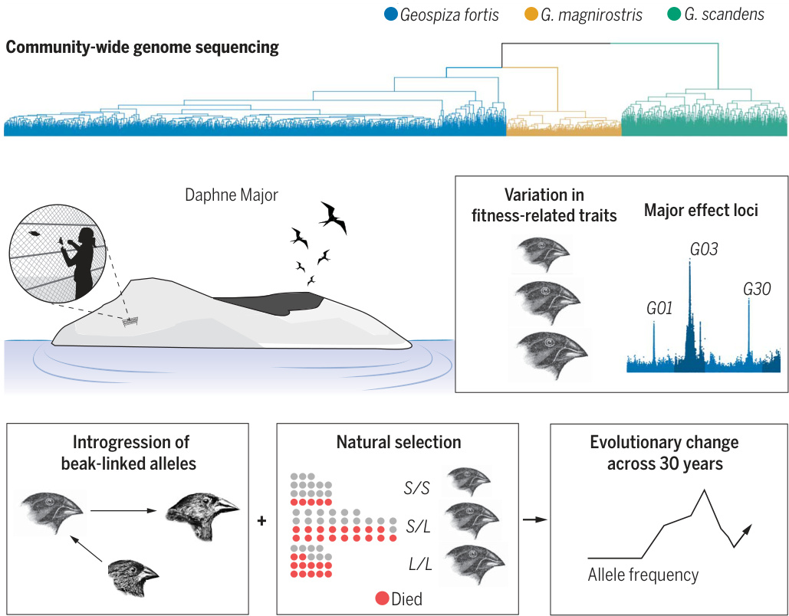
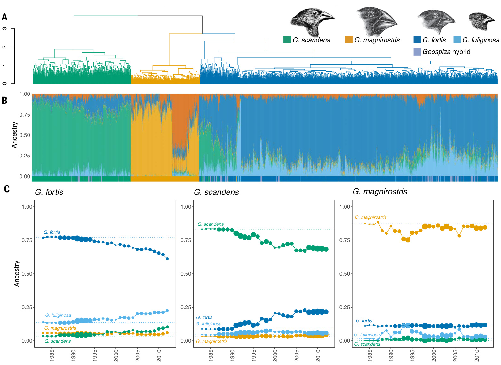
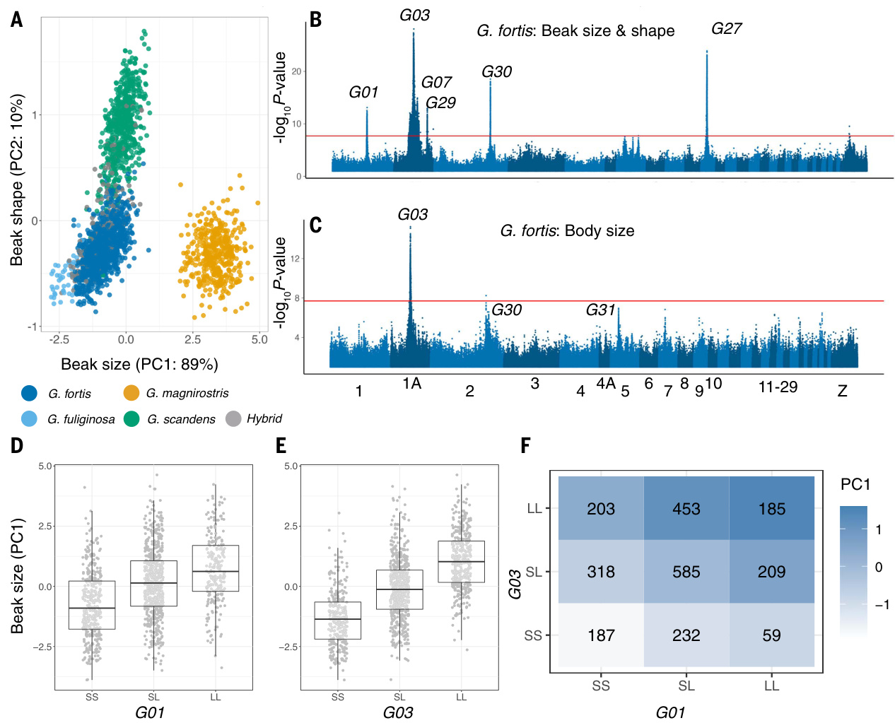
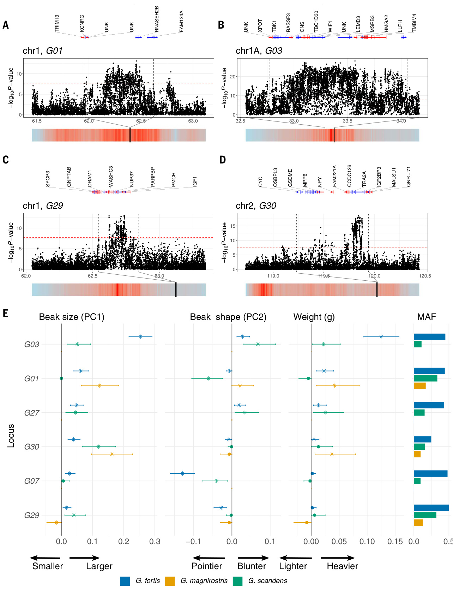
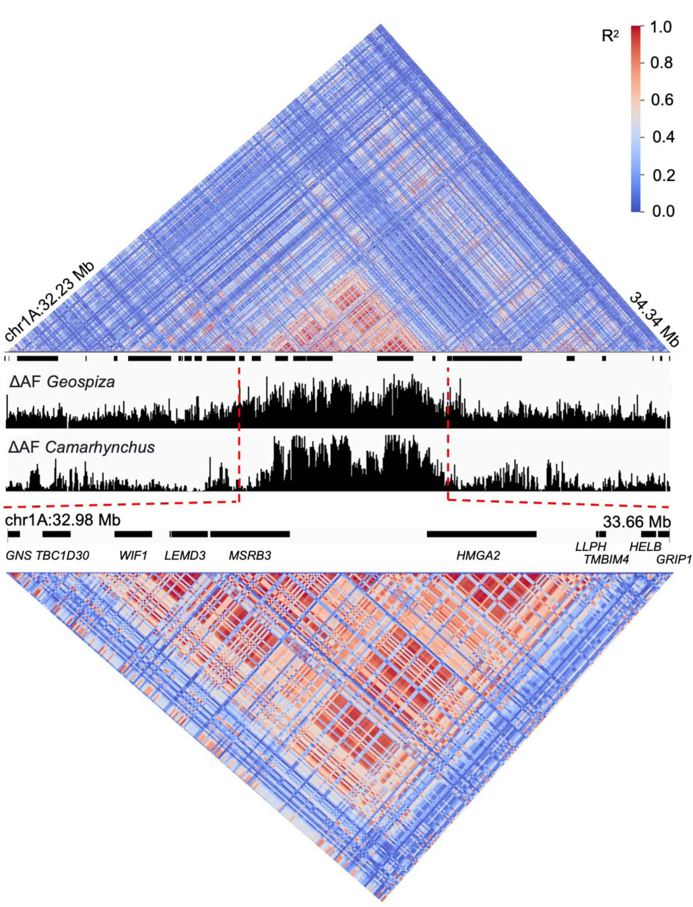
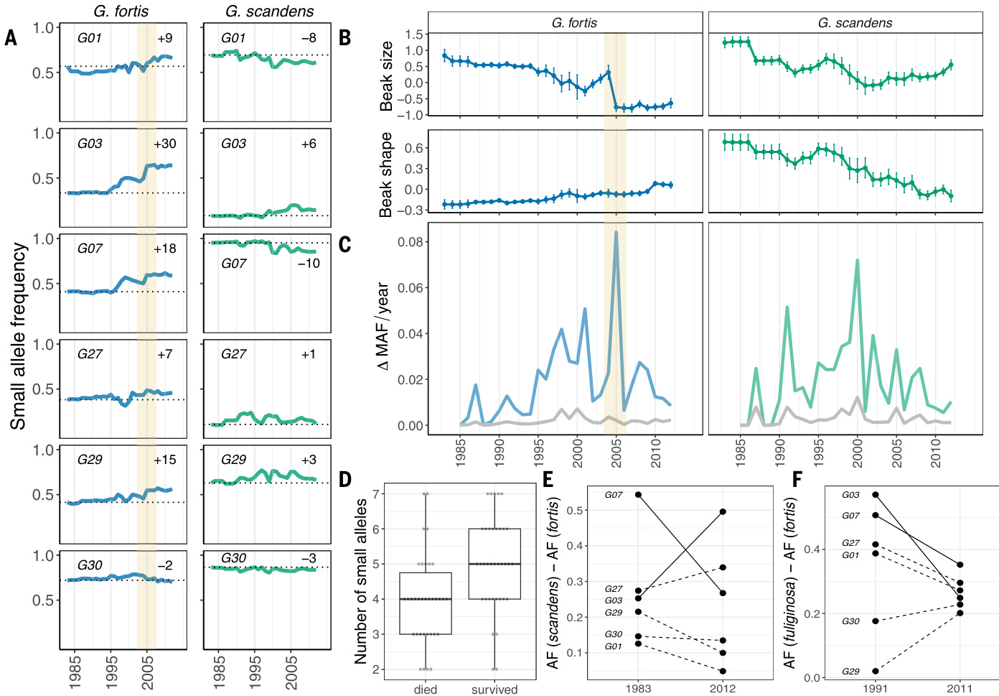

# ADAPTATION Community-wide genome sequencing reveals 30 years of Darwin's finch evolution

Erik D.Enbody\*,Ashley T.Sendell-Price,C.Grace Sprehn,Carl-Johan Rubin,Peter M.Visscher, B.Rosemary Grant,Peter R. Grant,Leif Andersson\*

INTRODUcTioN: Adaptive radiations are groups of organisms that have diverged ecologically from a common ancestor relatively rapidly. They have yielded important insights into the ecology,behavior,and genetics of speciation through inferences of the evolutionary processes that most likely gave rise to observed patterns of divergence.In a few cases,experiments have substantiated these inferences by testing hypotheses of causal mechanisms.Our understanding of evolutionaryradiations has been transformed in the past decade by discoveries of the genomic variation underlying phenotypic divergence.The dynamic genomic variation responsible for rapid evolutionary change in contemporary populations in nature, and its connection with evolution in the past, is not well known.

RATIONALE: We set out to establish the link between contemporary and past evolution in awell-studied system,Darwin's finches in the Galapagosarchipelago.Eighteenspecies have evolved from a common ancestor in the last million years.They divergedinbeakmorphologyand body size,and to a small extent,in plumage.Two evolutionary processes,natural selection and introgressive hybridization,influenced the outcomes of phenotypic evolutionin thisadaptiveradiation.We followed thefatesofindividuallymarkedandmeasured birds of four Geospiza species on Daphne Major Island for 4O years to investigate contemporary evolution.We combined observations on fitness with whole-genome sequencing to reveal and interpret the genetic architecture of evolutionary change.

  
Evolutionarychange revealed by community sequencing.Population monitoring over 3O years followed by genome-wide sequencing of \~4OoO individuals of four Darwin's finch species (the fourth,G.fuliginosa,is not visible in the tree)on Daphne Major, Galapagos lslands.Genome-wide association analysis identified major-effect loci on fitness-related traits,revealing alles transferredamong species by introgresionand subject to natural selection.S,small beak-size allele L,large beak-size allele.

RESULTs:We used whole-genome resequencingdatatotrack evolutionarychangein3955 finchesof four Geospiza species.We identified six loci that together explain as much as45%ofvariationinbeaksizeofG.fortis (medium ground finch),a highly heritable and key ecological trait. One locus alone is responsible for 25% of variation in beak size andl3% of variationinbodysize,andis most likely a supergene comprising four genes that contain multiple adaptive mutations with phenotypic consequences for both traits.The haplotypes associated with large and small beak size were established before the divergence ofGeospiza ground finchesand Camarynchus tree finches.Abrupt changes in allele frequencies at these lociin G. fortis resulted from strong natural selection during an extreme drought and explained a large part of the shift in beak size.Introgression of smallbeakalleles fromthesmallerG.fuliginosa influenced the outcome of natural selection byincreasing the frequencyof small alleles in G.fortis.In the cactus-feeding G.scandens population, we observed more gradual changes inallele frequencies over the studyperiod resulting from introgression.

CONCLUsloN: We show that a few loci of large effecthavehadamajorimpact onthe trajectory of Darwin's finch populations on the smallisland ofDaphneMajor.Theyaffect fitness through their association with survival in relation to competition for food,particularlyduring extremeclimatic events,and have been passed between species through hybridization.A reasonable explanation for the presence oflarge-effect alleles in Darwin's finchesis that these have evolved over time by the accumulation of multiple causal mutations as a response to diversifying selection. They contribute both to phenotypic differences between species and to phenotypic diversity within G.fortis.This genetic architecture differs from the one documented formany polygenic traits in other species lacking large-effect loci, such as beak morphology in some other birds and human stature,whichislikelyduetodifferences among species in selection regimes and the impact of gene exchange.These genetic changes at the populationlevel reveal the dynamics of evolutionary change in this iconic adaptiveradiation.■

# ADAPTATION Community-wide genome sequencing reveals 30 years of Darwin's finch evolution

Erik D.Enbodyl\*+,AshleyT.Sendell-Price,C.Grace Sprehn1±,Carl-Johan Rubin¹,Peter M.Visscher², B. Rosemary Grant²,Peter R. Grant², Leif Andersson1,4\*

Afundamental goal in evolutionary biology is to understand the geneticarchitecture of adaptive traits. Using whole-genome data of 3955 of Darwin's finches on the Galapagos Island of Daphne Major,we identifiedsixlociof large efectthatexplain45%of the variationinthe highlyheritable beak sizeofGeospiza fortis,a key ecological trait.The major locus is a supergene comprising four genes.Abrupt changes in allele frequencies at the loci accompanied a strong change in beak size caused by natural selection during a drought.A gradual change in Geospiza scandens occurred across 3O yearsasa result of introgressive hybridization with G.fortis.This study shows howa few lociwith large effect ona fitness-related trait contribute to the genetic potential for rapid adaptive radiation.

than 3O yearsand measured theirphenotypic evolution,genomic composition,and fitness variation.Finchesweremarkedwithdistinct combinationsofcoloredlegbandstoallow direct determination of individual fitness (survival).We identified, quantified,and documented the importance of sixlarge-effect loci andshowedhowallelicvariationhaschanged under contrasting influences of natural selection and introgressive hybridization. One of the loci comprising four genes in strong linkage disequilibrium (LD)acts asa supergene.Extrapolating from these findings,we suggest that a few loci of large effect contributed disproportionatelyto therapid diversification of species in this classical example of adaptive radiation.These findings demonstratethepotentialtoleveragelong-term genomic monitoring to understand shortand long-term processes that shape natural populations.

1 hefosiosat cess (I,2).By contrast, some extant groups of organisms have diversified froma common ancestor relatively recently into many ecologically differentiated species.These adaptiveradiations are the product of especially favorable intrinsic (genetic) potential and extrinsic (environmental) opportunity (3-5).An example of the latter is entry intoa new environment relatively free fromcompetitors and predators, such as in the colonization of lakes (6) and islands (3,7).Less is known about genetic potential,but recent studies have highlighted the relative contribution of genetic architecture, gene flow,and ancestral variation to adaptive radiation (5,8-1O). Theoretical work (I) predicts that diversification can be rapid when few genetic loci of large effect influence adaptive phenotypes and when adaptive introgression is possible.For differences among individuals in apopulation to propagate to differences among species, these large-effect loci must contribute to individual variation in fitness during incipient speciation.Yet surprisingly little is known of the effect sizes of loci that influence the fitness of individuals in wild populations (12),and how much allele frequencies vary over time beause of natural selection (I3).Thus, large-effectlocimayplayaprominentrole in evolutionary change,but thecircumstances underwhich this happens are not clear (14).

Darwin's finches in the Galapagos archipelago are especially suitable for clarifying these issues.The18 species of this classical adaptive radiation (I5,I6) differ principally in beak size, beak shape,and body size,and also toa lesser extent in plumage colorand pattern.Beak and body traits of three species in the genus Geospizaare highly heritable (16-19).Differences between species reflect dietary specializations (15,2O).Variationin beak-and body-size traits is associated with fitness (survival) indryseasons of food scarcity,especially during droughts (21), whereas reproductive fitnessvariesindependentlyofmorphological traits (22).Only a small fraction of the genome is strongly differentiated among species of the Geospiza ground finches (16,18,19,23),which suggests the possibility that large-effect loci affect fitness (I7).These speciation genomics approaches,referred to as reverse genetics (24), need to be combined with forward genetics, that is the direct study of the genetic variation underlying fitness-related traits (25).In this study,we combine these prior insights on variation in beak morphology and body size with aforward geneticsapproach,motivatedby the needto integrate these two levels of analysis (24,26). To accomplish this,we documented the underlying genetic architecture of morphological traits, themagnitude of the effects of individual loci,and the contribution of natural selection and introgressive hybridization to the fluctuations in allele frequencies at these loci.

We collected data from 3955 individuals from a community of four species of Geospiza ground finches(G.fortis,G.fuliginosa,G.magnirostris, and G.scandens) in theirshared environment ofDaphne Major Island each year for more

# Results Whole-genome communityanalysis over multiplegenerations

Blood samples were collected annually from the four species of finches on Daphne in the years 1988 to 2012 (from individuals hatched as earlyasl983).We performed low-pass, whole-genome sequencing for all individuals captured.In total, we sequenced 3955 individuals to a mean depth of 2.2×,comprising1909 G.fortis,852G.scandens,582G.magnirostris, 55G.fuliginosa,and 555 individualsof hybrid origin (table S1).For 2543 individuals sampled asadults,we measured three beak dimensions (length,depth,and width),bodyweight,and recorded sexwhen known.To identify singlenucleotide polymorphisms (SNPs),we used an iterative imputationpipeline witha reference panel of 433 Darwin's finches sequenced to higher coverage (15± 8×),a denovo pedigreebased recombination map (fig. S1),and the software GLIMPSE(27),which imputes genotypes based on genotype likelihoods (nsNPs = 5,163,84O).We found high concordance for imputed variants that havereference panel allele frequencies >O.5% (fig. S2) and,at the genome-wide level,high correlation between the first two components of a principal component analysis (PCA) using imputed genotypes versus genotype likelihoods (fig. S3).

# Admixture and immigrationare important components of population history

Genome-wide divergence is low among the four Geospiza species on Daphne (Fst = 0.03 to O.17).Totracktheancestry of every individual on the island,we estimated genomic ancestry (i.e., the contribution of historical population structure to an individual's genetic constitution） using a set of ancestryinformative,putativelyneutral, andunlinked markers (28).Daphne finches show extensive signatures of admixture (Fig.1),which is consistent with previous genomic and pedigreebasedobservations (29-32).Reflecting the accumulated effect of introgression,set in motion by ecological changes in the 198Os by two unusually intense El Nino events (33), finch species were more genetically differentiatedat the beginning thanat the endof thestudyperiod; self-ancestry (e.g.,G.fortis inG.fortis) declined 20%in G.fortis,17% in G.scandens,and O.2%in G.magnirostris (Fig. IC).These are likely the lower bounds of ancestry owing to high allele sharing across the radiation (16). The largest introgression of genomicmaterial inG.scandensis fromG.fortis, which increasedby12%.Bycontrast,the largest contribution to the G.fortis population originatesfromG.fuliginosa,whosecontribution to G.fortis increasedby14%.These directions of introgression are consistent with pedigree information (32).By contrast, interspecific ancestry in the noninterbreeding species G.magnirostris remained close to zero throughout (Fig.1C).

  
Fig.1.Admixture history of four species of finches on Daphne Major. (A) Clustering derived from the relatedness matrix produced by using genomewide SNPs in the software GEMMA.(B) Ancestry estimates (K= 5) for each of 3955 individuals on Daphne based on ancestry-informative SNPs.Filed column colors designate the proportion of ancestry from each of the five ancestral populations,representing the four species,plus a second G.magnirostris population   
indark orange.Below,filled horizontal bars designate the field identification, including a hybrid classification (purple).(C) Annual trends in ancestry per species grouping from K=4.Each panel refers to the field identification labeled above.Ancestry estimates are the mean value per cohort each year starting in 1983 and ending in 2Ol2.Ilustrations of the four species are adapted from P.R.G.and Darwin (83).

Changes in ancestry are strongly correlated with phenotypic shifts.Variation in beak morphologyamong the fourDaphne finch species can be decomposed into two principal components that explain 99.7% of morphological variation, with principal component 1(PC1) loading onbeak size (referred toas beak size hereafter) and PC2 on beak shape (referred to as beak shapehereafter) (Fig.2A).In G.fortis, change in beak shape is significantly correlated with the introgression of genomic material from G.scandens (ancestry-phenotype correlation, R²= O.23; fig. S4A) and change in beak size, with introgression from G.fuliginosa (R² = 0.12; fig. S4B).In G. scandens,introgression from G.fortis is correlated with beak shape (R² =

0.3;fig. S4C),andG.fortisandG.fuliginosa both contribute to a change in beak size, but to a small extent (R² = 0.04 and R² = 0.01; fig. S4D).Changes in shared ancestry between G.fuliginosaandG.scandensarenoteworthy because these species have not beenrecorded hybridizing onDaphne in 4O years of intense study of the breeding populations (32).We tracked a haplotype that is associated with G.fuliginosa ancestryand foundthat this haplotype has increased in G.scandens over time (supplementarynote1and fig.S5),which supports field observations and microsatellite analysis that G.fortis is a conduit species forintrogression from G.fuliginosa to G.scandens (32).

The estimated number of ancestral populations on Daphne is a good fit to K= 4 orK= 5, i.e., one more than the expected number of species (fig.S6).AtK= 5,the fifth populationreflects heterogeneity in the Daphne G.magnirostris breeding population.A single pair of individuals initiated the Daphne G.magnirostris population,which was later augmented by immigrants (34). Our ancestry analysis identified two sources of immigrants to Daphne: one from a nearby island (Santa Cruz,Marchena, orIsabela),and a second that was\~5% larger in size from an as-yet-unknown island of origin (fig. S7 and supplementary note 2). These results highlight the dual contributions of hybridization and immigration to genetic and phenotypic diversity onDaphne.

  
Fig.2.Genome-wide association analysis of morphological variation in beak and body size inG.fortis.(A) Morphological PCA for beak width,length,and depth,colored by species with hybrids in gray.PCl explains 89% of variation and PC2 explains 1O%.(B) Multivariate GWAS for beak PCl and PC2,including bodyweight and sexas covariates.The cutoff for genome-wide significance at -loglO(P value)=7.7 is indicated.Locus names match and extend those previously reported (23).(C) GWAS for body weight with sex as a covariate.   
G3O and G31 are highlighted despite falling short of the significance threshold.(D and E) Relationships between GOl and GO3 genotypes and beak size.Genotypes are coded according to carrying the phenotypically small (S)or large (L)allele.(F) Heatmap that demonstrates phenotypic effects of all genotype combinations at GOl and GO3,with sample sizes written within quadrants; positive or negative values mean that a beak size is larger or smaller than the average,respectively.

# HighSNPheritabilityof beakmorphology andbodysize

Heritability of beak traits in Geospiza ground finches is high (35).To determine the power for studying the genetic architecture of morphological traits,we independently calculated SNP heritability (h²sNp) of beak morphology and body size.h²sNp is an estimate of the proportion of variance in phenotypic traits explained by our imputed SNP dataset. This can be biased bylocal variation inLD,so to account for this bias when estimating h²sNp, we used an analysis of LD and minor allele frequency (MAF)- stratified residual maximum likelihood (GREMLLDMS)as implemented in the software package GCTA (36).Here,we analyzed three phenotypic traits,beak size,beak shape,and body size,by using individuals with complete phenotypic data (n=2545).We ranall associationanalyses separately on three genetic clusters (Fig.1A) that were representative ofG.fortis (n=1508), G.scandens (n= 552),and G.magnirostris (n=43o).We didnotincludeG.fuliginosa samples in this analysis because of low power for genotype-phenotype analysis (n = 55).

We estimated a total beak size h²sNp in G.fortis of 0.95 (SE = O.02).Alarge proportion of this estimate is captured by common (MAF> 0.05) and high-LD variants (h²sNp = O.77,SE = 0.04) (fig.S8). Heritability of beak shape (h²sNp =

0.78,SE = 0.03)(fig.S8)and body size (h²sNP = 0.67, SE = 0.04) (fig. S8) are also high (33,35). The high SNP-based estimates match pedigree h² (33,35) and confirm that beak traits and body size are highly heritable in Darwin's finches. High estimates provide an opportunity for genotype-phenotype analysis.

# GWAS identifies large-effect lociunderlying ecological traits

Toidentifylociunderlyingphenotypic variation,we performed a genome-wide association study(GWAS)using the software GEMMA (37).Because beak and body size(weight) are stronglycorrelated(G.fortis,r=0.74,P<0.001), we included body weight as a covariate in a multivariate GWAS of beak size (PCl) and shape (PC2)as the response variables.For beak size andshapein G.fortis,we identified sixindependent loci surpassing a significance threshold of -logio(P)>7.7 set by permutation (Fig. 2B; Fig.3,Ato D; fig.S9,and supplementary note 3).

Alargeregionof significantassociationspanning 4.3 Mb on chromosome 1A contains the previously identified Go3 locus that encompasses HMGA2 and three other genes (Fig.3B) (17).An exploratory analysis indicated that the majorityofthislargeregionisbehavingasa single locus in the G.fortis population on Daphne (fig. Sio).We identified the same six loci using a leave-one-out chromosome approach (fig. Sll and supplementary Note 4).

Weanalyzed body weight using the relatednessmatrixand sexas covariates.In G.fortis, weidentifiedalarge-effectlocus Go3 onchromosome 1A and two additional loci, G3o and G31,thatapproached genome-wide significance (Fig.2C).Thus,Go3 hasa large effect on body weight,and separatelyonbeak size,independent of body weight.Four of the six loci that control beak sizein G.fortisalso reach statistical significance in G.scandens,but only one(Goi) doesso in G.magnirostris (figs S12and Sl3).Weaker associations in these species mayreflect the smaller sample sizes (bya factor of 3 or more) and less withingroup variation at these loci.For example, G.magnirostris is nearly fixed for one allele atboth Go3 and G3o (and therefore, these loci are not detected in these species)(fig.S13).A notable feature ofG.scandensisanassociation of a single large region (34 Mb) on chromosome 5 with beak phenotype (fig. Sl3).This region harbors large divergent haplotypes (fig. S14) and overlaps a regionknown to be resistant to introgression from G.fortis to G.scandens (29).

  
Fig3Detail Beloweacd.i eachftdi [P<0.05:(28).(Right）The MAFwithinspeciesforeach locus.G.magnirostrisisfixedforthelargealeleatGO3,GO7andG27.

Two loci (G29 and G3o) have not been previouslyassociatedwithindividualvariationin Darwin's finches,and each contains insulin-like growth factor-related genes (IGF1 and IGF2BP3, Fig.3, C and D,respectively).These genes are part ofa well-characterized network involved in growth,metabolism,and aging(38-41).IGFs arealso associated withbeak size inPyrenestes Ostrinus (42) and the evolution of life-history variation across amniotes (43).A third IGFrelated gene,IGF2,falls just short of genomewidesignificance in the body-size GWAS in G.fortis (G31).Together with the previously reported G26 (IGFBP2) locus (23),the identificationof fourIGFlociassociated withDarwin's finch beak morphology supports the hypothesis that gene networks involved in this pathway coevolve (43).

# Effectsizes

To estimate effect sizes,we identified haplotypes associated with each GWAS signal (region size, 0.2to 4.3Mb).When combined, the sixloci account for 45% of thevariation in beaksizeand22%ofthevariationin beak shape in G.fortis (Fig.3E). Thesevalues decline to 29 and 22%,respectively,aftercontrollingfor the correlated effects of body size by using residuals of a model that includes body weightandsexascovariates.Similarly,in G.scandens,these sixloci account for 26% of beak size (residuals = 28%) and 2l% of beak shape (residuals=18%).Only three loci (G01, G29,G30) segregate in G.magnirostris,but cumulatively they explain 3o% (residuals = 23%) of variation in beak size (Fig.3E).All loci contribute additively to beak size variationin G.fortis(Fig.2,D toF,and fig.S16).When we fitted these sixlocias covariates ina GREML analysisofG.fortis,we foundthat they explain 59% of total h²sNp in beak size,l7% of the variation in weight,but only 3% of beak shape (fig. S17). Thus,a small number of loci explain a large portion of the heritable beak size variation in G.fortis.Effect-size estimationswere largely robust to filtering based on genomic ancestryestimates,whichsuggeststhat their magnitude is not inflated by background ancestry (fig. S18).

The single largest contributor to beak size is G03,which alone accounts for 25% of beak size variationin G.fortis (Fig.3Eand table S2), half of the total explained variation (45%). Thiswasreducedto 12%afterwe controlled for the correlated effect of body size (fig. S15 and table S2).The remaining five loci explain between 2%(G29)and 6%(G01) of beak size variation in G.fortis.Approximately 14% of beak shape variation in this species is explained byanotherlocus (Go7)after the effectsof body size are controlled.Across species,we detected heterogeneityat four loci associated with beak morphology in G. scandens (28) (supplementaryNote 5).Theselociimply that speciesspecific polymorphisms occur even on shared haplotypes.

Previously,we identified 28 loci with large allele-frequency differences among Geospiza species (23).We reduced them to 14 distinct loci after LD pruning(fig.Sl9) to eliminate those in strong LD within the G.fortis population onDaphne.Fourreached genome-wide significance in the present study (GoI,G03, G07,and G27).Six out of the10 remainingloci eitherhadsmall effectsonbeaksize (four loci explained <1% of variation) (fig.S2O) or explained1 to 2% of variation in beak shape (two loci) (fig. S2O).Inall six cases,the allele associatedwithalargebeakintheG.fortis population on Daphne is the most common in the largest species,G.magnirostris,rare in the smallest species,G.fuliginosa,and at intermediate frequencyin G.fortis (fig.S20). Together, these results indicate that species differences in allele frequencies associated with beak and body size are largely recapitulatedin individual variationinG.fortis.

# Candidatemutations

Identifying candidate causal genes and mutations can link quantitative trait loci (QTL) to theunderlying molecularmechanisms.Therefore,we compileda list of all SNPs and small insertions and deletions (indels)at the six loci affecting beak size in Geospiza withchange in allele frequencies (△AF)≥ O.9 betweenlarge and small haplotypes. Of these 3556 SNPs,12 were missense,ll were synonymous,and 102 sequence variants occurred at noncoding sites with high sequence conservation scores (77-way Vertebrate PhyloP ≥ 2)(table S3).This revealed two general observations.First,only three of the six beak loci harbor missense mutations with △AF ≥ O.9,which, togetherwith the abundance of conserved noncoding changes, suggests that regulatorymutations are important for the observed QTL effects.Second,7 out of 12 (58%)missense mutations were located inlocus Go7.Two are in the transcription factor gene ALXi,which hasa well-established roleincraniofacialdevelopmentinvertebrates (44) and is expressed during beak development in Darwin's finches and in the zebra finch (23).Four out of the five additional missense mutations in GO7occur in LRRIQl,a gene previously implicated in Parus major beak variation (45).The function of the LRRIQI proteinis poorly characterized, but it includes a calmodulin-binding domain (46) that may interact with the calmodulin pathway,a gene network previously implicated during development in Darwin's finches (47).The presence of seven missense mutations close to fixation among the haplotypes at the Go7 locus supports the prediction that this locus harbors multiple causal mutations and may act as a supergene (48).

The GO3 locus is a supergene The large region overlapping Go3 is the most important locus affecting body and beak size in the G.fortis population on Daphne Major (Fig.2,B and C). Go3 was previously defined as a 525-kb region based on a comparison among species (I7, 23).Within this smaller region,the Small(S) beakhaplotype is close to fixation in G.fuliginosa,the Large (L)haplotype is close to fixation in G.magnirostris and G. scandens,whereas the two alleles segregateat intermediate frequencies in G.fortis. By combining haplotype data from these four species on Daphne,we recovered a 525-kb region with △AF approaching 1.O between the S and L haplotypes (Fig. 4, top). These haplotypes also segregate in Camarhynchus tree finches (23),with △AFs approaching 1.0 in each of two distinct regions (Fig.4,bottom). G03 haplotypes for the 525-kb region are conserved inthe fourGeospizaandthethree Camarhynchus species,which suggests that theypredate the split between ground and tree finches (Fig.4).Notably,LD is not homogeneous across the region,as would be expected foran inversion-associated supergene.The shared LDpattern in Geospiza and Camarhynchus shows (i) near-complete LD within each of the two regions with the highest △AFs,one containingWIFl/LEMD3/MSRB3and onecontaining HMGA2;(ii) near-complete LD between these two regions;and (iii) an area between these two regions with lower △AFs among haplotypes and incomplete LD to the two regions (Fig.4).By contrast, the gray warbler finch(Certhidea fusca,sister to all other finch species） shows no strong LD in the corresponding region (fig. S21).These findings are inconsistent with a single mutation with pleiotropic effects on body and beak size in Geospiza and Camarhynchus.Instead,we propose that G03 is a supergene involving four genes and causal mutations with epistatic interactions.

The identification of two core regions of association provides a potential explanation for phology,generally exceedingannual shiftsin allele frequencyat random loci (Fig.5,B and C,and fig. S22).The strongest shift occurred in G.fortis during 2.5 years of drought from late 2003 to early 2005 (60).The beaks of G.fortis became smaller on average because of differential mortality resulting from competition withthemuchlargerG.magnirostris.The frequencyof the Go3 Sallele (Fig.5A) increased sharply fr0m 0.50 in 2004 to 0.63 in 2005(17). Ina generalized linear-mixed model, Go3 alone predicts survival witha selection coefficient of 0.49 (Fisher's exact test,P< O.o5).Three other loci show a very similar change with an increase of the allele associated with small beak size (and two others trend in this direction). Indeed, three loci (Gol,Go3,and G29)in combination predict survival from 2oo4 to 2005 better than Go3alone ina repeated leave-oneout analysis [Akaike information criterion (AIC); AICcombined = 89.4 versus AICGo3 = 97.6] (z = 3.1, P<0.0l)(Fig. 5D). Shifts in allele frequenciesatthese threelocicanaccount for 51% of the phenotypic shift in beak size due to natural selection.

  
Fig.4.LD patterns fromcombined Geospiza and Camarhynchus individuals and△AF.(Top)LD fora 2.1-Mb regionof locus GO3,with gene models indicated as black bars beneath.(Middle)△AF between Sand Lalleles in Geospiza or Camarhynchus.(Bottom)An enlarged region of high LD;black bars represent gene regions.

thepleiotropic effect of Go3 on both beak and body size.One region contains HMGA2, a transcription-facilitating factor gene.HMGA2 is one of the top four loci associated with variation in human stature and explains about 0.3%of genetic variance (49).It has major effects on bodysize in other vertebrates (50-53), and null alleles cause dwarf phenotypes in mice (54),rabbits (55),and pigs (56).We hypothesize that noncoding polymorphisms that affect HMGA2 expression cause a change inboth bodyand beak size,whereas the additional, independent effect on beak size (Fig. 2B) may be controlled by mutation(s) in one or more of the other genes at the Go3 locus. Among these three genes,LEMD3 isan interesting candidate (Fig.4), because loss-of-function

Changes in ancestry (Fig.iC) affected allele frequencies at these six loci.Allele frequency changesat the six loci (2 to 3o%) are greater in G.fortis than in G. scandens (1 to 10%) (Fig. 5A).The phenotypic change toward a blunter beak in G. scandens is the outcome of incremental gene flow fromG.fortis beginning in the 1990s (Fig.1C) (29,59).A spike in allelefrequency change at the turn of the century (Fig.5C) is likely due to this introgression in the El Nino year of 1998:The frequency of hybridization increased in the next two dry years with no breeding when many finches died from starvation, and then decreased in the following year (Fig.1) (33).At the locus with the largest phenotypic effect on beak shape (G07/ ALXI),G.scandens carrying a Blunt allele were more likely to have G. fortis ancestry than those carryingaPointed allele (Generalized linear model, GLM: F=1.l,P< 0.0001; fig. S23A and supplementary note 1). Similarly, G.fortis carrying the Sallele at Go3,the locus of greatest phenotypic effect on beak size,were more likely to have G.fuliginosa ancestry (GLM:F= -1.1,P< 0.0001; fig.S23B)and G.fuliginosa-associated SNPs (fig. S23, Cand D).G. fortis and G. scandens converged in allele frequency at Go7 but diverged at G03 (Fig.5F).Divergence is a consequence of hybridizationbetweenG.fortisandG.fuliginosa and strong selection in the 2004-2005 period, resultingina higher frequencyof theSallele at G03 in G.fortis (Fig.5,E and F).

mutations cause bone density disorders in humans.Further, the LEMD3 protein interacts with bone morphogenic protein (BMP) signaling (57).Differential expression of BMP4 is associated with variationin beak morphology in Darwin's finches (58),although the gene is not associated with a significant QTL effect on beak phenotypes.

# Natural selectionand introgressive hybridization changeallelefrequenciesatmajoreffect loci

TheaveragesizeofG.fortisandG.scandens beak dimensions oscillated in response to changing ecological conditions over the 3O years of monitoring (Fig. 5A) (33,59). Changes in allele frequencyat the six large-effect loci identified in our GWAS changed concordantly with mor

# Conclusions

We describe the genetic architecture underlying morphological traits and temporal variation in fitness in a natural community of Darwin's finches on the undisturbed island of Daphne

  
Fig.5.Evolutionary change over 30 years on Daphne Major.(A） Annual allele frequency trajectoriesat each of the six loci in G.fortisand G.scandens. (B)Annual phenotypic means for G.fortis and G.scandens between 1983 and 2012.(C) The absolute average change in allele frequency[△AF =abs(AFyearn AFyearn-1)] across allsix loci shown in Fig.2.The colored line indicates the average of all six loci and the gray line indicates 1OO randomly selected loci across the genomes with starting allele frequencies that match the six loci.The yellow bar highlights in (A) and (B) denote the 2OO4 to 2OO5 drought event.   
(D)The total number of small alleles at GOl,GO3,and G29 differs between individuals that survived or died in the 2OO4/2OO5 drought event.(E)△AF between G.scandens and G.fortis early compared with late in the study period. GO7 and GO3 are highlighted with solid lines,with GO7 becoming more similar among the two species and GO3,more different.(F) Same as (E),but comparing G.fuliginosa and G.fortis earlyand late in the study period,where both G07 and GO3 have converged in frequency.Additional discussion of GO7 can be found in supplementary note 1.

Major, Galapagos.The study encompassed lowpass,whole-genome sequencing of nearly 4000 birds from more than 30 years and 5 to 10 generations.We report that six loci are collectivelyresponsible foras muchas 45% of the genetic variance in beak size in G.fortis. One locus (Go3) explains 25% of the variance,partly through correlated effects of body size and partly (l2%) through direct effects independent of body size.Allele frequencies at the six loci inG.fortis andG.scandens changed asaresult of episodic natural selection and recurring introgressive hybridization.Because allele frequencies differ among species (23), these multidecade observations of allele dynamics provide the basis for a genetic understanding of speciation overa much longer period.

The field-standard geometricmodelis dominated by manyloci of small effect (61, 62). Darwin's finchesareclearly toward one extreme of variation in effect-size distributions. Empirical studieswitha comparable experimental design (i.e., sample size and methodology)and that use quantitative traits with highheritabilityarenotyetavailable for other birds.Therefore,for comparison,we turn to humans because stature has a heritability as highas that of beak traitsinDarwin's finches (h²\~ 0.8o),and effect sizes are estimated from millions of individuals (49).However, the selection pressuresaffecting human stature differ from those affecting beak size,which influences the distribution of effect sizes (63). Nevertheless,humanstatureis themost studied quantitative trait inanyanimal (49) and is useful to place ourresults in context.For example,a GWAS on humans from the UK Biobank that used a sample size identical to the one used here for G.fortis(n=1508)has only 20% power to detect a single QTL that reaches genome-wide significance (fig. S24) because thevariance explainedby individualloci is small. The top six loci from a recent GWAS study (49),based on 5.4 million individuals, onlyexplainabout1%ofthevariancein contrast to the 45 and 22% of the explained variance forbeaksizeand beakshape,respectively, inDarwin'sfinches.HMGA2providesastark contrast. The Go3locus that includesHMGA2 explains 25and13% of variation in beak size andbodysize,respectively,whereasHMGA2, one of the top six loci in humans,explains only 0.3%of variationinstature(49).Human statureis likelyunderstabilizingselection,meaning that large-effect alleles are detrimental (64, 65), occur at low frequencies,and contribute little to trait variance.Conditions that vary over time may instead lead to balancing selectionand the maintenance of variation,rather than the fixation of beneficial alleles,because offluctuationsin thefitnessofallelesat individual loci. This is the case in the Galapagos, where oscillating environmental conditions thatlackpredictabilityhave unpredictable evolutionary outcomes (59).We found substantial shifts in allele frequencies at these loci under periods of environmental stress and intense interspecies competition in G. fortis, which has an intermediate phenotype and genotype (Fig.5).The locimay have particularly large effectsbecause theyhave been subject to divergent selection during the evolution of Darwin's finches. Strong selection on beak size has driven alternative Go3 alleles close to fixationin the large(G.magnirostris) and small (G.fuliginosa) species,but their large phenotypiceffectsareobservedinG.fortis,where they are subject to oscillating directional selection.These findings offera snapshot into the population-level processes that underlie the long-term processes of speciation and adaptive radiation.

Asecond feature of interest in the genetic architecture of phenotypes,inaddition to effect sizes of individual loci, is the physical arrangement and interactions of genes on chromosomes.We identified large genomic regions acting as supergenes,which are clusters of closely linked genes in which haplotypes that control one or more phenotypic traits are inherited as alleles at a single locus owing to suppressed recombination,often due to the presence of inversions (66,67).The LD pattern for the \~525-kb G03 haplotypes associated with large and small beak size predates the split betweenGeospizaandCamarhynchus,dated 400,000 years ago (16).This implies that G03 is a supergene composed of multiple sequence variants that show epistatic interaction.It is improbable that such large haplotype blocks canbe maintained over\~4oo,ooo years without strong selection and suppressed recombination. There is no indication that the G03 region involves an inversion,but it occurs in a low recombination region (23),and rare recombinant haplotypes with low fitness may be eliminatedbyselection.Approximately7Mb from the Go3 region is anotherlocus,G07 (ALXI),which was suggested to be a supergene in a previous study (48). The two regions are separated bya recombination hotspot (23).This observation supports the prediction that clusters of adapted loci are formed during local adaptation (67, 68) and have an important role during adaptive radiation (5).

A third important factor is gene flow between closely related populations. Gene exchange modulates the segregation of large-effect alleles in Darwin's finches and in other species (12,69). Our results support theoretical predictions from simulations that adaptive radiationis likely to involve loci of large effect (II),and that the evolution of the effect size of fitnessrelated traits is predicted to move toward fewerlocioflarge effect (andmultiple linked sites) when selection for local adaptation takes place with ongoing gene flow (68, 70). This factor likely contributes to differences between ourresults and a reported polygenic basis for beak variation that lackslarge-effect loci in

Passerdomesticus(7I) and Parusmajor(45). Both species are widespread with large effective population sizes that are unaffected by introgressive hybridization.

Adaptive radiations are the product of a favorable genetic potential and environmental opportunity for evolutionary change (3-5). The value of Darwin's finches lies in what they reveal about these featuresin the early stages of speciationinayoungadaptiveradiation,when ecological divergence has occurred repeatedly andstrongly but without the kind of genetic divergence that impairs fertilityandviability (72).Focusing on genetic potential,we have shown that a few identified loci have large effects,individually and in combination,on quantitative, fitness-related,phenotypic traits. Allele frequenciesat the loci fluctuate through directional natural selection and introgressive hybridization, therebyrevealing the evolutionary dynamics of a classical case of adaptive radiation.

# Materialsandmethods

Detailed materials and methods canbe found in the supplementary materials (28).

# Samplepreparationand genotype imputation

Blood samples were collected from Darwin's finches on Daphne Major and other Galapagos islands byP.R.G.using methods described elsewhere (16,I7,33),and all phenotypic measurementswerecollectedbyP.R.G.Thisincluded 3955 finches on Daphne Major,and we generated Tn5 transposon-based whole-genome libraries for low-coverage short-read sequencing(73-75).Among these samples are 607 samples of bothG.fortisandG.scandensused inarecent publication (73).We created a reference panel of individuals with high-confidence variant sites for all 18 species of Galapagos finches and two outgroup species.This panel consisted of previouslypublished (16,17, 23) and new sequencing data generated in this study (supplementary materials).To create ourreference panel,we statistically inferred haplotypes using a combination of WhatsHap (76) (v0.18) and SHAPEIT4 (77) (v4.1.3). For all low-coverage individuals,we imputed variable sitesusing GLIMPSE (27) (V1.1),aided by a recombination map generated with 818 Geospiza families and Lep-MAP3 (78).

# Genomic analysis

For the four species on Daphne Major(G.fortis, G.scandens,G.fuliginosa,and G.magnirostris), we generated a set of ancestry-informative markersusing samples collected from other islands in the archipelago. Using these ancestryinformative markers,we ran ADMIXTURE vl.3.0 (79) on all Daphne samples to estimate ancestry coefficients for every individual.We conducted a GWASusing linearmixed models with the software GEMMA(37)and GCTA (80)

to identify QTLs associated with beak morphologyand body size.After identifying loci with strong associations,we identified haplotypes that are associated with each QTL. Analysis of effect sizesand theassociation between allele frequencies at these loci and ecological and other biotic factors were all conducted byusing these haplotype identifications.We searched for variants with putative functional consequences using a combination of variant effect analysis in snpEff(81) and phylogenetic conservation score analysis based on PhyloP.

1.G.G.Simpson,Tempo and Mode in Evolution (Columbia Univ. Press, 1944).   
2.A.R. Evans et al.,The maximum rate of mammal evolution. Proc.Natl.Acad.Sci.U.S.A.109,4187-4190 (2012). doi: 10.1073/pnas.1120774109; pmid: 22308461   
3．R.G. Gillespie et al., Comparing adaptive radiations across space,time,and taxa.J.Hered.111,1-20(2020). doi: 10.1093/jhered/esz064; pmid: 31958131   
4.J.I.Meier et al.,The coincidence of ecological opportunity with hybridization explains rapid adaptive radiation in Lake Mweru cichlid fishes. Nat. Commun.10,5391 (2019). doi: 10.1038/ s41467-019-13278-z; pmid: 31796733   
5．D.A. Marques,J.I. Meier, O.Seehausen,A combinatorial view on speciation and adaptive radiation. Trends Ecol. Evol. 34, 531-544 (2019). doi: 10.1016/j.tree.2019.02.008: pmid:30885412   
6．O.Seehausen, C.E.Wagner, Speciation in freshwater fishes. Annu. Rev. Ecol. Evol. Syst.45,621-65l(2014).doi: 10.1146/ annurev-ecolsys-120213-091818   
7.L. Valente et al.,A simple dynamic model explains the diversity of island birds worldwide. Nature 579,92-96 (2020). doi:10.1038/s41586-020-2022-5:pmid:32076267   
8.S.Gavrilets,J.B.Losos,Adaptive radiation: Contrasting theory with data. Science 323,732-737 (2009).doi: 10.1126/ science.1157966; pmid: 19197052   
9.C. H. Martin, E.J. Richards,The paradox behind the pattern of rapid adaptive radiation: How can the speciation process Sustain itself through an early burst? Annu.Rev.Ecol. Evol. Syst. 50,569-593 (2019).doi: 10.1146/annurev-ecolsys110617-062443; pmid: 36237480   
10.S.J.Arnold,Evolutionary Quantitative Genetics (Oxford Univ. Press,2023).   
11.S. Gavrilets,A. Vose, Dynamic patterns of adaptive radiation. Proc.Natl.Acad. Sci. U.S.A.102,18040-18045 (2005). doi:10.1073/pnas.0506330102;pmid:16330783   
12.0.Seehausen et al.,Genomicsand theoriginof species. Nat. Rev.Genet.15,176-192 (2014).doi: 10.1038/nrg3644; pmid: 24535286   
13.D.Agash,aneSingalRevisigthelefetio in adaptation. Am. Nat.726012 (2023). doi:10.1086/726012   
14.H. A. Orr, J.A. Coyne,The genetics of adaptation: A reassessment. Am. Nat.140, 725-742 (1992). doi:10.1086/ 285437; pmid: 19426041   
15.P.R.Grant,EcologyandEvolutionof Darwin'sFinches (Princeton Science Library Edition) (Princeton Univ.Press,1986).   
16.S.Lamichhaney et al., Evolution of Darwin's finches and their beaks revealed by genome sequencing. Nature 518,371-375 (2015). doi: 10.1038/nature1418l; pmid: 25686609   
17.S. Lamichhaney et al., A beak size locus in Darwin's finches facilitated character displacement during a drought. Science 352,470-474 (2016). doi: 10.1126/science.aad8786; pmid: 27102486   
18.J.A.Chaves et al., Genomic variation at the tips of the adaptive radiation of Darwin's finches. Mol. Ecol. 25,5282-5295 (2016). doi: 10.1111/mec.13743; pmid: 27363308   
19.L.P. Lawson, K. Petren,The adaptive genomic landscape of beak morphology in Darwin's finches. Mol. Ecol. 26, 4978-4989 (2017). doi: 10.11l1/mec.14166: pmid: 28475225   
20.P.T.Boag,P.R.Grant,Theclassicalcaseofcharacterreease Darwin's finches (Geospiza) on Isla Daphne Major,Galapagos. Biol.J. Linn. Soc.Lond.22,243-287 (1984).doi: 10.111/ j.1095-8312.1984.tb01679.x   
21.P.T. Boag, P.R. Grant,Intense natural selection in a population of Darwin's finches (geospizinae)in the Galapagos.Science 214, 82-85 (1981).doi: 10.1126/science.214.4516.82; pmid: 17802577

# REFERENCESAND NOTES

22.P.R.Grant,B.R.Grant,Non-randomfitness variationntwo populations of Darwin'sfinches.Proc.Biol.Sci.267,131-138 (2000).doi: 10.1098/rspb.2000.0977; pmid: 10687817   
23CJubntdtt depends onancestral genetic modules.Sci.Adv.8.eabm5982 (2022).doi: 10.1126/sciadv.abm5982; pmid: 35857449   
24.K. Bomblies, C.L.Peichel, Genetics of adaptation. Proc. Natl. Acad.Sci. U.S.A.119.e2122152119 (2022).doi: 10.1073/ pnas.2122152119;pmid:35858399   
25.R.D.H.Barrett，H.EHoekstra,olecularspandrestsof adaptation at the genetic level. Nat.Rev. Genet.12,767-780 (2011).doi: 10.1038/nrg3015: pmid: 22005986   
26.JR.Stinchcombe,H.E.HoekstraCombiningpopulation genomics andquantitative genetics:Finding thegenes underlyingecologicallyimportanttraits.Hredity170 (2008). doi: 10.1038/sj.hdy.6800937; pmid: 17314923   
27.S.Rubinaccbeoomesteeaea Eficientphasingandimputationofow-coveragesequencing data using large reference panels. Nat. Genet. 53,120-126 (2021).doi: 10.1038/s41588-020-00756-0; pmid: 33414550   
28.Materialsandmethodsareavalableassupplementary materials.   
29.S.Lamichhaney et al.,Female-biased gene flow between two species of Darwin's finches. Nat.Ecol. Evol.4,979-986 (2020).doi: 10.1038/s41559-020-1183-9;pmid:32367030   
30.P.R.Grant,B.R.Grant,J.A.Markert,L.F.KellrKPetren ConvergentevolutionofDarwin'sfinchescausedbyintrogsive hybridizationandselection.Evolution58,1588-1599 (004). pmid: 15341160   
31.P.R.Grant,B.R.Grant,Conspecificversus heterospecifcgene exchange betweenpopulationsof Darwin'sfinches.Philos. Trans.R.Soc.Lond.BBiol.Sci.365,1065-1076 (2010). doi: 10.1098/rstb.2009.0283; pmid: 20194169   
32.P.R.Grant,B.R.Grant,Triadhybridizationviaaconduit species.Proc.Natl.Acad.Sci.U.S.A.177888-7896(2020). doi: 10.1073/pnas.2000388117: pmid: 32213581   
33.P.R.Grant,R.B.Grant,40YearsofEvolution:Darwin'sFinches onDaphne Major Island(Princeton Univ.Press,2014).   
34.P.R.Grant,B.R.Grant,K.Petren,Apopulationfounded bya single pair of individuals: Establishment,expansion,and evolution.Genetica1582(200).doi3/ A:1013363032724; pmid: 11838776   
35.L.F. Keler, P. R. Grant, B. R. Grant, K. Petren, Heritability of morphologicaltraitsinDarwin'sfinches:Misidentfiedpateity and maternal effects.Heredity 87,325-336 (2001). doi: 10.1046/j.1365-2540.2001.00900.x: pmid: 11737279   
36.JYang etal.Geneticvarianceestimationwithimputed variants finds negligible missing heritability for human height and body massindex.Nat.Genet.47.114-120 (2015). doi:101038/ng39pid05   
37.X. Zhou, M. Stephens, Eficient multivariate linear mixed modelalgorithms forgenome-wideassociationstudies. Nat. Methods 11,407-409 (2014).doi: 10.1038/nmeth.2848; pmid: 24531419   
38.S.WulerRewih.Nallinali and metabolism. Cel/ 124,471-484 (2006).doi: 10.1016/ j.cell.2006.01.016; pmid: 16469695   
39DMelzee ageing.Nat.Rev. Genet.21,88-101 (202O).doi: 10.1038/ s41576-019-0183-6: pmid: 31690828   
40.R.Zoncu,enDbain:Frow integration tocancer,diabetesandageing.Nat.Rev.Mol.Cel Biol. 12,21-35 (20l1).doi: 10.1038/nrm3025; pmid: 21157483   
41Kori popular breed stereotypes.Science 376,eabk0639 (2022). doi:10.1126/science.abk0639;pmid:35482869   
42.B.M.vonHoldt etal.,Growth factor gene IGFlisassociated withbillsizeinebabledseedacrt ostrinus. Nat. Commun.9,4855 (2018).doi: 10.1038/s41467- 018-07374-9; pmid: 30451848   
43.S.E. McGaugh et al.,Rapid molecular evolution across amniotesoftheIS/TOR network.Proc.Natl.Acad.Sci.U.S.A. 112, 7055-7060 (2015). doi: 10.1073/pnas.1419659112; pmid: 25991861   
44.J.Pinietal.Aelatedfrontoaaldysplasirsultsfrom defective neural crest cell development and migration. EMBO Mol.Med.14,e16289 (2022).doi:10.15252/ emmm.202216289; pmid: 35795978   
45.M.Bosseetal.Recentnaturalselectiocausesadaptive evolutionofanavianpolygenic trait.Science358,365-368 (2017).doi: 10.1126/science.aal3298:pmid:29051380   
46.LRIQeciepedQtftai (human)]. NCBl; https://www.ncbi.nlm.nih.gov/gene/84125. elongateu Deak morproiogy I Uarwis Incres. Nature 442, 563-567 (2006). doi: 10.1038/nature04843: pmid: 16885984   
48.M.S.Almen et al.,Adaptive radiationof Darwin's finches revisited using whole genome sequencing. BioEssays 38. 14-20 (2016). doi: 10.1002/bies.201500079: pmid: 26606649   
49.LYengoetal.,Asaturatedmapofcommongeneticvariants associated withhuman height.Nature 610,704-712 (022). doi: 10.1038/s41586-022-05275-y: pmid: 36224396   
50.M.T.Websteretal.,Lnkedgeneticvariantsonchromosome 10controlearmorphologyandbodymassamongdogbreeds. BMC Genomics16474 (2015).doi:10116/s12864015-1702-2; pmid: 26100605   
51.M.Frischknecht etal.,A non-synonymous HMGA2 variant decreasesheight inshetlandponiesandothersmallhorses. PLOS ONE10, e0140749 (2015).doi: 10.1371/journal. pone.0140749; pmid: 26474182   
52.C.J.Posbergh,H.J.Huson,Allsheeps and sizes:Agenetic investigation of mature body size across sheep breeds reveals a polygenic nature.Anim.Genet.52,99-107 (2021). doi: 10.111/age.13016; pmid: 33089531   
53.Z.WuetalHeterogeneityofdwarfphenotypeinDutchtradional chickenbreedsrevealedbyenomicnalyses.vol.pl 1095-1108 (2021). doi: 10.111/eva.13183; pmid: 33897823   
54.M.O.Leetal.,Hmga2deficiencyisassociatedwithallometric growthretardation,infertilityandbehavioralabnormalities in mice.G312, jkab417 (2022).doi: 10.1093/g3journal/jkab417   
55.M.Carneiroetal.,Dwarfismandalteredcraniofacial development in rabbits is caused by a 12.1 kb deletion at the HMGA2 locus.Genetics 205,955-965 (2017).doi: 10.1534/ genetics.116.196667; pmid: 27986804   
56.J.Chungetal. High mobility groupA2 (HMGA2)deficiencyin pigs leads todwarfism,abnormal fetal resource allocation,and cryptorchidism.Proc.Natl.Acad.Sci.U.S.A.115,5420-5425 (2018).doi: 10.1073/pnas.1721630115;pmid: 29735702   
57.J. HellemansetalssfuntionmutatisinEult in osteopoikilosis,Buschke-Ollendorff syndrome and melorheostosis.Nat. Genet. 36,1213-1218 (2004). doi: 10.1038/ng1453;pmid:15489854   
58.O. Campas, R. Mallarino,A. Herrel, A.Abzhanov, M.P.Brenner, Scaling and shear transformations capture beak shape variationinDarwin'sfinches.Proc.Natl.Acad.SciUSA.107 3356-3360 (2010). doi: 10.1073/pnas.0911575107; pmid: 20160106   
59.P.R.Grant,B.R.Gant,Unpredictableevolutionin3-ear studyof Darwin'sfinches.Science296,707-711 (2002). doi: 10.1126/science.1070315;pmid: 11976447   
60.P.R.Grant,B.R.Gant,Evolutionofcharacterdisplacementin Darwin's finches.Science 313,224-226 (2006).doi: 10.1126/ science.1128374; pmid: 16840700   
61.H.A.Orr，Thepopulation geneticsofadaptation:The distribution of factors fixed during adaptive evolution.Evolution 52,935-949 (1998). doi: 10.2307/2411226; pmid: 28565213   
62.J.K.PritchardA.iiedaptation-tbyeesloe Nat. Rev. Genet.11,665-667 (2010).doi: 10.1038/nrg2880; pmid: 20838407   
63.D.L.Stern,V.OrgogozoThelociofevolution:Howpredictable isgeneticevolution？volutin62155-21778) doi: 10.111/j.1558-5646.2008.00450.x; pmid: 18616572   
64.J. Zeng et al.,Signatures of negative selection in the genetic architecture of human complex traits. Nat. Genet. 50,746-753 (2018).doi: 10.1038/s41588-018-0101-4: pmid: 29662166   
65.J.S. Sanjak,J. Sidorenko, M.R. Robinson,K.R.Thornton, P. M.Visscher, Evidence of directional and stabilizing selection in contemporaryhumans.Proc.Natl.Acad.Sci.U.S.A.5151-156 (2018).doi: 10.1073/pnas.1707227114; pmid: 29255044   
66.J.Gutierrez-Valencia,P.W. Hughes,E.L.Berdan,T. Slotte,The genomicarchitectureandevolutionary fatesof supergenes. Genome Biol.Evol.13,evab057 (2021).doi: 10.1093/gbe/ evab057; pmid: 33739390   
67.M. Kirkpatrick, N. Barton,Chromosome inversions, local adaptation and speciation. Genetics 173,419-434 (2006). doi: 10.1534/genetics.105.047985; pmid: 16204214   
68.S.Yeaman.CWiockThegeneticarceuef adaptation under migration-selection balance. Evolution 65. 1897-1911 (2011). doi: 10.1111/j.1558-5646.2011.01269.x; pmid: 21729046   
69.N.B.Edelman et al., Genomic architecture and introgression shape a butterfly radiation. Science 366,594-599 (2019). doi: 10.1126/science.aaw2090; pmid: 31672890   
70.0.Savolainen，ascouxJ.Merilacologicalgnoicof local adaptation. Nat. Rev. Genet.14,807-820 (2013). doi: 10.1038/nrg3522;pmid: 24136507   
71.S.L. Lundregan et al.,Inferences of genetic architecture of bill morphology in house sparrow using a high-density SNP array point to a polygenic basis. Mol. Ecol.27,3498-3514 (2018). doi: 10.11l1/mec.1481ll; pmid: 30040161   
72.P. R. Grant, B. R. Grant, Mating patterns of Darwin's Finch hybrids determined by song and morphology. Biol. J. Linn. Soc. Lond. 60, 317-343 (1997). doi: 10.1111/j.1095-8312.1997.tb01499.x   
73.E.D. Enbody et al., A multispecies BCO2 beak color polymorphism in the Darwin's finch radiation. Cur. Biol.31, 5597-5604.e7 (2021). doi: 10.1016/j.cub.2021.09.085; pmid: 34687609   
74.S. Picelli et al.,Tn5 transposase and tagmentation procedures for massively scaled sequencing projects. Genome Res.24, 2033-2040 (2014). doi: 10.1101/gr.177881.114; pmid: 25079858   
75. C.G. Sprehn, E. Enbody, Y. Zan, L. Andersson, Tn5 based tagmentation library prep protocol, high throughput vl (2021) doi:10.17504/protocols.io.bv5gn83w   
76. M. Martin et al., WhatsHap: fast and accurate read-based phasing. bioRxiv (2016),p. 085050.   
77.O. Delaneau, J.-F. Zagury, M. R. Robinson, J. L. Marchini, E.T. Dermitzakis,Accurate,scalable and integrative haplotype estimation. Nat. Commun.10. 5436 (2019). doi:10.1038/ s41467-019-13225-y: pmid: 31780650   
78.P.Rastas, Lep-MAP3: Robust linkage mapping even for low-coveragewhole genome sequencing data. Bioinformatics 33,3726-3732 (2017).doi:10.1093/bioinformatics/btx494; pmid:29036272   
79.D. H. Alexander, J. Novembre, K. Lange, Fast model-based estimation of ancestry in unrelated individuals. Genome Res.19, 1655-1664 (2009). doi: 10.1101/gr.094052.109: pmid: 19648217   
80.J. Yang,S. H. Lee, M.E. Goddard, P. M. Visscher, GCTA: A tool for genome-wide complex trait analysis.Am. J. Hum. Genet. 88, 76-82 (20ll). doi: 10.1016/j.ajhg.2010.11.01l; pmid: 21167468   
81.P. Cingolani et al., A program for annotating and predicting the effects of single nucleotide polymorphisms,SnpEff: SNPs in the genome of Drosophila melanogaster strain wll18; iso-2; iso-3. Fly 6,80-92 (2012). doi: 10.4161/fly.19695; pmid: 22728672   
82.E.Enbody, Data associated with Enbody et al.,2O23, Zenodo (2023): https://dx.doi.org/10.5281/zenodo.8044096.

# ACKNOWLEDGMENTS

We thank J. Sidorenko for assistance in processing UK Biobank data,R. Corbett-Detig for insightful discussion,and A. Cocco and J. Pettersson for assistance in the lab.The National Genomics Infrastructure (NGl)/Uppsala Genome Center provided service in massive parallel sequencing,and the computational infrastructure was provided by the Swedish National Infrastructure for Computing at UPPMAX,partially funded by the Swedish Research Council grant agreement no.2O18-O5973.This study used genotype and phenotype data from the UK Biobank resource under approved project 125O5.The National Science Foundation funded the collection of material under permits from the Galapagos National Parks Service and the Charles Darwin Research Station,and in accordance with protocols of Princeton University's Animal Welfare Committee.Funding:This project was financially supported by Vetenskapsradet (2Ol7-O2907) and the Knut and Alice Wallenberg Foundation (KAW 2O16.0361). Author contributions: Conceptualization: L.A., P.R.G., B.R.G., and E.D.E.; Data curation: C.G.S.and E.D.E.; Methodology: E.D.E. and L.A.; Formal analysis: E.D.E., A.S.P., C.J.R., and P.M.V.; Investigation: C.G.S., E.D.E., P.R.G., and B.R.G.; Visualization: E.D.E.and A.S.P.; Funding acquisition: L.A., P.R.G., and B.R.G.; Resources: P.R.G.and B.R.G. Supervision: L.A. Writing- original draft: E.D.E.Writing-review and editing:allauthors.Competing interests: The authors declare that they have no competing interests.Dataand materialsavailability:All custom code is available at Zenodo (82). Sequence data in this study have been deposited in the Sequence Read Archive under BioProject PRJNA897926.License information: Copyright @ 2023 the authors,some rights reserved; exclusive licensee American Association for the Advancement of Science.No claim to original US government works.https://www.science.org/about/sciencelicenses-journal-article-reuse

# SUPPLEMENTARYMATERIALS

science.org/doi/10.1l26/science.adf6218   
Materials and Methods   
Supplementary Notes S1 to S5   
Figs. S1 to S26   
Table Sl to S6   
References (83-113)   
Submitted 7 November 2O22;accepted 22 August 2023   
10.1126/science.adf6218