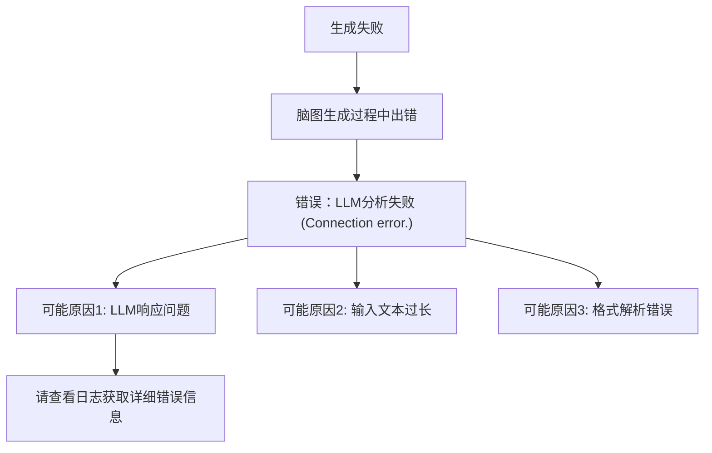

# 文献分析报告: tmph3z0ai2e

---

## 目录
<ul>
<li><a href='#1-文献元数据'>1. 文献元数据</a></li>
<li><a href='#1b-图片内容分析'>1b. 图片内容分析</a></li>
<li><a href='#2-方法学分析'>2. 方法学分析</a></li>
<li><a href='#3-创新点提取'>3. 创新点提取</a></li>
<li><a href='#4-问答对'>4. 问答对</a></li>
<li><a href='#5-文献故事'>5. 文献故事</a></li>
<li><a href='#6-文献逻辑脑图'>6. 文献逻辑脑图</a></li>
<li><a href='#7-深度文献分析'>7. 深度文献分析</a></li>
</ul>

---

## 1. 文献元数据

点击展开/折叠

<table>
  <tr><th colspan='2' style='text-align:center;'>文献基本信息</th></tr>
  <tr><td><b>标题</b></td><td>Community-wide genome sequencing reveals 30 years of Darwin’s finch evolution</td></tr>
  <tr><td><b>作者</b></td><td>Erik D. Enbody; Ashley T. Sendell-Price; C. G. Sprehn; Carl-Johan Rubin; P. Visscher; B. Grant; P. Grant; Leif Andersson</td></tr>
  <tr><td><b>DOI</b></td><td> 10.1126/science.adf6218</td></tr>
  <tr><td><b>发表日期</b></td><td>N/A</td></tr>
  <tr><td><b>期刊/来源</b></td><td>Science</td></tr>
</table>

<b>Semantic Scholar 信息</b>

<table>
  <tr><td><b>Paper ID</b></td><td>f957b2d45a93ddea76863e1c554c74908562e902</td></tr>
  <tr><td><b>被引次数</b></td><td>26</td></tr>
  <tr><td><b>摘要</b></td><td>A fundamental goal in evolutionary biology is to understand the genetic architecture of adaptive traits. Using whole-genome data of 3955 of Darwin’s finches on the Galápagos Island of Daphne Major, we identified six loci of large effect that explain 45% of the variation in the highly heritable beak ...</td></tr>
</table>

<b>PubMed 信息</b>

<table>
  <tr><td><b>PMID</b></td><td>37769091</td></tr>
  <tr><td><b>摘要</b></td><td>A fundamental goal in evolutionary biology is to understand the genetic architecture of adaptive traits. Using whole-genome data of 3955 of Darwin’s finches on the Galápagos Island of Daphne Major, we identified six loci of large effect that explain 45% of the variation in the highly heritable beak ...</td></tr>
</table>

---

## 1b. 图片内容分析

点击展开/折叠

未检测到图片或图片内容分析结果。

---

## 2. 方法学分析

点击展开/折叠

错误：LLM分析失败 (Connection error.)

---

## 3. 创新点提取

点击展开/折叠

错误：LLM分析失败 (Connection error.)

---

## 4. 问答对

点击展开/折叠

未能生成问答对。

---

## 5. 文献故事

点击展开/折叠

错误：LLM分析失败 (Connection error.)

---

## 6. 文献逻辑脑图

点击展开/折叠

---

## 7. 深度文献分析

点击展开/折叠

错误：LLM分析失败 (Connection error.)

<footer>

<b>报告生成时间:</b> 2025-06-24 17:45:31

<i>此报告由 SLAIS (Scientific Literature AI Insight System) 自动生成</i>

</footer>