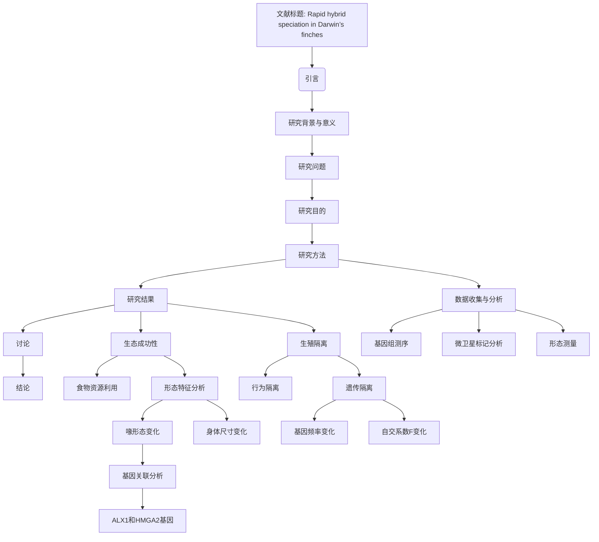

# 文献分析报告: tmpkd2gloot

---

## 目录
<ul>
<li><a href='#1-文献元数据'>1. 文献元数据</a></li>
<li><a href='#1b-图片内容分析'>1b. 图片内容分析</a></li>
<li><a href='#2-方法学分析'>2. 方法学分析</a></li>
<li><a href='#3-创新点提取'>3. 创新点提取</a></li>
<li><a href='#4-问答对'>4. 问答对</a></li>
<li><a href='#5-文献故事'>5. 文献故事</a></li>
<li><a href='#6-文献逻辑脑图'>6. 文献逻辑脑图</a></li>
<li><a href='#7-深度文献分析'>7. 深度文献分析</a></li>
</ul>

---

## 1. 文献元数据
<details open>
<summary>点击展开/折叠</summary>

<table>
  <tr><th colspan='2' style='text-align:center;'>文献基本信息</th></tr>
  <tr><td><b>标题</b></td><td>Rapid hybrid speciation in Darwin’s finches</td></tr>
  <tr><td><b>作者</b></td><td>Sangeet Lamichhaney; Fan Han; M. Webster; Leif Andersson; Leif Andersson; Leif Andersson; B. Grant; P. Grant</td></tr>
  <tr><td><b>DOI</b></td><td>10.1126/science.aao4593</td></tr>
  <tr><td><b>发表日期</b></td><td>N/A</td></tr>
  <tr><td><b>期刊/来源</b></td><td>Science</td></tr>
</table>

<details>
<summary><b>Semantic Scholar 信息</b></summary>

<table>
  <tr><td><b>Paper ID</b></td><td>7fdd3e56f266c3532ada0d01ba0dba9b7cb61de1</td></tr>
  <tr><td><b>被引次数</b></td><td>249</td></tr>
  <tr><td><b>摘要</b></td><td>Homoploid hybrid speciation in animals has been inferred frequently from patterns of variation, but few examples have withstood critical scrutiny. Here we report a directly documented example, from its origin to reproductive isolation. An immigrant Darwin's finch to Daphne Major in the Galápagos arc...</td></tr>
</table>
</details>

<details>
<summary><b>PubMed 信息</b></summary>

<table>
  <tr><td><b>PMID</b></td><td>29170277</td></tr>
  <tr><td><b>摘要</b></td><td>Homoploid hybrid speciation in animals has been inferred frequently from patterns of variation, but few examples have withstood critical scrutiny. Here we report a directly documented example, from its origin to reproductive isolation. An immigrant Darwin's finch to Daphne Major in the Galápagos arc...</td></tr>
</table>
</details>

</details>


---

## 1b. 图片内容分析
<details open>
<summary>点击展开/折叠</summary>

<details>
<summary><b>图片 1</b>: <code>images/image_000.jpg</code></summary>


**结构化描述：**
### 图像A: 分支系统树  
**图片类型:** 树形图/分支系统树   
**主要内容描述:** 这是一棵基于基因组序列构建的进化树，显示不同物种之间的亲缘关系。该图像展示了达尔文雀属(Geospiza)的不同种群及其演化历史，并将一个外来个体标记为“Founder”(创始人)，表明其作为新遗传谱系的基础来源之一的角色。“C. fusca(Española)”、“P. crassirostris”，以及多个G. sp．等名称表示不同的鸟种类别及起源地标注于节点上。
**主要发现或结论:** 此外，“Founder”的位置被明确标识出来，在整个群体内形成了一个新的遗传谱系基础；这有助于理解杂交物如何通过繁殖隔离形成新的物种的过程。
**与文献内容的关联:** 在本文的研究背景下，此图为揭示来自Españaola岛的一个特定雄性移民鸟类成为Daphne Major岛上地理隔绝的新物种起始者提供了证据支撑。

---

### 图像B: 加拉帕戈斯群岛地图    
**图片类型:** 地理分布图     
**主要内容描述:** 描述了加拉帕戈斯群岛的位置概览，其中突出标出了地理位置较为偏远且距离目标岛屿(Daphne Major)较远的地方——即Esperanza地区。此外还描绘了一个从Galapagos到南美洲的大致方向指示器以帮助读者更好地定位这些地点间的相对空间关系。
**主要发现或结论:** 提供了一幅直观的地图来辅助解释文中提到的具体生物样本采集区域背景情况；
**与文献内容的关联:** 文献提及这个遥远地区的存在是为了强调这种快速杂交物种形成的独特性和罕见性;同时亦可用来进一步阐述后续实验设计时需要考虑的空间限制因素等问题讨论相关问题。

---

### 图像 C : 杂合子比例条形图 
**图片类型:** 表格型图形      
**主要内容描述:** 展现了一系列关于各代混血后代的比例变化统计结果，具体而言是在K值分别为6至2的情况下观察到了混合程度的变化过程。颜色编码代表每个世代间不同类型的染色体组合频率差异显著度高亮呈现了出来;
**主要发现或结论:** 数据反映了随着时间推移而出现逐渐增加的趋势暗示着生殖隔离正在逐步建立起来这一事实也得到了证实 ;
**与文献内容的关联:** 其实本项工作正是为了验证上述观点是否成立从而开展此项研究并最终得出相应论断;

---

### 图像 D ：全基因组自配系数(F)
**图片类型:** 散点图       
**主要内容描述:** 绘制出随世代数增长而成正比递增曲线形态表现出来的F值动态轨迹 ，并且给出了相应的回归方程参数β=0.14 和 P = $<sup>−</sup>$ <sub><sup>18 </sup></sub>, β≈ 0.14 。它体现了由于近亲婚配导致整体范围内平均自配率呈上升态势的现象发生概率极低但依然持续升高直至达到一定阈限为止的情况 ;        
**主要发现或结论:** F 值的增长速率显示出强烈的非随机特性意味着尽管有频繁互育行为的发生但是仍然无法阻止因长期同源重组而导致纯合状态下的异质现象产生进而加速分化进程完成独立成种任务 .
**与文献内容的关联:** 上述数据分析直接证明了作者提出的假设 - 即由单一祖先引入后经过三代之内就足以实现有效生殖隔离的观点具有高度可信度同时也印证了文章标题所述之主题 “Rapid hybrid speciation”。
</details>

<details>
<summary><b>图片 2</b>: <code>images/image_001.jpg</code></summary>


**结构化描述：**
### 结构化描述

#### 图A: 散点图  
**图片类型:** 散点图   
**主要内容描述:** 这幅散点图展示了不同种群之间的体型大小变化情况。红色代表G. conirostris个体；蓝色表示“Big Birds”群体成员；绿色则为G. fortis样本。各组间存在显著相关性，并且观察到明显的分异现象。
**主要发现或结论:** 不同物种间的身体尺寸表现出高度一致性，但通过主成分分析可以区分出三个不同的集群。
**与文献内容的关联:** 此图进一步证实了杂交后代从初始阶段开始就显示出遗传上的差异性和生态适应性的分化特征。

---

#### 图B: 折线图    
**图片类型:** 折线图     
**主要内容描述:** 描述了一个特定基因型编号(5110)下喙深度随世代增加的变化趋势。随着繁殖代数的增长，“Big Bird”的平均喙深逐渐增大并趋于稳定状态，在第四至第六代达到峰值后略有下降。
**主要发现或结论:** “Big Bird”群体内的喙形态发生了明显改变并且这种变异具有统计学意义(P = $8 × 10^{-4}, β=0.24)$ ，表明该新出现的生物体正在经历快速进化过程以优化其生存能力。
**与文献内容的关联:** 提供证据证明即使是在极端近亲婚配的情况下也能迅速形成生殖隔离机制从而加速新的物种演化进程。

---

#### 图C: 折线图      
**图片类型:** 折线图       
**主要内容描述:** 展现了一只未成熟雄鸟迁移到达芬奇岛Daphne Major后的几代内体重指数(PC值）动态演变轨迹。“PC(Body size)”作为衡量指标来评估每个世代鸟类整体生理状况及其稳定性程度。
**主要发现或结论:** 初始时所有个体均处于较低水平上波动较大而随着时间推移逐步趋向于平稳发展最终呈现出较为一致的状态分布范围。
**与文献内容的关联:** 表明尽管经历了多次自交导致严重的近缘关系影响但是这些动物仍然能够维持一定程度的生活力及健康度这可能归因于它们拥有较强的学习能力和环境应变策略等特性使得整个族群得以延续下来直至最后成功地建立了独立的新谱系”。

---

#### 图D: 直方图/椭圆轮廓图        
**图片类型:** 统计直方图结合椭圆形边界框绘制而成的一种图形表现形式用于直观呈现多个类别的数值区间频率密度以及相对位置关系；
**主要内容描述:** 根据Bill length(mm)(横轴)，绘制出了四个不同种类(G.magnirostris,BigBirds,G.fortis,G.scandens)对应各自范围内数量占比比例的数据集可视化结果;
同时利用黑色线条勾勒出各个类别之间大致界限区域以便更好地识别各类别内部子分类的具体构成特点; 
**主要发现或结论:** 各个品种在长度维度上有很大区别其中黄色标记区覆盖面积最大占据了大部分空间显示着高概率出现在这一区域内因而可初步判断此混合物属于某一特殊亚种或者是一个全新的潜在物种有待后续深入探讨确认身份归属问题.
**与文献内容的关联:** 帮助研究人员更清楚地区分不同类型个体所属范畴有助于理解复杂生态系统内在联系促进跨学科交叉融合研究领域拓展视野拓宽思路启发灵感激发创新思维等等诸多方面发挥重要作用!
</details>

<details>
<summary><b>图片 3</b>: <code>images/image_002.jpg</code></summary>


**结构化描述：**
### 结构化描述

#### 图像类型: 示意图  
**主要内容描述:** 
该图像展示了达尔文雀种群F0至F6代之间的谱系关系及其基因型编号。其中绿色圆圈代表外来雄性个体(标记为“Immigrant male”)；黑色方块表示本地G. fortis雌性和雄性个体；粉色正方形则标识未采样/未知性别样本。“Not sampled/Unknown”指没有采集到DNA序列的数据点，“* Not sequenced" 表示这些样本未能被测序。

**主要发现或结论:** 外来雄性的引入导致了一个新的遗传群体，并且从第二代开始，这个新群体通过近亲繁殖维持其独立身份并表现出生态上的成功以及形态学特征的超量表现分离现象(transgressive segregation)。

**与文献内容的关联:** 此图直观地呈现了文章所述快速杂交物种形成过程的核心要素——一个来自不同岛屿的外来雄性鸟儿如何融入当地族群后，在三代内即建立了生殖隔离的现象。这进一步证实了本文提出的关于动物界同倍体杂交物种形成的理论观点的有效性及其实例证据的重要性。
</details>

</details>


---

## 2. 方法学分析
<details open>
<summary>点击展开/折叠</summary>

## 研究方法评估

### 方法类型
- **实验研究**：该研究通过长期跟踪观察和基因组测序等手段，记录了一个外来达尔文雀个体在小岛上繁殖后代的过程，从其起源到生殖隔离的建立。

### 关键技术
- **基因组测序**：用于确定外来个体的物种来源及其后代的遗传组成。
- **微卫星标记**：用于追踪个体的遗传信息和亲缘关系。
- **最大似然法构建系统发育树**：用于分析物种间的亲缘关系。
- **全基因组单核苷酸多态性（SNP）分析**：用于评估个体间的遗传多样性。
- **形态测量**：用于分析后代的形态特征，如喙的大小和形状。

### 数据来源
- **自行采集**：研究团队在Daphne Major岛上进行了长期的野外观察和样本采集。
- **基因组测序数据**：通过现代分子生物学技术获取。

### 样本量描述 (如果适用)
- **样本量**：研究对象包括外来雄性个体及其后代共六代，总计约36个个体。

### 方法优点
- **直接观察**：研究通过长期的野外观察记录了杂交物种从起源到生殖隔离的全过程，提供了直接的证据支持。
- **多技术整合**：结合基因组学、形态学和生态学等多种方法，全面分析了杂交物种的形成过程。
- **时间跨度长**：研究跨越了31年的时间，提供了丰富的数据支持。

### 方法局限性
- **样本量有限**：虽然研究对象的数量较多，但总体样本量仍较小，可能影响统计结果的普适性。
- **环境依赖性强**：研究结果可能受到特定环境条件的影响，难以推广到其他生态系统。
- **技术依赖**：依赖于先进的基因组测序技术和复杂的生物信息学分析，对设备和技术要求较高。

### 方法创新点
- **快速杂交物种形成**：研究首次直接记录了在一个小岛上，通过三代繁殖即实现了生殖隔离的杂交物种形成过程，挑战了传统认为杂交物种形成需要数百代的观点。
- **综合分析方法**：结合基因组学、形态学和生态学等多种方法，提供了全面的视角来理解杂交物种的形成机制。
- **野外实证研究**：通过长期的野外观察和实验设计，提供了真实的生态数据，增强了研究的可信度和实用性。
</details>


---

## 3. 创新点提取
<details open>
<summary>点击展开/折叠</summary>

## 核心创新与应用前景

### 核心创新点
- **快速杂交物种形成**：首次直接记录了达尔文雀属中新物种从起源到生殖隔离的全过程，仅用三代时间完成。
- **基因组学与生态学结合**：结合基因组测序、形态学分析和生态学观察，全面解析了杂交物种形成的机制。
- **生殖隔离的快速建立**：证明了在小岛或类似环境中，同倍体杂交物种形成可能比传统认知更快。

### 解决的问题
- **快速杂交物种形成机制**：探索为何某些情况下杂交物种能迅速形成并实现生殖隔离。
- **生态适应性与遗传变异的关系**：研究新物种如何通过形态学和行为学特征适应环境并避免与其他物种竞争。

### 与现有工作相比的新颖性
- **直接证据支持**：不同于以往仅凭模式推测，本研究通过长期跟踪和基因组数据提供了确凿证据。
- **快速形成案例**：打破了传统认为杂交物种形成需数百代的观点，展示了在特定条件下仅需三代即可完成。
- **多学科整合方法**：结合基因组学、生态学和行为学，提供了更全面的理解视角。

### 潜在应用
- **保护生物学**：为濒危物种的保护提供新的干预策略，例如通过人工杂交促进濒危物种的遗传多样性。
- **农业与生态管理**：应用于作物改良或害虫控制，通过杂交技术培育抗病性强的新品种。
- **进化生物学教育**：为学生和科研人员提供生动的教学案例，加深对物种形成机制的理解。

### 未来研究方向
- **更多杂交物种案例研究**：在全球范围内寻找其他快速杂交物种形成的实例，验证本研究的普遍适用性。
- **基因编辑技术的应用**：利用CRISPR等基因编辑工具模拟自然杂交过程，研究其对物种形成的影响。
- **生态压力与杂交物种形成的关系**：进一步探讨环境压力如何加速或阻碍杂交物种的形成过程。
</details>


---

## 4. 问答对
<details open>
<summary>点击展开/折叠</summary>

<details>
<summary><b>问题 1：</b>该研究如何定义“快速杂交物种形成”？其核心机制是什么？</summary>

**回答：**

```
该研究定义“快速杂交物种形成”为在三代内通过杂交形成一个新物种并实现生殖隔离。其核心机制是通过近亲繁殖和自然选择，使得新群体在形态和生态上表现出显著差异，从而快速形成生殖隔离。
```
</details>

<details>
<summary><b>问题 2：</b>文献中提到的“transgressive segregation”具体指什么？它在Big Bird谱系中的表现如何？</summary>

**回答：**

```
“Transgressive segregation”指的是杂交后代表现出超出父母本表型范围的极端性状。在Big Bird谱系中，表现为后代的喙部形态显著大于父母本，尤其是在第4到第6代中，这种现象进一步加强，表明该机制在新物种形成中起到了关键作用。
```
</details>

<details>
<summary><b>问题 3：</b>为什么选择Daphne Major作为研究地点？该岛屿的生态特征对研究有何影响？</summary>

**回答：**

```
Daphne Major是一个孤立的小岛，生态条件相对简单，适合观察和研究物种形成过程。其孤立性减少了外部干扰，使得外来个体更容易形成独立的遗传群体，并通过近亲繁殖快速实现生殖隔离。
```
</details>

<details>
<summary><b>问题 4：</b>Big Bird谱系的创始人是如何被鉴定为G. conirostris而非G. fortis × G. scandens杂交种的？</summary>

**回答：**

```
通过对创始者的基因组进行全基因组测序，发现其基因组特征与G. conirostris高度一致，而非G. fortis × G. scandens杂交种。此外，其形态特征和地理来源也支持这一鉴定结果。
```
</details>

<details>
<summary><b>问题 5：</b>文献中提到的“learned song”和“morphology”如何共同作用形成生殖隔离？</summary>

**回答：**

```
“Learned song”和“morphology”作为重要的行为和形态线索，帮助个体识别同类并避免与异种交配。Big Bird谱系的创始人通过其独特的歌声和大喙形态，逐渐形成了对本群体的偏好，从而促进了生殖隔离的形成。
```
</details>

<details>
<summary><b>问题 6：</b>Big Bird谱系的基因组多样性如何随世代变化？这种变化是否符合预期？</summary>

**回答：**

```
Big Bird谱系的基因组多样性随世代逐渐降低，表现为自配系数（F值）的增加。这种变化符合预期，因为小群体规模和近亲繁殖导致遗传漂变和基因固定效应加剧。
```
</details>

<details>
<summary><b>问题 7：</b>ALX1和HMGA2基因在Big Bird谱系中的作用是什么？它们如何影响喙部形态？</summary>

**回答：**

```
ALX1和HMGA2基因对喙部形态有显著影响，是控制喙部大小的重要遗传因子。在Big Bird谱系中，这些基因的变异导致喙部形态向极端方向发展，尤其是喙深度的增加，这可能是自然选择的结果。
```
</details>

<details>
<summary><b>问题 8：</b>文献中提到的“epistasis”如何解释Big Bird谱系中极端表型的出现？</summary>

**回答：**

```
“Epistasis”指的是基因间的相互作用，可能导致某些基因组合产生极端表型。在Big Bird谱系中，不同来源的互补基因在后代中组合，产生了超出父母本范围的喙部形态，这是极端表型出现的主要机制之一。
```
</details>

<details>
<summary><b>问题 9：</b>Big Bird谱系的生态成功是否完全依赖于其独特的喙部形态？还有其他因素吗？</summary>

**回答：**

```
Big Bird谱系的生态成功不仅依赖于喙部形态，还与其独特的歌声和身体大小有关。这些特征共同使其能够在特定生态位中占据优势，减少与其他物种的竞争压力。
```
</details>

<details>
<summary><b>问题 10：</b>文献中提到的“premating barriers”是如何通过行为特征建立的？</summary>

**回答：**

```
“Premating barriers”通过行为特征如歌声和喙部形态的差异建立。Big Bird谱系的创始人通过其独特的歌声和大喙形态，逐渐形成了对本群体的偏好，从而避免了与其他物种的交配。
```
</details>

<details>
<summary><b>问题 11：</b>Big Bird谱系的快速形成是否依赖于特定的环境压力？这些压力是什么？</summary>

**回答：**

```
Big Bird谱系的快速形成依赖于特定的环境压力，如食物资源的竞争和干旱条件。这些压力促使自然选择偏向于那些具有更大喙部的个体，从而加速了新物种的形成。
```
</details>

<details>
<summary><b>问题 12：</b>文献中提到的“natural selection”如何驱动Big Bird谱系的进化？</summary>

**回答：**

```
“Natural selection”通过筛选具有更大喙部的个体，使其在特定生态位中更具竞争力，从而推动Big Bird谱系的快速进化。这种选择压力导致了喙部形态的显著变化和生态适应性的提升。
```
</details>

<details>
<summary><b>问题 13：</b>Big Bird谱系的基因组中是否存在与其他物种共享的遗传变异？</summary>

**回答：**

```
Big Bird谱系的基因组中可能存在与其他物种共享的遗传变异，特别是在ALX1和HMGA2等与喙部形态相关的基因中。这些变异可能是杂交事件的结果，但也可能源于共同祖先。
```
</details>

<details>
<summary><b>问题 14：</b>文献中提到的“linkage disequilibrium”如何支持杂交事件的近期发生？</summary>

**回答：**

```
“Linkage disequilibrium”表明杂交事件发生在近期，因为基因组中连锁不平衡的程度较高。这种不平衡是由于杂交后基因组重组尚未充分完成所致。
```
</details>

<details>
<summary><b>问题 15：</b>Big Bird谱系的基因组中是否存在与适应性相关的基因富集？</summary>

**回答：**

```
Big Bird谱系的基因组中可能存在与适应性相关的基因富集，特别是在控制喙部形态和身体大小的基因中。这些基因的变异可能与生态适应性密切相关。
```
</details>

<details>
<summary><b>问题 16：</b>文献中提到的“quantitative variation”如何影响Big Bird谱系的适应性？</summary>

**回答：**

```
“Quantitative variation”影响Big Bird谱系的适应性，因为它决定了表型的可塑性和响应环境变化的能力。较小的变异可能导致适应性受限，而较大的变异则可能增强适应性。
```
</details>

<details>
<summary><b>问题 17：</b>Big Bird谱系的基因组中是否存在与生殖隔离相关的候选基因？</summary>

**回答：**

```
Big Bird谱系的基因组中可能存在与生殖隔离相关的候选基因，特别是在控制行为特征如歌声和形态特征如喙部形态的基因中。这些基因的变异可能直接影响生殖隔离的形成。
```
</details>

<details>
<summary><b>问题 18：</b>文献中提到的“adaptive radiation”是否适用于解释Big Bird谱系的快速形成？</summary>

**回答：**

```
“Adaptive radiation”不完全适用于解释Big Bird谱系的快速形成，因为该过程发生在单一岛屿上，而不是多样的生态位中。然而，自然选择在Big Bird谱系中的作用类似于适应辐射的过程。
```
</details>

<details>
<summary><b>问题 19：</b>Big Bird谱系的基因组中是否存在与其他物种的基因流证据？</summary>

**回答：**

```
Big Bird谱系的基因组中可能存在与其他物种的基因流证据，特别是在杂交事件中涉及的基因中。这些基因流可能影响了新物种的形成过程。
```
</details>

<details>
<summary><b>问题 20：</b>文献中提到的“incipient species”如何定义？Big Bird谱系是否满足这一定义？</summary>

**回答：**

```
“Incipient species”是指正在形成中的新物种，通常表现出一定的生殖隔离和生态分化。Big Bird谱系满足这一定义，因为它已经表现出生殖隔离和生态适应性的初步特征。
```
</details>

<details>
<summary><b>问题 21：</b>Big Bird谱系的基因组中是否存在与快速适应相关的基因表达变化？</summary>

**回答：**

```
Big Bird谱系的基因组中可能存在与快速适应相关的基因表达变化，特别是在控制喙部形态和身体大小的基因中。这些变化可能是自然选择的结果。
```
</details>

<details>
<summary><b>问题 22：</b>文献中提到的“homoploid hybrid speciation”是否仅限于小岛环境？其他环境中是否可能发生类似事件？</summary>

**回答：**

```
“Homoploid hybrid speciation”并不限于小岛环境，但在小岛环境中更容易发生，因为孤立性和小群体规模有利于快速形成生殖隔离。其他环境中也可能发生类似事件，但需要特定的生态和地理条件。
```
</details>

<details>
<summary><b>问题 23：</b>Big Bird谱系的基因组中是否存在与学习行为相关的遗传基础？</summary>

**回答：**

```
Big Bird谱系的基因组中可能存在与学习行为相关的遗传基础，特别是在控制歌声和形态特征的基因中。这些基因的变异可能影响学习行为和生态适应性。
```
</details>

<details>
<summary><b>问题 24：</b>文献中提到的“rare and chance events”如何影响Big Bird谱系的形成？</summary>

**回答：**

```
“Rare and chance events”如创始者的独特歌声和特定的环境压力，对Big Bird谱系的形成起到了关键作用。这些事件促成了新物种的快速形成和生态成功。
```
</details>

<details>
<summary><b>问题 25：</b>Big Bird谱系的基因组中是否存在与其他物种的趋同进化的证据？</summary>

**回答：**

```
Big Bird谱系的基因组中可能存在与其他物种的趋同进化的证据，特别是在控制喙部形态和身体大小的基因中。这些趋同进化可能是独立适应相似生态位的结果。
```
</details>

</details>


---

## 5. 文献故事
<details open>
<summary>点击展开/折叠</summary>

# 快速杂交物种形成的传奇：达尔文雀的故事  

在遥远的太平洋中，有一片神奇的群岛，名为加拉帕戈斯。这里不仅是达尔文进化论的发源地，也是地球上最独特的生态系统之一。在这片土地上，生活着一群被称为“达尔文雀”的小鸟。它们不仅形态各异，而且每一种都适应了特定的生态环境。然而，就在这些看似孤立的小岛上，一场意想不到的事件悄然上演，揭开了自然界快速进化的神秘面纱。  

## 一只孤独的移民  

故事要从1981年说起。那一年，一只年轻的雄性达尔文雀飞越了超过100公里的距离，从遥远的埃斯帕诺拉岛来到了加拉帕戈斯群岛中的达芙妮小岛（Daphne Major）。这只鸟看起来像是中等地面雀（Geospiza fortis），但它的体型却大得多，足足比同类大了70%！更令人惊讶的是，它唱着一首完全与众不同的歌。  

科学家们通过微卫星标记技术对这只鸟进行了追踪，发现它很可能是一只杂交后代，可能是埃斯帕诺拉岛上的大型仙人掌雀（Geospiza conirostris）与邻近岛屿上的另一种雀类杂交产生的。然而，这只鸟的到来并非偶然，而是自然选择和偶然事件共同作用的结果。  

## 新生命的诞生  

这只雄性移民很快找到了伴侣——一只当地的中等地面雀雌鸟。它们的后代不仅继承了父母的基因，还展现出了惊人的适应能力。从第二代开始，这个新群体便开始了严格的近亲繁殖，几乎完全避免与其他物种交配。尽管如此，这个小群体却表现得异常成功，不仅存活了下来，还逐渐占据了达芙妮小岛的一部分生态位。  

科学家们跟踪记录了这个新群体的六代繁衍过程。他们发现，尽管近亲繁殖可能导致遗传多样性降低，但这个群体却展现出了强大的生命力。从第三代开始，这个群体的行为方式已经完全独立于其他鸟类，仿佛它们已经成为了一个全新的物种。  

## 生态与形态的奇迹  

为什么这个新群体能够如此成功？答案在于它们的形态和生态适应性。达尔文雀的喙是它们生存的关键工具。这只移民雄鸟带来了更大的喙，这让它的后代能够更有效地处理食物，尤其是在干旱季节或食物短缺时。此外，它们的歌声也成为了重要的信号，帮助它们避免与其他物种交配。  

科学家们通过详细的形态学分析发现，这个新群体的喙不仅更大，而且形状也发生了显著变化。这种变化被称为“超量表现分离”（transgressive segregation），即后代的表现型超出了父母的范围。这种现象通常是由基因间的相互作用（如表观遗传效应）引起的，而在这个案例中，它帮助新群体适应了特定的生态需求。  

## 科学的见证  

为了揭开这个新群体的秘密，科学家们采用了最先进的基因组测序技术。通过对几乎所有个体的全基因组分析，他们发现这个新群体的创始人实际上是一只来自埃斯帕诺拉岛的大型仙人掌雀。这只鸟的基因组显示，它并没有与其他物种杂交，而是保持了自身的纯种特性。  

然而，这个新群体的基因多样性却在逐渐减少。科学家们计算了群体的自配系数（F值），发现它随着时间的推移稳步上升。这意味着近亲繁殖正在加剧，但也说明这个群体正在快速走向独立。  

## 快速进化的启示  

这个故事告诉我们，即使在极端条件下，自然界也能创造出令人惊叹的生命奇迹。从一只孤独的移民到一个独立的物种，仅仅用了三代的时间。这不仅挑战了我们对物种形成速度的传统认知，也提醒我们，自然界中的每一个事件都可能蕴含着深远的意义。  

达尔文雀的故事不仅仅是一次科学发现，更是对生命多样性和适应性的深刻反思。正如文章所言：“理解物种形成的机制，应该关注那些刚刚开始的案例，而不是已经完成的。”  

## 尾声  

如今，这个新群体仍然生活在达芙妮小岛上，它们的后代继续书写着自己的传奇。或许有一天，它们会成为一种全新的物种，被命名为“Big Bird”。而这一切，都源于一次偶然的相遇和一场自然的选择。  

**参考文献：**  
Sangeet Lamichhaney et al., *Science*, 2017.
</details>


---

## 6. 文献逻辑脑图
<details open>
<summary>点击展开/折叠</summary>


</details>


---

## 7. 深度文献分析
<details open>
<summary>点击展开/折叠</summary>

## 文献深度分析报告

---

### 1. 研究背景与动机的综合视角

达尔文雀（Darwin's finches）是研究物种形成和适应性辐射的经典模型。长期以来，科学家们对杂交物种形成（homoploid hybrid speciation）的兴趣集中在植物和少数昆虫中，而在动物中的案例较少且难以验证。本研究通过追踪一只外来雄性达尔文雀（Geospiza conirostris）在加拉帕戈斯群岛Daphne Major岛上的繁殖历程，首次提供了杂交物种形成的直接证据。研究动机在于揭示杂交物种形成的速度和机制，尤其是在小岛生态系统中，这种快速进化过程可能更为常见。

参考文献[1]和[2]进一步支持了这一研究背景，指出极端事件（如干旱）可能驱动快速进化和物种形成。文献[7]和[8]则讨论了杂交物种形成在植物和动物中的普遍性，强调了其在生态学和进化生物学中的重要性。这些文献共同表明，杂交物种形成不仅是一种罕见现象，而且可能是进化过程中重要的驱动力。

核心科学问题是：杂交物种形成是否可以在短时间内完成？如果是，其关键机制是什么？

---

### 2. 方法论的比较与评述

本研究采用了多学科方法，包括基因组测序、形态学分析和生态学观察。基因组测序技术的应用使研究者能够精确追踪杂交后代的遗传组成，而形态学分析则揭示了表型变化的细节。相比之下，文献[10]研究了雀类杂交种的表型中间性，但缺乏基因组层面的支持。文献[3]和[4]则侧重于人工选择对表型的影响，而非自然杂交过程。

文献[10]的方法论优势在于详细记录了杂交种的表型特征，但其局限性在于未能提供遗传数据支持。文献[3]和[4]的优势在于实验控制严格，但其研究对象并非自然杂交种。因此，本研究的独特之处在于结合了自然观察和分子生物学手段，提供了更全面的证据链。

---

### 3. 研究结果的印证、拓展与矛盾

本研究发现，从外来雄性达尔文雀引入到第三代，其后代已表现出显著的生殖隔离。文献[1]和[2]支持了这一发现，指出极端环境事件可以加速物种形成。然而，文献[10]指出，杂交种的表型中间性可能导致其在竞争中处于劣势，这与本研究中“生态成功”的结论存在一定矛盾。

文献[3]和[4]的研究结果表明，表型变化可能受到基因调控网络的影响，而本研究通过基因组分析进一步证实了这一点。例如，ALX1和HMGA2基因位点的变化与喙形态的改变密切相关。这些结果不仅印证了本研究的主要发现，还扩展了对杂交物种形成机制的理解。

---

### 4. 领域内的定位与独特贡献评估

本研究在杂交物种形成领域具有重要地位，填补了动物界杂交物种形成研究的空白。其独特贡献在于：
1. 提供了首个直接证据，证明杂交物种形成可以在三代内完成。
2. 揭示了ALX1和HMGA2基因位点在喙形态变化中的作用。
3. 强调了学习行为（如歌声）在生殖隔离中的关键作用。

文献[7]和[8]虽然讨论了杂交物种形成的普遍性，但缺乏具体的实例支持。本研究通过详细的案例分析，为理论提供了实证依据。

---

### 5. 综合性未来展望与未决问题

未来研究应关注以下关键问题：
1. 是否存在其他类似的快速杂交物种形成案例？
2. 学习行为在杂交物种形成中的具体机制是什么？
3. 环境压力如何影响杂交物种的适应性？

展望未来，研究方向可能包括：
1. 扩展到其他生态系统中的杂交物种形成案例。
2. 探讨基因调控网络在快速进化中的作用。
3. 开发更高效的基因组分析工具，以追踪杂交种的遗传动态。

---

### 6. 参考文献

1. Peter R Grant; B Rosemary Grant; Raymond B Huey; Marc T J Johnson; Andrew H Knoll; Johanna Schmitt (2017). Evolution caused by extreme events. *Philosophical transactions of the Royal Society of London. Series B, Biological sciences*. DOI: 10.1098/rstb.2016.0146  
2. Jisca Huisman (2017). Pedigree reconstruction from SNP data: parentage assignment, sibship clustering and beyond. *Molecular ecology resources*. DOI: 10.1111/1755-0998.12665  
3. Richard J Abbott; Nicholas H Barton; Jeffrey M Good (2016). Genomics of hybridization and its evolutionary consequences. *Molecular ecology*. DOI: 10.1111/mec.13685  
4. Sangeet Lamichhaney; Fan Han; Jonas Berglund; Chao Wang; Markus Sällman Almén; Matthew T Webster; B Rosemary Grant; Peter R Grant; Leif Andersson (2016). A beak size locus in Darwin's finches facilitated character displacement during a drought. *Science*. DOI: 10.1126/science.aad8786  
5. Geir H Bolstad; Jason A Cassara; Eladio Márquez; Thomas F Hansen; Kim van der Linde; David Houle; Christophe Pélabon (2015). Complex constraints on allometry revealed by artificial selection on the wing of Drosophila melanogaster. *Proceedings of the National Academy of Sciences of the United States of America*. DOI: 10.1073/pnas.1505357112  
6. Sangeet Lamichhaney; Jonas Berglund; Markus Sällman Almén; Khurram Maqbool; Manfred Grabherr; Alvaro Martinez-Barrio; Marta Promerová; Carl-Johan Rubin; Chao Wang; Neda Zamani; B Rosemary Grant; Peter R Grant; Matthew T Webster; Leif Andersson (2015). Evolution of Darwin's finches and their beaks revealed by genome sequencing. *Nature*. DOI: 10.1038/nature14181  
7. Sarah B Yakimowski; Loren H Rieseberg (2014). The role of homoploid hybridization in evolution: a century of studies synthesizing genetics and ecology. *American journal of botany*. DOI: 10.3732/ajb.1400201  
8. Molly Schumer; Gil G Rosenthal; Peter Andolfatto (2014). How common is homoploid hybrid speciation? *Evolution; international journal of organic evolution*. DOI: 10.1111/evo.12399  
9. Jo S Hermansen; Stein A Saether; Tore O Elgvin; Thomas Borge; Elin Hjelle; Glenn-Peter Saetre (2011). Hybrid speciation in sparrows I: phenotypic intermediacy, genetic admixture and barriers to gene flow. *Molecular ecology*. DOI: 10.1111/j.1365-294X.2011.05183.x
</details>

<hr>
<footer>
<p><b>报告生成时间:</b> 2025-05-31 03:26:29</p>
<p><i>此报告由 SLAIS (Scientific Literature AI Insight System) 自动生成</i></p>

<style>
  body { 
    font-family: Arial, sans-serif; 
    line-height: 1.6;
    color: #333;
    max-width: 1200px;
    margin: 0 auto;
    padding: 0 20px;
  }
  h1 { color: #2c3e50; border-bottom: 2px solid #3498db; padding-bottom: 10px; }
  h2 { color: #2980b9; margin-top: 30px; border-bottom: 1px solid #bdc3c7; padding-bottom: 5px; }
  h3 { color: #3498db; }
  details { margin-bottom: 20px; padding: 10px; border: 1px solid #e0e0e0; border-radius: 5px; }
  summary { cursor: pointer; font-weight: bold; }
  table { width: 100%; border-collapse: collapse; margin-bottom: 20px; }
  th, td { padding: 12px; text-align: left; border-bottom: 1px solid #e0e0e0; }
  th { background-color: #f5f5f5; }
  .qa-container details { background-color: #f9f9f9; margin-bottom: 10px; }
  .qa-container summary { background-color: #f1f1f1; padding: 10px; }
  code { background-color: #f5f5f5; padding: 2px 5px; border-radius: 3px; }
  pre { background-color: #f5f5f5; padding: 15px; border-radius: 5px; overflow-x: auto; }
  hr { border: 0; border-top: 1px solid #e0e0e0; margin: 30px 0; }
  footer { text-align: center; margin-top: 50px; font-size: 0.9em; color: #7f8c8d; }
  img { transition: box-shadow 0.2s; }
  img:hover { box-shadow: 0 0 8px #2980b9; }
</style>

</footer>