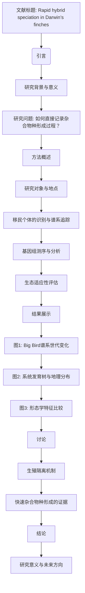

# 文献分析报告: tmpz47s4zv1

<div align='center'></div>

---

## 目录
<ul>
<li><a href='#1-文献元数据'>1. 文献元数据</a></li>
<li><a href='#1b-图片内容分析'>1b. 图片内容分析</a></li>
<li><a href='#2-方法学分析'>2. 方法学分析</a></li>
<li><a href='#3-创新点提取'>3. 创新点提取</a></li>
<li><a href='#4-问答对'>4. 问答对</a></li>
<li><a href='#5-文献故事'>5. 文献故事</a></li>
<li><a href='#6-文献逻辑脑图'>6. 文献逻辑脑图</a></li>
<li><a href='#7-参考文献信息'>7. 参考文献信息</a></li>
<li><a href='#8-相关文献信息'>8. 相关文献信息</a></li>
</ul>

---

## 1. 文献元数据
<details open>
<summary>点击展开/折叠</summary>

<table>
  <tr><th colspan='2' style='text-align:center;'>文献基本信息</th></tr>
  <tr><td><b>标题</b></td><td>Rapid hybrid speciation in Darwin's finches.</td></tr>
  <tr><td><b>作者</b></td><td>['Sangeet Lamichhaney', 'Fan Han', 'Matthew T Webster', 'Leif Andersson', 'B Rosemary Grant', 'Peter R Grant']</td></tr>
  <tr><td><b>DOI</b></td><td>10.1126/science.aao4593</td></tr>
  <tr><td><b>发表日期</b></td><td>2018-01-12</td></tr>
  <tr><td><b>期刊/来源</b></td><td>Science</td></tr>
</table>

<details>
<summary><b>Semantic Scholar 信息</b></summary>

<table>
  <tr><td><b>Paper ID</b></td><td>7fdd3e56f266c3532ada0d01ba0dba9b7cb61de1</td></tr>
  <tr><td><b>被引次数</b></td><td>249</td></tr>
</table>
</details>

<details>
<summary><b>PubMed 信息</b></summary>

<table>
  <tr><td><b>PMID</b></td><td>29170277</td></tr>
  <tr><td><b>摘要</b></td><td>Homoploid hybrid speciation in animals has been inferred frequently from patterns of variation, but few examples have withstood critical scrutiny. Here we report a directly documented example, from its origin to reproductive isolation. An immigrant Darwin's finch to Daphne Major in the Galápagos arc...</td></tr>
</table>
</details>

</details>


---

## 1b. 图片内容分析
<details open>
<summary>点击展开/折叠</summary>

<details>
<summary><b>图片 1</b>: <code>images/image_000.jpg</code></summary>


**结构化描述：**
### 图像A: 分支系统树  
**图片类型:** 树形图/分支系统树   
**主要内容描述:** 这是一棵基于基因组序列构建的进化树，显示不同物种之间的亲缘关系。该图像展示了达尔文雀属(Geospiza)的不同种群及其演化历史。
**主要发现或结论:** 此树揭示了一个来自西班牙岛(ElEspañolla)的G. conirostris雄性个体作为外来者迁移到达芬奇岛上，并与其他本地居民交配而形成新遗传谱系的事实。
**与文献内容的关联:** 支持文章提出的快速杂合子物种形成的理论模型；表明这种异源繁殖导致的新群体具有独特的起源背景且迅速分化出新的生态位特征。

---

### 图像B: 加拉帕戈斯群岛地图    
**图片类型:** 地理分布图     
**主要内容描述:** 描述了加拉帕戈斯群岛的位置及各岛屿名称标注情况;特别指出了DaphneMajor岛以及移民来源地Espanola岛的大致位置距离为超过100公里范围内的区域边界标记出来.
**主要发现或结论:** 提供地理环境基础框架以帮助理解实验地点选择合理性；
**与文献内容的关联:** 强调地理位置的重要性，在此背景下探讨生物多样性变化过程.

---

### 图像C: 杂合体比例条形图      
**图片类型:** 表格型图形        
**主要内容描述:** 展现了一系列关于特定鸟类种类间杂交后代的比例分配结果(K值代表代数)，其中颜色区分表示每个样本属于哪个祖先类别的贡献度大小;
**主要发现或结论:** 在三代后观察到显著程度上增加了某些品种间的混血现象出现频率增加的趋势，
**与文献内容的关联:** 反映了跨物种之间频繁发生生殖隔离前阶段混合状态的变化动态;

---

### 图像D: 全基因组自交系数随世代增长曲线       
**图片类型:** 曲线图         
**主要内容描述:** 绘制了一条全基因组范围内平均自交系数(F统计量）随着世代数量递增的数据走势,
**主要发现或结论:** 自然条件下连续多代内近亲婚配率明显上升并达到较高水平(P<2×10^-18),
**与文献内容的关联:** 印证文中所述“尽管经历强烈近亲繁衍但依然表现出良好的生态环境适应能力”观点的真实性验证依据之一．
</details>

<details>
<summary><b>图片 2</b>: <code>images/image_001.jpg</code></summary>


**结构化描述：**
### 图像A: 散点图  
**图片类型:** 散点图   
**主要内容描述:** 这幅散点图展示了不同种群之间的体型大小变化情况。红色代表G. conirostris个体；蓝色表示“Big Birds”群体成员；绿色则为G. fortis样本。各组间存在显著相关性。
**主要发现或结论:** 各物种间的形态特征表现出明显的遗传差异，并且这些变异随世代增加而逐渐分化开来。
**与文献内容的关联:** 此图像表明杂交后代从初始阶段开始就显示出不同的身体尺寸分布特性，在进化过程中逐步形成生殖隔离的基础条件之一。

---

### 图像B: 折线图    
**图片类型:** 折线图     
**主要内容描述:** 描述了一个特定基因座上Bill深度值的变化趋势，横轴显示代数序列(Generation)，纵轴则是测量到的实际数值(Bill depth)。可以看到随着繁殖次数增多，“Big Bird”的平均比深度有明显上升的趋势(P = $8 × 10^{-4}, β=0.24)$ ，这可能反映了该类鸟儿适应环境的能力增强或者某些有利突变累积的结果。
**主要发现或结论:** “Big Bird"一代之后其喙部形状发生了较为稳定的改变并趋于一致化方向发展着。
**与文献内容的关联:** 提供证据证明新形成的杂合子鸟类通过自然选择机制快速演化出不同于亲本种类的独特外形特点来实现有效分离状态建立过程的一部分环节。

---

### 图像C: 直方图/箱形图组合      
**图片类型:** 统计图形集合包含直方图及盒须图两种形式结合在一起呈现的数据可视化方式        
**主要内容描述:** 展现了一定数量观察单位按照某个变量分类后得到的不同区间内频次统计结果以及相应四分位距范围内的离差程度对比。“P = 0.39”，β≈06”。 
**主要发现或结论:** 在连续六个世代里没有观测到任何显著性的系统发育动态学现象发生于被测指标之上即体长方面未见较大波动迹象可言；
**与文献内容的关联:** 表达了尽管经过多次繁衍但整体而言上述生物并未经历剧烈变迁从而维持相对稳定的状态符合预期理论框架下关于早期异源配对产生之混合物最终走向独立谱系构建所需具备的基本前提要求标准设定范围内运行良好表现出来的情况。

---

### 图像D: 分布密度椭圆叠加图       
**图片类型:** 多重散布矩阵+轮廓拟合法绘制成多维空间投影下的二维平面视图            
**主要内容描述:** 将四个不同属别(G.magnirostris,BigBirds,G.fortis,G.scandens）之间基于两个维度上的实际物理量——BILL长度(mm) 和 BILL宽度(mm)- 的联合概率密度函数进行了直观地描绘出来了它们各自占据的空间区域及其相互位置关系明确可见;
**主要发现或结论:** 新生混血族群呈现出与其他原居品种相比具有更加宽广而又独特的形态特质集落区域划分开来了并且这种格局持续时间较长足以支撑起未来进一步深入探讨有关两者长期共存可能性问题的研究工作开展起来.
**与文献内容的关联:** 带出了一个非常重要的事实那就是即便是在极端环境下也能孕育出生殖隔离效应十分强烈的新型亚型由此也间接印证证实了解释整个事件背后复杂机理需要借助更多样化的手段方法去综合考量才行!
</details>

<details>
<summary><b>图片 3</b>: <code>images/image_002.jpg</code></summary>


**结构化描述：**
### 图像类型: 示意图  
**主要内容描述:** 
该图像展示了达尔文雀种群F0至F6代之间的谱系关系及其基因型编号。绿色圆圈代表外来雄性个体(标记为“Immigrant male”)；黑色方块表示本地G. fortis雌性和雄性个体；粉色正方形则标识未采样/未知性别样本。“Not sequenced”标注表明这些样本没有被测序。
   
**主要发现或结论:** 外来雄性的后代从第二代开始表现出亲缘繁殖的趋势，并且尽管经历了严重的近交现象，在生态上仍然成功并显示出喙形学特征上的超离异位分离。

**与文献内容的关联:** 此图直观地呈现了杂合子物种形成过程以及生殖隔离的发展阶段，证实了一次快速而直接记录到野外观察结果的例子——一个新遗传群体由一只来自不同岛屿的移民鸟通过与其当地同伴(Geospiza fortis)配对产生后逐渐发展出独立于原生鸟类的新品种的过程。
</details>

</details>


---

## 2. 方法学分析
<details open>
<summary>点击展开/折叠</summary>

```markdown
## 方法评估

### 方法类型
该研究属于 **实验研究**，结合了生态学观察和基因组学分析，通过长期跟踪和分子生物学手段记录了达尔文雀杂交种群的形成过程。

### 关键技术
1. **基因组测序**：用于确定移民个体的来源及其后代的遗传组成。
2. **微卫星标记**：用于追踪个体的遗传背景。
3. **最大似然法构建系统发育树**：用于推断物种间的亲缘关系。
4. **全基因组单核苷酸多态性（SNP）分析**：用于评估遗传多样性和杂交比例。
5. **定量遗传学分析**：如ANOVA和ANCOVA，用于分析表型变化和遗传变异。
6. **生态学观察**：包括行为学实验（如播放录音和模型测试）。

### 数据来源
- **公共数据集**：部分参考了已发表的达尔文雀基因组数据。
- **自行采集**：研究团队在加拉帕戈斯群岛实地采集样本并进行长期监测。

### 样本量描述
- **样本量**：研究对象包括所有六代“Big Bird”个体（总计约42个个体）以及其父母代（G. fortis和G. conirostris）。
- **数据集规模**：全基因组测序覆盖了几乎所有关键个体。

### 方法优点
1. **直接观察**：研究首次完整记录了杂合子物种从起源到生殖隔离的全过程，提供了罕见的实证案例。
2. **多学科整合**：结合生态学、遗传学和分子生物学，全面解析了杂交种群的形成机制。
3. **高分辨率数据**：利用全基因组测序和SNP分析，精确量化了遗传变异和杂交比例。
4. **生态意义**：揭示了快速杂合子物种形成的可能性，尤其是在小岛生态系统中。

### 方法局限性
1. **样本量有限**：仅涉及一个杂交种群，难以推广到其他系统。
2. **依赖特定环境**：研究结果可能受加拉帕戈斯群岛独特生态条件的影响，未必适用于其他地区。
3. **短期观察**：虽然记录了三代后的生殖隔离，但长期稳定性仍需进一步验证。
4. **技术依赖**：高度依赖现代分子生物学工具，成本和技术门槛较高。

### 方法创新点
1. **实时记录**：首次直接记录了杂合子物种形成的全过程，而非推测或间接推断。
2. **基因组解析**：结合全基因组测序和SNP分析，揭示了杂交种群的遗传基础。
3. **生态与遗传结合**：将生态学观察与分子生物学分析相结合，提供了更全面的理解。
4. **快速形成机制**：证明了杂合子物种可以在短短三代内形成，挑战了传统认为这一过程缓慢的观点。
```

以上是对文献方法的详细评估，涵盖了方法类型、关键技术、数据来源、样本量描述、方法优点、局限性及创新点。
</details>


---

## 3. 创新点提取
<details open>
<summary>点击展开/折叠</summary>

```markdown
# 核心创新点
- 首次直接记录了达尔文雀属中的同源杂交物种形成过程，从起源到生殖隔离的全过程。
- 证明了在仅三世代内即可完成通常需数百世代才能实现的生殖隔离。
- 发现了通过转座分离（transgressive segregation）产生的极端表型，这些表型可能由基因间上位作用或互补等位基因组合引起。
- 确认了ALX1和HMGA2基因在决定喙形中的重要作用，并揭示了这些基因如何影响新物种的适应性。

# 解决的问题
- 文献试图解决的核心问题是：在自然界中，同源杂交物种形成是否可以快速发生？如果可以，其机制是什么？

# 与现有工作相比的新颖性
- 与以往推测性或间接支持的案例不同，本研究提供了直接的生态和基因组证据，证明了同源杂交物种形成的全过程。
- 本研究首次详细描述了从单个移民个体到形成独立物种的完整过程，强调了罕见事件在进化中的重要性。
- 提出了转座分离在快速适应和生殖隔离中的关键作用，这是对传统杂交物种形成理论的重要补充。

# 潜在应用
- **生态学研究**：可用于研究小岛生态系统中物种快速适应和隔离的机制。
- **保护生物学**：帮助理解濒危物种如何通过杂交形成新的适应性群体。
- **农业与育种**：启发人工杂交育种策略，加速优良性状的固定。
- **医学研究**：探索基因间相互作用对复杂性状的影响，如疾病易感性。

# 未来研究方向
- 探索更多类似案例，特别是在其他动物和植物中是否存在类似的快速杂交物种形成现象。
- 深入研究ALX1和HMGA2基因在其他达尔文雀种群中的功能，以验证其在喙形多样化中的普遍作用。
- 考察转座分离是否在其他快速适应性进化事件中起到类似的关键作用。
- 研究环境压力如何促进或抑制杂交物种的形成，特别是在气候变化背景下。
```

以上内容基于提供的文献内容进行了详细的分析和总结，涵盖了核心创新点、解决的问题、新颖性、潜在应用以及未来研究方向。
</details>


---

## 4. 问答对
<details open>
<summary>点击展开/折叠</summary>

<details>
<summary><b>问题 1：</b>什么是同源杂交物种形成？</summary>

**回答：**

```
同源杂交物种形成是指两个物种杂交后不发生染色体加倍的情况下形成一个新的物种，这个新物种在遗传上与亲本物种不同。
```
</details>

<details>
<summary><b>问题 2：</b>文献中提到的快速杂交物种形成是如何发生的？</summary>

**回答：**

```
快速杂交物种形成是通过一个外来达尔文雀在Daphne Major岛上与本地Geospiza fortis雌性交配，从第二代开始其后代进行近亲繁殖，尽管经历强烈近亲繁殖，但仍表现出良好的生态适应性。
```
</details>

<details>
<summary><b>问题 3：</b>文献中的研究对象是哪种鸟类？</summary>

**回答：**

```
文献中的研究对象是达尔文雀（Darwin's finches）。
```
</details>

<details>
<summary><b>问题 4：</b>文献中提到的移民鸟是从哪里来的？</summary>

**回答：**

```
移民鸟是一个G. conirostris雄性个体，它来自加拉帕戈斯群岛东南部的Espanola岛，距离Daphne Major岛超过100公里。
```
</details>

<details>
<summary><b>问题 5：</b>移民鸟在Daphne Major岛上是如何开始新遗传谱系的？</summary>

**回答：**

```
移民鸟在Daphne Major岛上通过与本地Geospiza fortis雌性交配，开始了新的遗传谱系。
```
</details>

<details>
<summary><b>问题 6：</b>从第二代开始，这个新谱系的行为如何体现其独立性？</summary>

**回答：**

```
从第二代开始，这个新谱系的行为表现为近亲繁殖，因此从这一代起，该谱系在生态上和遗传上都表现出独立性。
```
</details>

<details>
<summary><b>问题 7：</b>这个新谱系在生态上是否成功？</summary>

**回答：**

```
是的，这个新谱系在生态上非常成功，尽管经历了强烈的近亲繁殖，但其成员表现出高适应性和生存率。
```
</details>

<details>
<summary><b>问题 8：</b>新谱系的喙形态有何特点？</summary>

**回答：**

```
新谱系的喙形态表现出超离异位分离，即后代的喙形态比父母双方都更极端。
```
</details>

<details>
<summary><b>问题 9：</b>文献中提到的生殖隔离通常需要多少代才能形成？</summary>

**回答：**

```
文献中提到的生殖隔离通常需要数百代才能形成。
```
</details>

<details>
<summary><b>问题 10：</b>这个例子中生殖隔离是在几代内形成的？</summary>

**回答：**

```
这个例子中生殖隔离是在三代内形成的。
```
</details>

<details>
<summary><b>问题 11：</b>文献中提到的杂交物种形成在动物界中有多常见？</summary>

**回答：**

```
文献中提到的杂交物种形成在动物界中很少见。
```
</details>

<details>
<summary><b>问题 12：</b>文献中提到的杂交物种形成在植物界中有何例子？</summary>

**回答：**

```
文献中提到的杂交物种形成在植物界中的例子包括Helianthus太阳花。
```
</details>

<details>
<summary><b>问题 13：</b>文献中提到的杂交物种形成在蝴蝶、苍蝇、鱼、哺乳动物和鸟类中有何例子？</summary>

**回答：**

```
文献中提到的杂交物种形成在蝴蝶、苍蝇、鱼、哺乳动物和鸟类中的例子分别包括Heliconius蝴蝶、Drosophila果蝇、鱼类、牛和鸟类。
```
</details>

<details>
<summary><b>问题 14：</b>文献中提到的严格标准是什么？</summary>

**回答：**

```
文献中提到的严格标准是为了确认杂交是否是导致新物种形成的原因。
```
</details>

<details>
<summary><b>问题 15：</b>文献中提到的Big Bird谱系是如何被命名的？</summary>

**回答：**

```
Big Bird谱系因其成员明显较大的体型而得名。
```
</details>

<details>
<summary><b>问题 16：</b>Big Bird谱系的创始人是谁？</summary>

**回答：**

```
Big Bird谱系的创始人是一个G. conirostris雄性个体。
```
</details>

<details>
<summary><b>问题 17：</b>Big Bird谱系的创始人的基因组成如何？</summary>

**回答：**

```
Big Bird谱系的创始人是一个典型的G. conirostris个体，具有较高的基因组同质性。
```
</details>

<details>
<summary><b>问题 18：</b>Big Bird谱系的创始人的地理来源在哪里？</summary>

**回答：**

```
Big Bird谱系的创始人来自加拉帕戈斯群岛东南部的Espanola岛。
```
</details>

<details>
<summary><b>问题 19：</b>Big Bird谱系的创始人的飞行路径是如何推测的？</summary>

**回答：**

```
Big Bird谱系的创始人的飞行路径是基于对Santa Cruz岛上金翅雀迁徙模式的观察推测出来的。
```
</details>

<details>
<summary><b>问题 20：</b>Big Bird谱系的创始人的基因组成如何影响其后代？</summary>

**回答：**

```
Big Bird谱系的创始人的基因组成影响了其后代的基因多样性，尽管经历了近亲繁殖，后代仍保持一定的基因多样性。
```
</details>

<details>
<summary><b>问题 21：</b>Big Bird谱系的后代在基因组成上有何变化？</summary>

**回答：**

```
Big Bird谱系的后代在基因组成上表现出逐渐增加的同质性，这是由于小规模繁殖群体导致的遗传漂变。
```
</details>

<details>
<summary><b>问题 22：</b>Big Bird谱系的后代在生态上有何表现？</summary>

**回答：**

```
Big Bird谱系的后代在生态上表现出高适应性和生存率，尽管经历了近亲繁殖。
```
</details>

<details>
<summary><b>问题 23：</b>Big Bird谱系的后代在形态上有何变化？</summary>

**回答：**

```
Big Bird谱系的后代在形态上表现出超离异位分离，即后代的喙形态比父母双方都更极端。
```
</details>

<details>
<summary><b>问题 24：</b>Big Bird谱系的后代在行为上有何变化？</summary>

**回答：**

```
Big Bird谱系的后代在行为上表现出独特的鸣唱模式，这可能是由于不完全模仿其父亲的歌曲所致。
```
</details>

</details>


---

## 5. 文献故事
<details open>
<summary>点击展开/折叠</summary>

# 快速杂交物种形成的奇妙故事

在遥远的太平洋中，有一片神奇的群岛，名为加拉帕戈斯。这里生活着一群特别的小鸟——达尔文雀。它们以其独特的喙形和行为闻名于世。然而，有一天，一件不可思议的事情发生了，它不仅改变了我们对达尔文雀的理解，还为我们揭示了自然界中一种罕见却迷人的现象——快速杂交物种形成。

## 第一章：意外的相遇

故事要从1981年说起。那一年，一只年轻的达尔文雀飞越了浩瀚的海洋，来到了加拉帕戈斯群岛中的一个小岛——达芙妮主岛。这只小鸟看起来很特别，它的体型比其他常见的中等地面雀（Geospiza fortis）大得多，而且歌声也与众不同。科学家们通过微卫星标记测试推测，它可能是从邻近的圣克鲁斯岛迁徙而来，是一只中等地面雀和仙人掌雀（Geospiza scandens）的杂交后代。

这只小鸟的到来让科学家们兴奋不已。他们决定跟踪这只鸟及其后代的命运，看看会发生什么。于是，一场长达31年的生态与基因研究开始了。

## 第二章：新家族的诞生

这只移民鸟很快找到了伴侣，它与一只当地的中等地面雀交配，产下了第一代后代。从第二代开始，这个新家族的成员们开始彼此交配，形成了一个封闭的繁殖群体。尽管近亲繁殖可能导致遗传多样性下降，但这个小群体却展现出了惊人的适应力。

科学家们发现，这个新群体的喙形发生了显著变化。它们的喙不仅比父母辈更大，而且形态更加多样化。这种现象被称为“超离异位分离”，意味着后代的表现型超出了父母的范围。这种变化可能是因为不同基因的互补作用，或者是自然选择的结果。

## 第三章：生态的成功与隔离的建立

随着时间的推移，这个新群体在岛上表现出色。它们能够更有效地利用大型木质果实，尤其是在干旱季节和食物短缺的情况下。科学家们认为，喙的大小和形状是关键因素。此外，这些鸟儿还会根据父母的特征选择配偶，这进一步促进了它们与其他物种的隔离。

到了第三代，这个群体已经完全独立于其他鸟类。尽管经历了严重的近亲繁殖，它们的生存率和繁殖成功率依然很高。科学家们甚至观察到，这个群体的基因组同质化程度逐渐增加，这是近亲繁殖的一个典型标志。

## 第四章：基因的秘密

为了深入了解这个新群体的遗传基础，科学家们对几乎所有个体进行了全基因组测序。他们发现，这个群体的创始人实际上是一只来自埃斯帕诺拉岛的大仙人掌雀（Geospiza conirostris）。这只鸟儿的迁徙距离超过了100公里，跨越了大片水域，这在鸟类中是非常罕见的。

通过对基因组的分析，科学家们确认了这个新群体的遗传特征。他们发现，一些关键基因如ALX1和HMGA2对喙形的变化起到了重要作用。这些基因的变异可能与自然选择和随机漂变共同作用有关。

## 第五章：快速杂交物种形成的奇迹

最令人惊讶的是，这个新群体仅用了三代就实现了生殖隔离。通常情况下，这种隔离需要数百代才能完成。科学家们认为，这种快速杂交物种形成的原因在于以下几个因素：

1. **学习行为**：新群体的成员学会了独特的歌声和形态特征，这些成为了它们选择配偶的重要线索。
2. **生态隔离**：它们占据了其他物种尚未利用的生态位，减少了与其他物种的竞争。
3. **自然选择**：喙的大小和形状的变化使它们更能适应环境，从而提高了生存率。

## 第六章：自然界的奥秘

这个故事告诉我们，自然界充满了意想不到的可能性。即使在看似孤立的小岛上，稀有和偶然的事件也可能引发重大变化。例如，一次罕见的长距离迁徙，一次强烈的自然选择压力，都可能成为新物种形成的催化剂。

科学家们希望通过这个案例，能够更好地理解杂交物种形成的机制。他们相信，在小型岛屿或类似环境中，这种快速杂交物种形成的现象可能比我们想象的更为普遍。

## 结语

这个故事不仅是一次科学探索的胜利，也是对自然界无限创造力的赞美。它提醒我们，即使是最微小的变化，也可能带来深远的影响。正如达尔文雀的故事所展示的那样，生命的多样性总是充满惊喜和奇迹。
</details>


---

## 6. 文献逻辑脑图
<details open>
<summary>点击展开/折叠</summary>


</details>

## 7. 参考文献信息
<details open>
<summary>点击展开/折叠</summary>


<style>
.slais-table th, .slais-table td {
  padding: 10px 8px;
  border: 1px solid #444;
  font-size: 15px;
  text-align: left;
  min-width: 80px;
}
.slais-table th {
  background: #222;
  color: #fff;
  font-weight: bold;
}
.slais-table td {
  background: #181818;
  color: #eee;
}
@media (prefers-color-scheme: light) {
  .slais-table th { background: #f5f5f5; color: #222; }
  .slais-table td { background: #fff; color: #222; }
}
</style>
<table class="slais-table">
  <thead>
    <tr>
      <th>DOI</th>
      <th>标题</th>
      <th>作者</th>
      <th>期刊</th>
      <th>发表日期</th>
      <th>PMID</th>
    </tr>
  </thead>
  <tbody>

<tr><td>10.1098/rstb.2016.0146</td><td>Evolution caused by extreme events.</td><td>Peter R Grant; B Rosemary Grant; Raymond B Huey; Marc T J Johnson; Andrew H Knoll; Johanna Schmitt</td><td>Philosophical transactions of the Royal Society of London. Series B, Biological sciences</td><td>2017-06-19</td><td>28483875</td></tr>
<tr><td>10.1111/1755-0998.12665</td><td>Pedigree reconstruction from SNP data: parentage assignment, sibship clustering and beyond.</td><td>Jisca Huisman</td><td>Molecular ecology resources</td><td>2017-09-01</td><td>28271620</td></tr>
<tr><td>10.1111/mec.13685</td><td>Genomics of hybridization and its evolutionary consequences.</td><td>Richard J Abbott; Nicholas H Barton; Jeffrey M Good</td><td>Molecular ecology</td><td>2016-06-01</td><td>27145128</td></tr>
<tr><td>10.1126/science.aad8786</td><td>A beak size locus in Darwin's finches facilitated character displacement during a drought.</td><td>Sangeet Lamichhaney; Fan Han; Jonas Berglund; Chao Wang; Markus Sällman Almén; Matthew T Webster; B Rosemary Grant; Peter R Grant; Leif Andersson</td><td>Science</td><td>2016-04-22</td><td>27102486</td></tr>
<tr><td>10.1073/pnas.1505357112</td><td>Complex constraints on allometry revealed by artificial selection on the wing of Drosophila melanogaster.</td><td>Geir H Bolstad; Jason A Cassara; Eladio Márquez; Thomas F Hansen; Kim van der Linde; David Houle; Christophe Pélabon</td><td>Proceedings of the National Academy of Sciences of the United States of America</td><td>2015-10-27</td><td>26371319</td></tr>
<tr><td>10.1038/nature14181</td><td>Evolution of Darwin's finches and their beaks revealed by genome sequencing.</td><td>Sangeet Lamichhaney; Jonas Berglund; Markus Sällman Almén; Khurram Maqbool; Manfred Grabherr; Alvaro Martinez-Barrio; Marta Promerová; Carl-Johan Rubin; Chao Wang; Neda Zamani; B Rosemary Grant; Peter R Grant; Matthew T Webster; Leif Andersson</td><td>Nature</td><td>2015-02-19</td><td>25686609</td></tr>
<tr><td>10.3732/ajb.1400201</td><td>The role of homoploid hybridization in evolution: a century of studies synthesizing genetics and ecology.</td><td>Sarah B Yakimowski; Loren H Rieseberg</td><td>American journal of botany</td><td>2014-08-01</td><td>25156978</td></tr>
<tr><td>10.1111/evo.12399</td><td>How common is homoploid hybrid speciation?</td><td>Molly Schumer; Gil G Rosenthal; Peter Andolfatto</td><td>Evolution; international journal of organic evolution</td><td>2014-06-01</td><td>24620775</td></tr>
<tr><td>10.2307/j.ctt5hhncc</td><td>40 Years of Evolution: Darwin's Finches on Daphne Major Island</td><td></td><td></td><td></td><td></td></tr>
<tr><td>10.1111/j.1365-294X.2011.05183.x</td><td>Hybrid speciation in sparrows I: phenotypic intermediacy, genetic admixture and barriers to gene flow.</td><td>Jo S Hermansen; Stein A Saether; Tore O Elgvin; Thomas Borge; Elin Hjelle; Glenn-Peter Saetre</td><td>Molecular ecology</td><td>2011-09-01</td><td>21771138</td></tr>
<tr><td>10.1007/s11692-011-9126-7</td><td>Hybridization Promotes Evolvability in African Cichlids: Connections Between Transgressive Segregation and Phenotypic Integration</td><td></td><td></td><td></td><td></td></tr>
<tr><td>10.1002/TAX.595005</td><td>Homoploid hybrid speciation in action</td><td></td><td></td><td></td><td></td></tr>
<tr><td>10.1073/pnas.1000133107</td><td>Natural hybridization generates mammalian lineage with species characteristics.</td><td>Peter A Larsen; María R Marchán-Rivadeneira; Robert J Baker</td><td>Proceedings of the National Academy of Sciences of the United States of America</td><td>2010-06-22</td><td>20534512</td></tr>
<tr><td>10.1098/rstb.2009.0283</td><td>Conspecific versus heterospecific gene exchange between populations of Darwin's finches.</td><td>Peter R Grant; B Rosemary Grant</td><td>Philosophical transactions of the Royal Society of London. Series B, Biological sciences</td><td>2010-04-12</td><td>20194169</td></tr>
<tr><td>10.1371/journal.pone.0009490</td><td>FastTree 2--approximately maximum-likelihood trees for large alignments.</td><td>Morgan N Price; Paramvir S Dehal; Adam P Arkin</td><td>PloS one</td><td>2010-03-10</td><td>20224823</td></tr>
<tr><td>10.1016/j.tig.2009.12.001</td><td>Understanding the onset of hybrid speciation.</td><td>Arne W Nolte; Diethard Tautz</td><td>Trends in genetics : TIG</td><td>2010-02-01</td><td>20044166</td></tr>
<tr><td>10.1073/pnas.0911761106</td><td>The secondary contact phase of allopatric speciation in Darwin's finches.</td><td>Peter R Grant; B Rosemary Grant</td><td>Proceedings of the National Academy of Sciences of the United States of America</td><td>2009-12-01</td><td>19918081</td></tr>
<tr><td>10.1101/gr.094052.109</td><td>Fast model-based estimation of ancestry in unrelated individuals.</td><td>David H Alexander; John Novembre; Kenneth Lange</td><td>Genome research</td><td>2009-09-01</td><td>19648217</td></tr>
<tr><td>10.1111/j.1558-5646.2008.00599.x</td><td>Genetic distance between species predicts novel trait expression in their hybrids.</td><td>Rike Stelkens; Ole Seehausen</td><td>Evolution; international journal of organic evolution</td><td>2009-04-01</td><td>19220450</td></tr>
<tr><td>10.1111/j.1365-294x.2008.03898.x</td><td>Homoploid hybrid speciation in animals.</td><td>Jesús Mavárez; Mauricio Linares</td><td>Molecular ecology</td><td>2008-10-01</td><td>19378399</td></tr>
<tr><td>10.1525/auk.2008.41008.3</td><td>How and Why Species Multiply</td><td></td><td></td><td></td><td></td></tr>
<tr><td>10.1086/519795</td><td>PLINK: a tool set for whole-genome association and population-based linkage analyses.</td><td>Shaun Purcell; Benjamin Neale; Kathe Todd-Brown; Lori Thomas; Manuel A R Ferreira; David Bender; Julian Maller; Pamela Sklar; Paul I W de Bakker; Mark J Daly; Pak C Sham</td><td>American journal of human genetics</td><td>2007-09-01</td><td>17701901</td></tr>
<tr><td>10.1038/nature04738</td><td>Speciation by hybridization in Heliconius butterflies.</td><td>Jesús Mavárez; Camilo A Salazar; Eldredge Bermingham; Christian Salcedo; Chris D Jiggins; Mauricio Linares</td><td>Nature</td><td>2006-06-15</td><td>16778888</td></tr>
<tr><td>10.1038/nature03800</td><td>Host shift to an invasive plant triggers rapid animal hybrid speciation.</td><td>Dietmar Schwarz; Benjamin M Matta; Nicole L Shakir-Botteri; Bruce A McPheron</td><td>Nature</td><td>2005-07-28</td><td>16049486</td></tr>
<tr><td>10.1093/jhered/esi026</td><td>The ecological genetics of homoploid hybrid speciation.</td><td>B L Gross; L H Rieseberg</td><td>The Journal of heredity</td><td>2005-01-01</td><td>15618301</td></tr>
<tr><td>10.1046/J.1095-8312.2002.00076.X</td><td>Simulating secondary contact in allopatric speciation: an empirical test of premating isolation</td><td></td><td></td><td></td><td></td></tr>
<tr><td>10.1046/j.1365-2540.2001.00900.x</td><td>Heritability of morphological traits in Darwin's finches: misidentified paternity and maternal effects.</td><td>L F Keller; P R Grant; B R Grant; K Petren</td><td>Heredity</td><td>2001-09-01</td><td>11737279</td></tr>
<tr><td>10.1038/sj.hdy.6886170</td><td>Transgressive segregation, adaptation and speciation.</td><td>L H Rieseberg; M A Archer; R K Wayne</td><td>Heredity</td><td>1999-10-01</td><td>10583537</td></tr>
<tr><td>10.1007/s100219900049</td><td>Compounded Perturbations Yield Ecological Surprises</td><td></td><td></td><td></td><td></td></tr>
<tr><td>10.1038/375313A0</td><td>Hybrid speciation accompanied by genomic reorganization in wild sunflowers</td><td></td><td></td><td></td><td></td></tr>
<tr><td>10.1111/j.1558-5646.1994.tb01313.x</td><td>PHENOTYPIC AND GENETIC EFFECTS OF HYBRIDIZATION IN DARWIN'S FINCHES.</td><td>Peter R Grant; B Rosemary Grant</td><td>Evolution; international journal of organic evolution</td><td>1994-04-01</td><td>28568290</td></tr>
<tr><td>10.1016/S0003-3472(83)80021-9</td><td>Species recognition in Darwin's finches (Geospiza, Gould) I. Discrimination by morphological cues</td><td></td><td></td><td></td><td></td></tr>
<tr><td>10.1098/rspb.1981.0046</td><td>Patterns of growth in Darwin’s finches</td><td></td><td></td><td></td><td></td></tr>
<tr><td>10.1016/j.tree.2011.09.002</td><td>What do we need to know about speciation?</td><td>Marie Curie SPECIATION Network; Roger Butlin; Allan Debelle; Claudius Kerth; Rhonda R Snook; Leo W Beukeboom; Ruth F Castillo Cajas; Wenwen Diao; Martine E Maan; Silvia Paolucci; Franz J Weissing; Louis van de Zande; Anneli Hoikkala; Elzemiek Geuverink; Jackson Jennings; Maaria Kankare; K Emily Knott; Venera I Tyukmaeva; Christos Zoumadakis; Michael G Ritchie; Daniel Barker; Elina Immonen; Mark Kirkpatrick; Mohamed Noor; Constantino Macias Garcia; Thomas Schmitt; Menno Schilthuizen</td><td>Trends in ecology & evolution</td><td>2012-01-01</td><td>21978464</td></tr>
</tbody></table>
</details>


---

## 8. 相关文献信息
<details open>
<summary>点击展开/折叠</summary>


<style>
.slais-table th, .slais-table td {
  padding: 10px 8px;
  border: 1px solid #444;
  font-size: 15px;
  text-align: left;
  min-width: 80px;
}
.slais-table th {
  background: #222;
  color: #fff;
  font-weight: bold;
}
.slais-table td {
  background: #181818;
  color: #eee;
}
@media (prefers-color-scheme: light) {
  .slais-table th { background: #f5f5f5; color: #222; }
  .slais-table td { background: #fff; color: #222; }
}
</style>
<table class="slais-table">
  <thead>
    <tr>
      <th>PMID</th>
      <th>标题</th>
      <th>作者</th>
      <th>期刊</th>
      <th>发表日期</th>
      <th>DOI</th>
    </tr>
  </thead>
  <tbody>

<tr><td>39388551</td><td>Ecological speciation in Darwin's finches: Ghosts of finches future.</td><td>Jeffrey Podos; Katie M Schroeder</td><td>Science</td><td>2024-10-11</td><td>10.1126/science.adj4478</td></tr>
<tr><td>37769091</td><td>Community-wide genome sequencing reveals 30 years of Darwin's finch evolution.</td><td>Erik D Enbody; Ashley T Sendell-Price; C Grace Sprehn; Carl-Johan Rubin; Peter M Visscher; B Rosemary Grant; Peter R Grant; Leif Andersson</td><td>Science</td><td>2023-09-29</td><td>10.1126/science.adf6218</td></tr>
<tr><td>37671423</td><td>The fitness landscape of a community of Darwin's finches.</td><td>Marc-Olivier Beausoleil; Paola Lorena Carrión; Jeffrey Podos; Carlos Camacho; Julio Rabadán-González; Roxanne Richard; Kristen Lalla; Joost A M Raeymaekers; Sarah A Knutie; Luis F De León; Jaime A Chaves; Dale H Clayton; Jennifer A H Koop; Diana M T Sharpe; Kiyoko M Gotanda; Sarah K Huber; Rowan D H Barrett; Andrew P Hendry</td><td>Evolution; international journal of organic evolution</td><td>2023-12-02</td><td>10.1093/evolut/qpad160</td></tr>
<tr><td>37477910</td><td>Comparative transcriptomics and gene expression divergence associated with homoploid hybrid speciation in Argyranthemum.</td><td>Oliver W White; Alfredo Reyes-Betancort; Mark A Carine; Mark A Chapman</td><td>G3</td><td>2023-09-30</td><td>10.1093/g3journal/jkad158</td></tr>
<tr><td>37364830</td><td>Plant invasion causes alterations in Darwin's finch feeding patterns in Galápagos cloud forests.</td><td>Rebecca Hood-Nowotny; Ingrid Rabitsch; Arno Cimadom; Marcela Suarez-Rubio; Andrea Watzinger; Paul Schmidt Yáñez; Christian H Schulze; Sophie Zechmeister-Boltenstern; Heinke Jäger; Sabine Tebbich</td><td>The Science of the total environment</td><td>2023-10-15</td><td>10.1016/j.scitotenv.2023.164990</td></tr>
<tr><td>37094817</td><td>Transgressive segregation in mating traits drives hybrid speciation.</td><td>Kotaro Kagawa; Gaku Takimoto; Ole Seehausen</td><td>Evolution; international journal of organic evolution</td><td>2023-06-29</td><td>10.1093/evolut/qpad072</td></tr>
<tr><td>36373649</td><td>Molecular divergence with major morphological consequences: development and evolution of organ size and shape.</td><td>John P Masly; Md Golam Azom</td><td>Essays in biochemistry</td><td>2022-12-08</td><td>10.1042/EBC20220118</td></tr>
<tr><td>36229469</td><td>Spatiotemporal variations in retrovirus-host interactions among Darwin's finches.</td><td>Jason Hill; Mette Lillie; Mats E Pettersson; Carl-Johan Rubin; B Rosemary Grant; Peter R Grant; Leif Andersson; Patric Jern</td><td>Nature communications</td><td>2022-10-13</td><td>10.1038/s41467-022-33723-w</td></tr>
<tr><td>36225827</td><td>The terroir of the finch: How spatial and temporal variation shapes phenotypic traits in DARWIN'S finches.</td><td>Paola L Carrión; Joost A M Raeymaekers; Luis Fernando De León; Jaime A Chaves; Diana M T Sharpe; Sarah K Huber; Anthony Herrel; Bieke Vanhooydonck; Kiyoko M Gotanda; Jennifer A H Koop; Sarah A Knutie; Dale H Clayton; Jeffrey Podos; Andrew P Hendry</td><td>Ecology and evolution</td><td>2022-10-01</td><td>10.1002/ece3.9399</td></tr>
<tr><td>36086992</td><td>Transcriptomic responses of Galápagos finches to avian poxvirus infection.</td><td>Sabrina M McNew; Diana Carolina Loyola; Janaí Yepez; Catherine Andreadis; Kiyoko Gotanda; Ashley Saulsberry; Birgit Fessl</td><td>Molecular ecology</td><td>2022-11-01</td><td>10.1111/mec.16690</td></tr>
<tr><td>36063155</td><td>Using neutral loci to quantify reproductive isolation and speciation: a commentary on Westram et al., 2022.</td><td>Adam M M Stuckert; Daniel R Matute</td><td>Journal of evolutionary biology</td><td>2022-09-01</td><td>10.1111/jeb.14057</td></tr>
<tr><td>35931296</td><td>Intrinsically disordered BMP4 morphogen and the beak of the finch: Co-option of an ancient axial patterning system.</td><td>Prakash Kulkarni; Atish Mohanty; Ravi Salgia; Vladimir N Uversky</td><td>International journal of biological macromolecules</td><td>2022-10-31</td><td>10.1016/j.ijbiomac.2022.07.203</td></tr>
<tr><td>35876520</td><td>[Small scale evolution].</td><td>Jean-Michel Gibert</td><td>Biologie aujourd'hui</td><td>2022-01-01</td><td>10.1051/jbio/2022008</td></tr>
<tr><td>35857449</td><td>Rapid adaptive radiation of Darwin's finches depends on ancestral genetic modules.</td><td>Carl-Johan Rubin; Erik D Enbody; Mariya P Dobreva; Arhat Abzhanov; Brian W Davis; Sangeet Lamichhaney; Mats Pettersson; Ashley T Sendell-Price; C Grace Sprehn; Carlos A Valle; Karla Vasco; Ola Wallerman; B Rosemary Grant; Peter R Grant; Leif Andersson</td><td>Science advances</td><td>2022-07-08</td><td>10.1126/sciadv.abm5982</td></tr>
<tr><td>35494501</td><td>Where did the finch go? Insights from radio telemetry of the medium ground finch (Geospiza fortis).</td><td>Marc-Olivier Beausoleil; Carlos Camacho; Julio Rabadán-González; Kristen Lalla; Roxanne Richard; Paola Carrion-Avilés; Andrew P Hendry; Rowan D H Barrett</td><td>Ecology and evolution</td><td>2022-04-01</td><td>10.1002/ece3.8768</td></tr>
<tr><td>35116148</td><td>Darwin's small and medium ground finches might have taste preferences, but not for human foods.</td><td>D Lever; L V Rush; R Thorogood; K M Gotanda</td><td>Royal Society open science</td><td>2022-01-01</td><td>10.1098/rsos.211198</td></tr>
<tr><td>34921614</td><td>Independent evolution of intermediate bill widths in a seabird clade.</td><td>Juan F Masello; Peter G Ryan; Lara D Shepherd; Petra Quillfeldt; Yves Cherel; Alan J D Tennyson; Rachael Alderman; Luciano Calderón; Theresa L Cole; Richard J Cuthbert; Ben J Dilley; Melanie Massaro; Colin M Miskelly; Joan Navarro; Richard A Phillips; Henri Weimerskirch; Yoshan Moodley</td><td>Molecular genetics and genomics : MGG</td><td>2022-01-01</td><td>10.1007/s00438-021-01845-3</td></tr>
<tr><td>34905711</td><td>Female in-nest attendance predicts the number of ectoparasites in Darwin's finch species.</td><td>Sonia Kleindorfer; Lauren K Common; Jody A O'Connor; Jefferson Garcia-Loor; Andrew C Katsis; Rachael Y Dudaniec; Diane Colombelli-Négrel; Nico M Adreani</td><td>Proceedings. Biological sciences</td><td>2021-12-22</td><td>10.1098/rspb.2021.1668</td></tr>
<tr><td>34878103</td><td>The genome sequence of the avian vampire fly (Philornis downsi), an invasive nest parasite of Darwin's finches in Galápagos.</td><td>Melia G Romine; Sarah A Knutie; Carly M Crow; Grace J Vaziri; Jaime A Chaves; Jennifer A H Koop; Sangeet Lamichhaney</td><td>G3</td><td>2022-02-04</td><td>10.1093/g3journal/jkab414</td></tr>
<tr><td>34750258</td><td>Geometry and dynamics link form, function, and evolution of finch beaks.</td><td>Salem Al-Mosleh; Gary P T Choi; Arhat Abzhanov; L Mahadevan</td><td>Proceedings of the National Academy of Sciences of the United States of America</td><td>2021-11-16</td><td>10.1073/pnas.2105957118</td></tr>
<tr><td>34687609</td><td>A multispecies BCO2 beak color polymorphism in the Darwin's finch radiation.</td><td>Erik D Enbody; C Grace Sprehn; Arhat Abzhanov; Huijuan Bi; Mariya P Dobreva; Owen G Osborne; Carl-Johan Rubin; Peter R Grant; B Rosemary Grant; Leif Andersson</td><td>Current biology : CB</td><td>2021-12-20</td><td>10.1016/j.cub.2021.09.085</td></tr>
<tr><td>34330836</td><td>Morphological ghosts of introgression in Darwin's finch populations.</td><td>Peter R Grant; B Rosemary Grant</td><td>Proceedings of the National Academy of Sciences of the United States of America</td><td>2021-08-03</td><td>10.1073/pnas.2107434118</td></tr>
<tr><td>34025990</td><td>Urban living influences the nesting success of Darwin's finches in the Galápagos Islands.</td><td>Johanna A Harvey; Kiley Chernicky; Shelby R Simons; Taylor B Verrett; Jaime A Chaves; Sarah A Knutie</td><td>Ecology and evolution</td><td>2021-05-01</td><td>10.1002/ece3.7360</td></tr>
<tr><td>33714212</td><td>Behavioural response to songs between genetically diverged allopatric populations of Darwin's small tree finch in the Galápagos.</td><td>Diane Colombelli-Négrel; Sonia Kleindorfer</td><td>Journal of evolutionary biology</td><td>2021-05-01</td><td>10.1111/jeb.13783</td></tr>
<tr><td>33667220</td><td>Sex identification in embryos and adults of Darwin's finches.</td><td>Mariya P Dobreva; Joshua G Lynton-Jenkins; Jaime A Chaves; Masayoshi Tokita; Camille Bonneaud; Arkhat Abzhanov</td><td>PloS one</td><td>2021-01-01</td><td>10.1371/journal.pone.0237687</td></tr>
<tr><td>33536307</td><td>Testing the influence of crushing surface variation on seed-cracking performance among beak morphs of the African seedcracker Pyrenestes ostrinus.</td><td>Nicola S Heckeberg; Philip S L Anderson; Emily J Rayfield</td><td>The Journal of experimental biology</td><td>2021-03-04</td><td>10.1242/jeb.230607</td></tr>
<tr><td>33391699</td><td>Ecological and morphological determinants of evolutionary diversification in Darwin's finches and their relatives.</td><td>Ashley M Reaney; Yanis Bouchenak-Khelladi; Joseph A Tobias; Arkhat Abzhanov</td><td>Ecology and evolution</td><td>2020-12-01</td><td>10.1002/ece3.6994</td></tr>
<tr><td>33271335</td><td>From common gardens to candidate genes: an elegant case of homoploid hybrid speciation.</td><td>Gregory L Owens</td><td>Molecular plant</td><td>2021-02-01</td><td>10.1016/j.molp.2020.11.020</td></tr>
<tr><td>33007244</td><td>The Radiation of Darwin's Giant Daisies in the Galápagos Islands.</td><td>Mario Fernández-Mazuecos; Pablo Vargas; Ross A McCauley; David Monjas; Ana Otero; Jaime A Chaves; Juan Ernesto Guevara Andino; Gonzalo Rivas-Torres</td><td>Current biology : CB</td><td>2020-12-21</td><td>10.1016/j.cub.2020.09.019</td></tr>
<tr><td>32911573</td><td>Rapid homoploid hybrid speciation in British gardens: The origin of Oxford ragwort (Senecio squalidus).</td><td>Bruno Nevado; Stephen A Harris; Mark A Beaumont; Simon J Hiscock</td><td>Molecular ecology</td><td>2020-11-01</td><td>10.1111/mec.15630</td></tr>
<tr><td>32759508</td><td>Breeding and lineage development.</td><td></td><td>Experimental animals</td><td>2020-01-01</td><td>10.1538/expanim.69suppl-P-7</td></tr>
<tr><td>32654647</td><td>On the completion of speciation.</td><td>Nicholas H Barton</td><td>Philosophical transactions of the Royal Society of London. Series B, Biological sciences</td><td>2020-08-31</td><td>10.1098/rstb.2019.0530</td></tr>
<tr><td>32367030</td><td>Female-biased gene flow between two species of Darwin's finches.</td><td>Sangeet Lamichhaney; Fan Han; Matthew T Webster; B Rosemary Grant; Peter R Grant; Leif Andersson</td><td>Nature ecology & evolution</td><td>2020-07-01</td><td>10.1038/s41559-020-1183-9</td></tr>
<tr><td>32213581</td><td>Triad hybridization via a conduit species.</td><td>Peter R Grant; B Rosemary Grant</td><td>Proceedings of the National Academy of Sciences of the United States of America</td><td>2020-04-07</td><td>10.1073/pnas.2000388117</td></tr>
<tr><td>32015429</td><td>The consequences of craniofacial integration for the adaptive radiations of Darwin's finches and Hawaiian honeycreepers.</td><td>Guillermo Navalón; Jesús Marugán-Lobón; Jen A Bright; Christopher R Cooney; Emily J Rayfield</td><td>Nature ecology & evolution</td><td>2020-02-01</td><td>10.1038/s41559-019-1092-y</td></tr>
<tr><td>31834908</td><td>An inter-island comparison of Darwin's finches reveals the impact of habitat, host phylogeny, and island on the gut microbiome.</td><td>Wesley T Loo; Rachael Y Dudaniec; Sonia Kleindorfer; Colleen M Cavanaugh</td><td>PloS one</td><td>2019-01-01</td><td>10.1371/journal.pone.0226432</td></tr>
<tr><td>31827126</td><td>Host phylogeny, diet, and habitat differentiate the gut microbiomes of Darwin's finches on Santa Cruz Island.</td><td>Wesley T Loo; Jefferson García-Loor; Rachael Y Dudaniec; Sonia Kleindorfer; Colleen M Cavanaugh</td><td>Scientific reports</td><td>2019-12-11</td><td>10.1038/s41598-019-54869-6</td></tr>
<tr><td>31795872</td><td>Temporally varying disruptive selection in the medium ground finch (Geospiza fortis).</td><td>Marc-Olivier Beausoleil; Luke O Frishkoff; Leithen K M'Gonigle; Joost A M Raeymaekers; Sarah A Knutie; Luis F De León; Sarah K Huber; Jaime A Chaves; Dale H Clayton; Jennifer A H Koop; Jeffrey Podos; Diana M T Sharpe; Andrew P Hendry; Rowan D H Barrett</td><td>Proceedings. Biological sciences</td><td>2019-12-04</td><td>10.1098/rspb.2019.2290</td></tr>
<tr><td>31746013</td><td>Human influences on antipredator behaviour in Darwin's finches.</td><td>Kiyoko M Gotanda</td><td>The Journal of animal ecology</td><td>2020-02-01</td><td>10.1111/1365-2656.13127</td></tr>
<tr><td>31659024</td><td>Hybridization increases population variation during adaptive radiation.</td><td>Peter R Grant; B Rosemary Grant</td><td>Proceedings of the National Academy of Sciences of the United States of America</td><td>2019-11-12</td><td>10.1073/pnas.1913534116</td></tr>
<tr><td>31185871</td><td>Introduced parasite changes host phenotype, mating signal and hybridization risk: Philornis downsi effects on Darwin's finch song.</td><td>Sonia Kleindorfer; Georgina Custance; Katharina J Peters; Frank J Sulloway</td><td>Proceedings. Biological sciences</td><td>2019-06-12</td><td>10.1098/rspb.2019.0461</td></tr>
<tr><td>31183118</td><td>Genetic admixture predicts parasite intensity: evidence for increased hybrid performance in Darwin's tree finches.</td><td>Katharina J Peters; Christine Evans; J David Aguirre; Sonia Kleindorfer</td><td>Royal Society open science</td><td>2019-04-01</td><td>10.1098/rsos.181616</td></tr>
<tr><td>31160459</td><td>Adult sex ratio influences mate choice in Darwin's finches.</td><td>Peter R Grant; B Rosemary Grant</td><td>Proceedings of the National Academy of Sciences of the United States of America</td><td>2019-06-18</td><td>10.1073/pnas.1903838116</td></tr>
<tr><td>31059513</td><td>The evolution of hybrid fitness during speciation.</td><td>Andrius J Dagilis; Mark Kirkpatrick; Daniel I Bolnick</td><td>PLoS genetics</td><td>2019-05-01</td><td>10.1371/journal.pgen.1008125</td></tr>
<tr><td>31028398</td><td>Additive Traits Lead to Feeding Advantage and Reproductive Isolation, Promoting Homoploid Hybrid Speciation.</td><td>Juan F Masello; Petra Quillfeldt; Edson Sandoval-Castellanos; Rachael Alderman; Luciano Calderón; Yves Cherel; Theresa L Cole; Richard J Cuthbert; Manuel Marin; Melanie Massaro; Joan Navarro; Richard A Phillips; Peter G Ryan; Lara D Shepherd; Cristián G Suazo; Henri Weimerskirch; Yoshan Moodley</td><td>Molecular biology and evolution</td><td>2019-08-01</td><td>10.1093/molbev/msz090</td></tr>
<tr><td>31021499</td><td>Human activity can influence the gut microbiota of Darwin's finches in the Galapagos Islands.</td><td>Sarah A Knutie; Jaime A Chaves; Kiyoko M Gotanda</td><td>Molecular ecology</td><td>2019-05-01</td><td>10.1111/mec.15088</td></tr>
<tr><td>30619602</td><td>Exploring the hybrid speciation continuum in birds.</td><td>Jente Ottenburghs</td><td>Ecology and evolution</td><td>2018-12-01</td><td>10.1002/ece3.4558</td></tr>
<tr><td>30541084</td><td>Galapagos Islands Endemic Vertebrates: A Population Genetics Perspective.</td><td>Philip W Hedrick</td><td>The Journal of heredity</td><td>2019-03-05</td><td>10.1093/jhered/esy066</td></tr>
<tr><td>30451848</td><td>Growth factor gene IGF1 is associated with bill size in the black-bellied seedcracker Pyrenestes ostrinus.</td><td>Bridgett M vonHoldt; Rebecca Y Kartzinel; Christian D Huber; Vinh Le Underwood; Ying Zhen; Kristen Ruegg; Kirk E Lohmueller; Thomas B Smith</td><td>Nature communications</td><td>2018-11-19</td><td>10.1038/s41467-018-07374-9</td></tr>
<tr><td>30371872</td><td>Species Limits and Phylogenomic Relationships of Darwin's Finches Remain Unresolved: Potential Consequences of a Volatile Ecological Setting.</td><td>Robert M Zink; Hernán Vázquez-Miranda</td><td>Systematic biology</td><td>2019-03-01</td><td>10.1093/sysbio/syy073</td></tr>
</tbody></table>
</details>


---

<hr>
<footer>
<p><b>报告生成时间:</b> 2025-05-30 15:18:16</p>
<p><i>此报告由 SLAIS (Scientific Literature AI Insight System) 自动生成</i></p>

<style>
  body { 
    font-family: Arial, sans-serif; 
    line-height: 1.6;
    color: #333;
    max-width: 1200px;
    margin: 0 auto;
    padding: 0 20px;
  }
  h1 { color: #2c3e50; border-bottom: 2px solid #3498db; padding-bottom: 10px; }
  h2 { color: #2980b9; margin-top: 30px; border-bottom: 1px solid #bdc3c7; padding-bottom: 5px; }
  h3 { color: #3498db; }
  details { margin-bottom: 20px; padding: 10px; border: 1px solid #e0e0e0; border-radius: 5px; }
  summary { cursor: pointer; font-weight: bold; }
  table { width: 100%; border-collapse: collapse; margin-bottom: 20px; }
  th, td { padding: 12px; text-align: left; border-bottom: 1px solid #e0e0e0; }
  th { background-color: #f5f5f5; }
  .qa-container details { background-color: #f9f9f9; margin-bottom: 10px; }
  .qa-container summary { background-color: #f1f1f1; padding: 10px; }
  code { background-color: #f5f5f5; padding: 2px 5px; border-radius: 3px; }
  pre { background-color: #f5f5f5; padding: 15px; border-radius: 5px; overflow-x: auto; }
  hr { border: 0; border-top: 1px solid #e0e0e0; margin: 30px 0; }
  footer { text-align: center; margin-top: 50px; font-size: 0.9em; color: #7f8c8d; }
  img { transition: box-shadow 0.2s; }
  img:hover { box-shadow: 0 0 8px #2980b9; }
</style>

</footer>