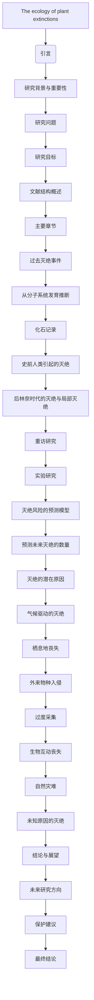

# 文献分析报告: tmpz7_994yy

---

## 目录
<ul>
<li><a href='#1-文献元数据'>1. 文献元数据</a></li>
<li><a href='#1b-图片内容分析'>1b. 图片内容分析</a></li>
<li><a href='#2-方法学分析'>2. 方法学分析</a></li>
<li><a href='#3-创新点提取'>3. 创新点提取</a></li>
<li><a href='#4-问答对'>4. 问答对</a></li>
<li><a href='#5-文献故事'>5. 文献故事</a></li>
<li><a href='#6-文献逻辑脑图'>6. 文献逻辑脑图</a></li>
<li><a href='#7-深度文献分析'>7. 深度文献分析</a></li>
</ul>

---

## 1. 文献元数据
<details open>
<summary>点击展开/折叠</summary>

<table>
  <tr><th colspan='2' style='text-align:center;'>文献基本信息</th></tr>
  <tr><td><b>标题</b></td><td>The ecology of plant extinctions.</td></tr>
  <tr><td><b>作者</b></td><td>['Richard T Corlett']</td></tr>
  <tr><td><b>DOI</b></td><td>10.1016/j.tree.2024.11.007</td></tr>
  <tr><td><b>发表日期</b></td><td>2025-03-01</td></tr>
  <tr><td><b>期刊/来源</b></td><td>Trends in ecology & evolution</td></tr>
</table>

<details>
<summary><b>Semantic Scholar 信息</b></summary>

<table>
  <tr><td><b>Paper ID</b></td><td>7ff41177f81c27684726797b71ad28cc34bbc4bb</td></tr>
  <tr><td><b>被引次数</b></td><td>3</td></tr>
</table>
</details>

<details>
<summary><b>PubMed 信息</b></summary>

<table>
  <tr><td><b>PMID</b></td><td>39648048</td></tr>
  <tr><td><b>摘要</b></td><td>Extinctions occur when enough individual plants die without replacement to extirpate a population, and all populations are extirpated. While the ultimate drivers of plant extinctions are known, the proximate mechanisms at individual and population level are not. The fossil record supports climate ch...</td></tr>
</table>
</details>

</details>


---

## 1b. 图片内容分析
<details open>
<summary>点击展开/折叠</summary>

<details>
<summary><b>图片 1</b>: <code>images/image_000.jpg</code></summary>


**结构化描述：**
### 结构化描述

#### 图像类型:
**表格**

---

#### 主要内容描述:

该表格列出了导致植物灭绝的不同驱动因素及其证据来源。具体而言，“Paleo-record”一栏表示化石记录下的情况；“Recent”则代表近期的研究成果。“Refs.” 列提供了相关参考文献编号以供进一步查阅详细资料。

---
  
#### 关键发现/结论:

此表揭示了现代植物灭绝对策因气候变化的影响贯穿整个历史时期，并且有大量最近的相关研究证实这一点(例如引用自[12–14]等)，而土地利用变化仅影响到近几十年的情况([28–30])以及入侵物种问题也主要是基于重新访问调查的结果([5],[6]), 直接开发活动及共生体丧失的问题目前尚无足够的古代记录可供参照，但这些现象通常通过重访研究、市场调研等方式得到验证 ([7], [9])

--- 

#### 文献关联性:

这张表格为文章后续讨论不同驱动力如何引起个体死亡率增加或繁殖力下降等问题奠定了基础，在理解过去事件的基础上可以更好地指导当前保护策略制定并缩小广泛通用威胁范围从而聚焦于未来可能引发大规模灭绝过程的核心机制上。(见正文第一页引言段落)

请注意上述总结仅为根据提供的文本片段生成的信息概览而非原文翻译或者直接摘录其中任何部分内容！
</details>

</details>


---

## 2. 方法学分析
<details open>
<summary>点击展开/折叠</summary>

## 研究方法评估

### 方法类型
- **综述与理论分析**：本文主要通过对现有文献和数据的回顾，结合理论分析来探讨植物灭绝的原因、机制及其预测模型。

### 关键技术
- **分子系统发育分析**：用于推断物种的分化和灭绝速率。
- **化石记录分析**：通过古生物学数据了解过去的气候变迁对植物分布的影响。
- **重访研究**：实地考察已知植物种群的变化情况。
- **实验研究**：通过控制变量实验研究特定环境因子对植物生存的影响。
- **统计建模**：利用贝叶斯加性回归树(BART)等方法预测植物灭绝风险。

### 数据来源
- **公共数据集**：如国际自然保护联盟(IUCN)红色名录的数据。
- **自行采集**：部分数据来源于作者团队的实地调查。
- **模拟生成**：通过构建数学模型预测未来的植物灭绝趋势。

### 样本量描述 (如果适用)
- 文章未明确给出具体的样本数量，但提到了多个地区的重访研究和实验案例，表明研究覆盖了广泛的地理区域和生态类型。

### 方法优点
- **全面性**：涵盖了从历史到现代的各种驱动因素，提供了丰富的背景信息。
- **多维度分析**：结合了分子生物学、生态学、统计学等多个学科的方法，增强了研究的科学性和可信度。
- **实用性**：提出的预测模型和保护建议具有实际操作意义，有助于指导未来的保护工作。

### 方法局限性
- **数据不完整性**：化石记录和某些地区的监测数据可能存在缺失或不准确的问题。
- **模型假设**：许多预测模型依赖于一定的假设条件，可能导致结果偏差。
- **时间滞后效应**：植物灭绝往往存在较长的时间滞后效应，这使得短期观测难以完全反映实际情况。

### 方法创新点
- **综合多种方法**：将传统的重访研究与现代的分子系统发育分析相结合，提供了一个全新的视角。
- **提出新的预测模型**：如使用贝叶斯加性回归树(BART)预测植物灭绝风险，这是一种较为新颖的技术手段。
- **强调生态网络的重要性**：指出生物互动丧失可能是加速植物灭绝的重要因素之一，这一观点值得进一步深入研究。
</details>


---

## 3. 创新点提取
<details open>
<summary>点击展开/折叠</summary>

## 核心创新与应用前景

### 核心创新点
- 提出了植物灭绝的终极驱动因素与近端机制之间的差异，并强调需要深入研究植物灭绝的近端原因。
- 强调了气候变化、土地利用变化、外来物种入侵、过度开发和生物互作丧失对植物灭绝的综合影响。
- 使用分子系统发育学、化石记录和重访研究等多种方法来推断植物灭绝的历史模式。
- 探讨了预测植物灭绝风险的方法，包括基于物种分布模型（SDMs）和基于性状的预测模型。

### 解决的问题
- 植物灭绝的近端机制尚不清楚，尤其是导致种群消失的具体原因。
- 当前的植物灭绝预测方法存在缺陷，需要更准确的评估工具。
- 如何识别和减轻特定植物物种面临的威胁。

### 与现有工作相比的新颖性
- 本研究首次全面整合了多种数据来源（如化石记录、重访研究、实验研究）来探讨植物灭绝的近端机制。
- 提出了结合性状和机制模型的新方法，以提高对植物灭绝风险的预测能力。
- 强调了植物灭绝的滞后效应，即许多灭绝可能是由过去的环境变化引起的，而不是当前的状况。

### 潜在应用
- **生态保护规划**：为濒危植物物种提供针对性的保护措施。
- **政策制定**：支持国际公约如《生物多样性公约》和《世界自然保护联盟》的决策。
- **教育与公众意识提升**：通过展示植物灭绝的风险和原因，增强公众对生物多样性保护的关注。
- **科学研究**：为未来的生态学和进化生物学研究提供理论框架和技术手段。

### 未来研究方向
- 开发更精确的植物灭绝预测模型，特别是结合基因组学和微气候数据的方法。
- 研究植物种群动态中的滞后效应，探索如何加速濒危物种的恢复。
- 探索植物与传粉者、种子传播者及其他共生体之间的相互作用对灭绝风险的影响。
- 加强对植物灭绝近端机制的理解，特别是在不同地理区域和生态系统中的表现。
</details>


---

## 4. 问答对
<details open>
<summary>点击展开/折叠</summary>

<details>
<summary><b>问题 1：</b>植物灭绝的主要终极驱动因素有哪些？它们如何影响植物的生存？</summary>

**回答：**

```
植物灭绝的主要终极驱动因素包括土地利用变化、不可持续的收获、入侵性害虫和病原体、人为引起的气候变化的潜在重大影响以及失去生物相互作用的可能贡献。这些因素通过改变植物的栖息地、减少其繁殖能力、增加死亡率以及破坏其与其它生物之间的相互依赖关系来影响植物的生存。例如，土地利用变化会直接减少植物可用的生境面积，而气候变化则可能导致植物无法适应新的环境条件。
```
</details>

<details>
<summary><b>问题 2：</b>文献中提到的植物灭绝的近期案例主要集中在哪些类型的物种上？</summary>

**回答：**

```
文献中提到的植物灭绝的近期案例主要集中在窄域物种上。这些物种由于其地理分布范围较小，更容易受到环境变化的影响，因此面临更高的灭绝风险。尽管已知的近期植物灭绝案例数量较少，但许多物种可能已经处于不可避免的灭绝状态，除非给予针对性的支持。
```
</details>

<details>
<summary><b>问题 3：</b>过去的植物灭绝是否能为预测未来的植物灭绝提供有效的模型？</summary>

**回答：**

```
过去的植物灭绝可以通过化石记录和分子系统发育学等方法为预测未来的植物灭绝提供一定的参考。然而，这些模型的有效性受到数据质量和模型假设的限制。例如，化石记录可能遗漏了一些重要的信息，而分子系统发育学模型也可能存在无限多种可能性。因此，虽然过去的数据可以提供洞察，但需要结合更多现代技术和数据进行改进。
```
</details>

<details>
<summary><b>问题 4：</b>文献中提到的“灭绝债务”是什么？它对当前植物多样性有何影响？</summary>

**回答：**

```
“灭绝债务”是指由于过去发生的事件（如栖息地破碎化或气候变化）而导致的预期未来灭绝。即使栖息地恢复或改善，某些物种仍可能因为再生失败而在数十年甚至数世纪后灭绝。这种时间滞后效应意味着当前的植物多样性可能仍然受到过去事件的影响，增加了预测和管理未来灭绝风险的复杂性。
```
</details>

<details>
<summary><b>问题 5：</b>气候变化如何成为植物灭绝的主要驱动因素之一？</summary>

**回答：**

```
气候变化通过改变植物的生长环境，如温度、降水模式和季节性变化，成为植物灭绝的主要驱动因素之一。文献指出，许多植物在过去几十年中经历了温度升高和蒸气压差增加的现象，这直接影响了植物的生存和繁殖能力。此外，气候变化还可能导致植物分布范围的边缘收缩，进一步加剧灭绝风险。
```
</details>

<details>
<summary><b>问题 6：</b>土地利用变化如何影响植物种群的分布和生存？</summary>

**回答：**

```
土地利用变化通过直接减少植物的栖息地面积和质量来影响植物种群的分布和生存。例如，将原始森林转化为单一作物种植会导致植物种群的局部灭绝。即使栖息地碎片仍然存在，植被结构的变化或火、放牧、养分和水文系统的改变也会对植物种群产生负面影响。这种变化通常会导致植物种群的减少甚至灭绝。
```
</details>

<details>
<summary><b>问题 7：</b>文献中提到的“暖边收缩”现象如何表明气候变化对植物分布的影响？</summary>

**回答：**

```
“暖边收缩”现象表明气候变化正在推动植物分布范围向更凉爽的方向移动。这种现象通过观察植物在温暖边缘的分布减少来体现，表明植物无法适应更高温度的环境。这不仅证明了气候变化对植物分布的影响，还表明未来可能出现大规模的气候驱动灭绝。
```
</details>

<details>
<summary><b>问题 8：</b>为什么植物灭绝的近期案例数量相对较少，但潜在的灭绝风险却很高？</summary>

**回答：**

```
植物灭绝的近期案例数量相对较少是因为许多灭绝事件发生在科学描述之前，属于‘暗灭绝’。此外，植物通常寿命较长，可能形成克隆或拥有种子库，能够在极小的数量下存活很长时间，这也延迟了灭绝的发生。然而，这些因素并不能消除潜在的灭绝风险，尤其是对于那些栖息地丧失或受到多重威胁的物种来说，灭绝的可能性依然很高。
```
</details>

<details>
<summary><b>问题 9：</b>文献中提到的“狭域物种”为何更容易受到灭绝威胁？</summary>

**回答：**

```
狭域物种由于其地理分布范围较小，更容易受到环境变化的影响。它们通常对特定的生态条件高度依赖，因此当这些条件发生变化时，它们的生存能力迅速下降。此外，狭域物种往往具有较低的初始丰度和较小的种群规模，这使得它们在面对外部压力时更加脆弱。
```
</details>

<details>
<summary><b>问题 10：</b>文献中提到的“后验率”是如何估计的？这种方法存在哪些局限性？</summary>

**回答：**

```
“后验率”是通过化石记录和分子系统发育学模型估计的，通常在每百万个物种每年0.05至0.15个灭绝之间。然而，这种方法存在局限性，包括化石记录的不完整性以及对系统发育树解释的问题。这些局限性意味着这些估计值应该谨慎对待，不能作为精确的指标。
```
</details>

<details>
<summary><b>问题 11：</b>文献中提到的“分子系统发育学”如何帮助我们理解植物灭绝的历史模式？</summary>

**回答：**

```
分子系统发育学通过分析现存物种的时间校准系统发育树，使用出生-死亡模型来推断物种形成和灭绝率。尽管这种方法存在一些理论上的挑战，如无限多种可能性的存在，但它仍然是理解植物灭绝历史模式的重要工具。新方法的发展有助于解决部分问题，但仍需注意化石记录可能遗漏的部分历史。
```
</details>

<details>
<summary><b>问题 12：</b>文献中提到的“化石记录”如何补充了植物灭绝的研究？</summary>

**回答：**

```
化石记录提供了植物灭绝的长期视角，尤其是在过去快速气候变化期间，显示了运动作为响应的重要性，而不是适应或进化。尽管化石记录在空间和时间上存在不均匀性，且标本不完整，但它仍然是理解植物灭绝机制的重要资源。特别是对于一些常见低地物种，化石记录可以帮助填补科学描述之前的空白。
```
</details>

<details>
<summary><b>问题 13：</b>文献中提到的“重新访问研究”如何帮助我们了解植物种群的变化？</summary>

**回答：**

```
重新访问研究通过对比历史数据和当前数据，可以估算个体死亡率和种群灭绝率。这种方法依赖于准确标记或绘制早期调查中的种群或个体植物，并进行连续监测。尽管历史信息的准确性、空间分辨率和完整性可能有所不同，但重新访问研究能够揭示种群动态变化，特别是在长期保护良好的地点，种群保持较高水平。
```
</details>

<details>
<summary><b>问题 14：</b>实验研究如何揭示植物灭绝的潜在机制？</summary>

**回答：**

```
实验研究通过控制变量来确认观测研究中的相关性是否具有因果关系，并提供机会识别导致灭绝的具体机制。例如，实验可以研究植物-土壤反馈等影响灭绝风险的因素。通过实验，研究人员可以测试不同的扰动（如栖息地破碎化、火灾、放牧等）对植物种群的影响，从而揭示潜在的机制。
```
</details>

<details>
<summary><b>问题 15：</b>文献中提到的“气候驱动的灭绝”如何通过实验模拟来验证？</summary>

**回答：**

```
气候驱动的灭绝可以通过实验模拟来验证，例如通过加热处理观察植物种群的变化。实验研究表明，气候变暖会导致植物种群的快速下降和局部灭绝，这可能是由于多个生命阶段的繁殖能力和生存能力下降以及种子库的耗尽。这些实验结果支持了气候变暖对植物灭绝的直接影响。
```
</details>

<details>
<summary><b>问题 16：</b>文献中提到的“生活史特征”如何影响植物灭绝的风险？</summary>

**回答：**

```
生活史特征对植物灭绝风险的影响没有一致的模式，但一些特征（如附生植物）可能更具脆弱性，这表明它们的易感性可能与地区和谱系有关。其他植物特性通常是不良的灭绝风险预测因子，缺乏跨研究的一致性和大陆间的可比性。
```
</details>

<details>
<summary><b>问题 17：</b>文献中提到的“物种分布模型”如何用于预测植物灭绝风险？</summary>

**回答：**

```
物种分布模型（SDMs）通过当前环境条件下的物种分布来解释和预测物种分布。这些模型通常基于相关性，但存在许多问题，如数据不足、模型准确性可能被高估、未来条件下的关系可能不再适用等。尽管如此，SDMs仍然是预测植物灭绝风险的重要工具，尤其是在结合其他方法（如机械模型或性状分析）时。
```
</details>

<details>
<summary><b>问题 18：</b>文献中提到的“红名单评估”如何帮助我们理解植物灭绝的风险？</summary>

**回答：**

```
红名单评估通过一系列标准评估植物灭绝风险，并将其分为不同的风险类别。尽管只有20%的植物物种在全球范围内进行了评估，但这些评估为理解植物灭绝风险提供了重要依据。此外，红名单评估还用于训练模型，以预测未列入名单的物种的灭绝风险。然而，评估过程缓慢且数据要求严格，因此需要结合统计建模和其他方法来弥补不足。
```
</details>

<details>
<summary><b>问题 19：</b>文献中提到的“多重威胁”如何共同作用于植物灭绝？</summary>

**回答：**

```
多重威胁（如栖息地丧失、气候变化、过度采伐等）常常协同作用，增加植物灭绝的风险。例如，栖息地丧失可能导致植物种群的局部灭绝，而气候变化可能进一步削弱剩余种群的生存能力。这些威胁的叠加效应使得植物种群更容易受到灭绝的影响。
```
</details>

<details>
<summary><b>问题 20：</b>文献中提到的“生物互动丧失”如何加速植物灭绝？</summary>

**回答：**

```
生物互动丧失（如传粉者、种子传播者或菌根真菌的丧失）可能导致植物种群的次级灭绝。尽管尚未有明确的植物实例，但生态网络的重建和生态冗余可能延缓了这一过程。然而，种群下降的现象已被报道，这表明缺乏次级灭绝可能只是植物过程的滞后效应所致。
```
</details>

<details>
<summary><b>问题 21：</b>文献中提到的“古环境DNA”如何帮助我们理解植物灭绝的历史？</summary>

**回答：**

```
古环境DNA可以从湖泊沉积物中提取，用于检测过去植物种群的变化。尽管超过100万年的DNA难以提取，但这种方法可以揭示过去植物种群的遗传多样性和分布变化，从而帮助理解植物灭绝的历史背景。
```
</details>

<details>
<summary><b>问题 22：</b>文献中提到的“进化基因组学”如何帮助我们预测植物对气候变化的响应？</summary>

**回答：**

```
进化基因组学通过分析植物种群的基因组数据，可以预测植物对气候变化的响应。这种方法不仅可以研究不同种群对气候变化的生态反应，还可以探索其潜在的进化反应。此外，古环境DNA技术可以检测过去植物种群的遗传变化，为理解其适应性提供线索。
```
</details>

<details>
<summary><b>问题 23：</b>文献中提到的“微气候”如何影响植物的生存？</summary>

**回答：**

```
微气候通常与宏观气候不同步，植物通常依赖于细尺度的微生境来建立初期种群。微气候的变化可能显著影响植物的生存，尤其是在快速气候变化的情况下。这种差异性使得不同物种对气候变暖的响应表现出极大的变异性。
```
</details>

<details>
<summary><b>问题 24：</b>文献中提到的“时间滞后效应”如何影响植物灭绝的预测？</summary>

**回答：**

```
时间滞后效应意味着植物灭绝可能在环境变化发生后数十年甚至数世纪才显现。这种滞后效应可能反映了个体内某些抗性生命阶段的存在，以及种群或亚种群层面的持久性。因此，当前的植物多样性可能仍然受到过去事件的影响，这增加了预测未来灭绝风险的难度。
```
</details>

<details>
<summary><b>问题 25：</b>文献中提到的“全球植物多样性框架”如何指导植物保护工作？</summary>

**回答：**

```
全球植物多样性框架旨在通过设定目标和措施来指导植物保护工作。例如，Kunming-Montreal框架强调了针对每种受威胁植物物种的针对性干预措施。这些框架为保护行动提供了方向，但需要结合具体的生物学需求和生态机制来实施有效保护。
```
</details>

</details>


---

## 5. 文献故事
<details open>
<summary>点击展开/折叠</summary>

# 植物灭绝的故事：从远古到未来的生态警钟

在一个遥远的时代，地球上的生命经历了无数次的兴衰更替。从恐龙的消失到冰河时期的来临，大自然总是以一种令人敬畏的方式书写着自己的篇章。然而，今天，我们正站在一个新的转折点上——一个由人类主导的时代，植物的生存面临着前所未有的挑战。让我们一起穿越时间的长河，探索植物灭绝背后的秘密，以及我们该如何应对这一全球性的危机。

## 远古的气候变迁与植物的命运

在数百万年前的地球上，气候的变化是植物灭绝的主要推手。想象一下，当时的森林覆盖着广袤的土地，而温暖湿润的气候让许多植物得以繁茂生长。然而，随着气候逐渐变冷，一些对寒冷敏感的植物种类开始走向灭亡。这种变化并非偶然，而是自然选择的结果。那些适应了新环境的植物幸存下来，形成了今天我们所见的欧洲温带树种。

但是，这种适应并非总是顺利的。有些植物虽然能够忍受低温，却无法抵御干旱的压力。因此，即使它们在某些地区存活了下来，但在其他地方却消失了踪迹。这表明，除了气候本身的变化外，还有其他因素也在起作用。科学家们通过研究化石记录发现，植物的灭绝往往伴随着生态系统中其他成员的消失，比如昆虫或其他动物。这些生物之间的相互依赖关系一旦被打破，植物的生存就会变得更加艰难。

## 现代的威胁：土地利用与气候变化

进入近代以后，人类活动成为了植物灭绝的主要原因。随着城市化的扩张和农业的发展，大片的原始森林被砍伐殆尽，取而代之的是单一作物的大面积种植。这样的转变不仅减少了植物的栖息地，还改变了土壤结构和水分循环模式，使得许多原本适应特定环境的植物难以继续生存下去。

与此同时，气候变化带来的极端天气事件也越来越频繁地发生。高温、干旱以及频繁的风暴都给植物带来了巨大的压力。特别是在热带地区，由于温度升高导致的降水模式改变，许多植物发现自己正处于一个既不适宜也不安全的新环境中。尽管有些植物可以通过迁移来寻找更适合自己的生长地点，但并不是所有的植物都有这样的能力。

## 小范围物种的困境

值得注意的是，尽管已知的植物灭绝案例相对较少，但这并不意味着大多数植物都安然无恙。实际上，许多窄分布的植物种类已经处于极度濒危的状态。这些植物通常只存在于特定的小范围内，一旦其栖息地遭到破坏，就很难恢复。此外，即使是在同一区域内，不同种群之间也可能存在显著差异，这意味着即使是同一个物种内的不同群体也可能面临不同的命运。

## 科学研究的重要性

为了更好地理解和预测未来的植物灭绝趋势，科学家们正在努力收集更多的数据。他们利用分子遗传学技术重建植物家族的历史，并结合化石记录来追溯过去的灭绝事件。此外，实地考察和实验研究也为揭示植物灭绝的具体机制提供了宝贵的线索。例如，通过对比不同时间段内植物数量的变化，研究人员可以评估哪些因素对植物种群的增长或衰退产生了影响。

## 我们的责任

面对如此严峻的局面，我们必须采取行动。首先，我们需要加强对濒危植物的保护工作，确保它们不会因为缺乏关注而彻底消失。其次，我们应该鼓励和支持科学研究，以便更深入地了解植物灭绝的原因及其后果。最后，作为普通人，我们也应该意识到自己行为对自然界的影响，并尽量减少不必要的浪费和污染。

总之，植物灭绝是一个复杂而又紧迫的问题，它提醒我们要珍惜自然资源，尊重生命多样性。只有当我们真正认识到这一点时，才能确保我们的后代也能享受到丰富多彩的大自然馈赠。
</details>


---

## 6. 文献逻辑脑图
<details open>
<summary>点击展开/折叠</summary>


</details>


---

## 7. 深度文献分析
<details open>
<summary>点击展开/折叠</summary>

## 文献深度分析报告

---

### 1. 研究背景与动机的综合视角

植物灭绝是全球生物多样性危机的重要组成部分，其背后的原因复杂多样。当前研究的动机在于理解植物灭绝的终极驱动因素及其近端机制，特别是如何从个体和种群层面解释植物灭绝的过程。这一研究背景源于生态学和保护生物学领域对生物多样性丧失的关注。植物作为生态系统的基础组成部分，其灭绝不仅影响生态系统的功能，还可能导致其他生物的连锁反应。

植物灭绝的核心科学问题包括：
1. 气候变化是否仍是主导因素？
2. 土地利用变化如何加剧灭绝风险？
3. 人类活动（如过度采集、入侵物种）对植物灭绝的具体影响。
4. 如何预测未来的植物灭绝趋势？

参考文献表明，尽管动物灭绝的近端机制已较为明确，但植物灭绝的近端机制仍需深入研究。这反映了植物生态学研究的滞后性，尤其是在个体和种群层面的机制解析上。

---

### 2. 方法论的比较与评述

当前文献采用的方法主要包括：
1. **分子系统发育分析**：通过时间校准的系统发育树推断灭绝率。
2. **化石记录分析**：利用古气候数据和化石分布重建过去的灭绝模式。
3. **重访研究**：通过对比历史和现状数据评估种群动态。
4. **实验研究**：模拟环境变化对植物生存的影响。

与参考文献相比，其他研究方法如物种分布模型（SDMs）和基因组数据分析也得到了广泛应用。然而，这些方法各有优劣：
- **分子系统发育分析**：优点在于能够追溯长期演化历史，但可能遗漏部分灭绝事件。
- **化石记录分析**：提供历史背景，但受化石记录不完整性的限制。
- **重访研究**：直接反映现实变化，但需要长期监测。
- **实验研究**：可控性强，但难以完全模拟自然条件。

总体而言，当前文献强调多方法结合的重要性，以弥补单一方法的局限性。

---

### 3. 研究结果的印证、拓展与矛盾

参考文献和相关文献的结果支持了当前文献的主要发现：
1. **气候变化的影响**：化石记录和实验研究表明，气候变化是植物灭绝的重要驱动因素，特别是在边缘种群中观察到的暖边灭绝现象。
2. **土地利用变化的作用**：重访研究显示，土地利用变化导致的栖息地丧失是当前植物灭绝的主要原因。
3. **预测模型的局限性**：尽管SDMs被广泛使用，但其准确性受到数据质量和假设条件的限制。

然而，也存在一些矛盾点：
- 部分研究认为植物灭绝的风险被高估，而另一些研究则认为低估了灭绝速度。
- 不同模型对同一物种的预测结果差异较大，这可能与模型参数设置有关。

---

### 4. 领域内的定位与独特贡献评估

当前文献在植物灭绝研究领域具有重要地位：
1. **填补研究空白**：首次系统性地整合了化石记录、分子系统发育分析和实验研究，为理解植物灭绝机制提供了新的视角。
2. **独特贡献**：提出了“灭绝债务”的概念，强调历史事件对未来灭绝的影响，并呼吁采取针对性干预措施。
3. **方法创新**：结合多学科方法，为未来研究提供了可操作的框架。

与其他研究相比，当前文献的独特之处在于其综合性，不仅关注灭绝的最终驱动因素，还深入探讨了近端机制。

---

### 5. 综合性未来展望与未决问题

基于当前文献及其学术上下文，未来研究应重点关注以下关键问题：
1. **灭绝机制的细化**：如何识别导致个体死亡的具体原因？
2. **模型改进**：如何提高SDMs的预测精度，同时减少数据需求？
3. **基因组数据的应用**：如何利用基因组数据预测植物对气候变化的适应能力？
4. **保护策略优化**：如何设计更具针对性的保护措施？

未来研究方向可能包括：
1. 开发更精细的实验平台，模拟多种环境压力的叠加效应。
2. 探索植物与微生物互作在网络中的作用。
3. 利用遥感技术和大数据分析，实时监测植物种群动态。

---

### 参考文献

1. Corlett, R.T. (2024). The ecology of plant extinctions. *Trends in Ecology & Evolution*, 39(11), 1043–1047. DOI: 10.1016/j.tree.2024.11.007.
2. Chevalier, M. et al. (2024). Climate change may reveal currently unavailable parts of species' ecological niches. *Nature Ecology & Evolution*, 8, 1298–1310. DOI: 10.1038/s41559-024-02426-4.
3. Hollenbeck, E.C.; Sax, D.F. (2024). Experimental evidence of climate change extinction risk in Neotropical montane epiphytes. *Nature Communications*, 15, 6045. DOI: 10.1038/s41467-024-49181-5.
4. Peng, S. et al. (2024). Incorporating plant phenological responses into species distribution models reduces estimates of future species loss and turnover. *New Phytologist*, 242, 2338–2352. DOI: 10.1111/nph.19698.
5. Zurell, D. (2023). Predicting extinctions with species distribution models. *Cambridge Prisms Extinction*, 1, e8. DOI: 10.1017/CBO9781107415324.

---

**Markdown 格式报告完成。**
</details>

<hr>
<footer>
<p><b>报告生成时间:</b> 2025-05-31 03:31:56</p>
<p><i>此报告由 SLAIS (Scientific Literature AI Insight System) 自动生成</i></p>

<style>
  body { 
    font-family: Arial, sans-serif; 
    line-height: 1.6;
    color: #333;
    max-width: 1200px;
    margin: 0 auto;
    padding: 0 20px;
  }
  h1 { color: #2c3e50; border-bottom: 2px solid #3498db; padding-bottom: 10px; }
  h2 { color: #2980b9; margin-top: 30px; border-bottom: 1px solid #bdc3c7; padding-bottom: 5px; }
  h3 { color: #3498db; }
  details { margin-bottom: 20px; padding: 10px; border: 1px solid #e0e0e0; border-radius: 5px; }
  summary { cursor: pointer; font-weight: bold; }
  table { width: 100%; border-collapse: collapse; margin-bottom: 20px; }
  th, td { padding: 12px; text-align: left; border-bottom: 1px solid #e0e0e0; }
  th { background-color: #f5f5f5; }
  .qa-container details { background-color: #f9f9f9; margin-bottom: 10px; }
  .qa-container summary { background-color: #f1f1f1; padding: 10px; }
  code { background-color: #f5f5f5; padding: 2px 5px; border-radius: 3px; }
  pre { background-color: #f5f5f5; padding: 15px; border-radius: 5px; overflow-x: auto; }
  hr { border: 0; border-top: 1px solid #e0e0e0; margin: 30px 0; }
  footer { text-align: center; margin-top: 50px; font-size: 0.9em; color: #7f8c8d; }
  img { transition: box-shadow 0.2s; }
  img:hover { box-shadow: 0 0 8px #2980b9; }
</style>

</footer>